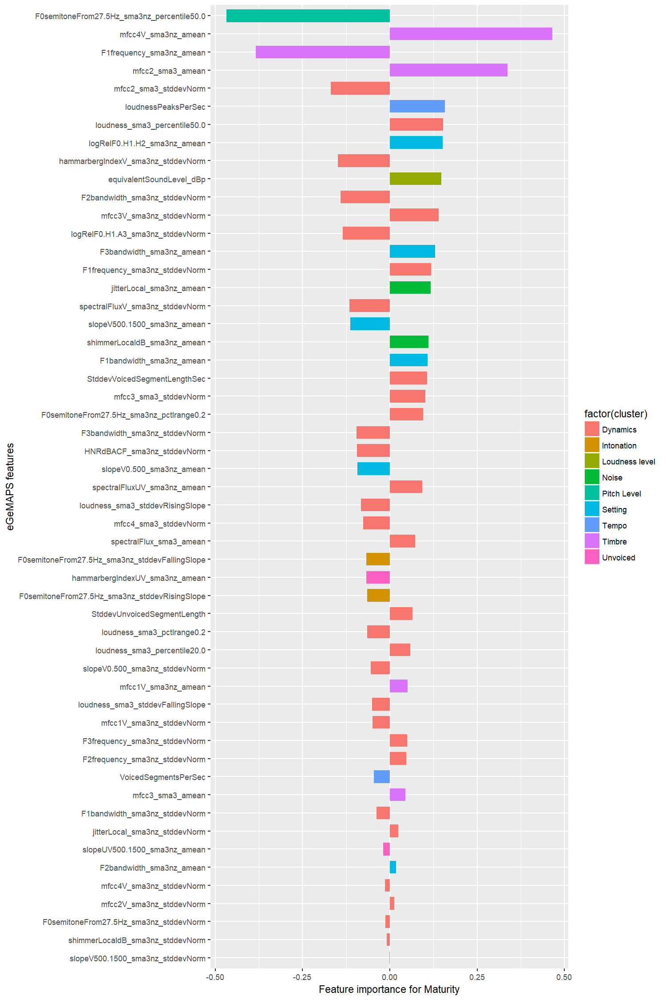

Correlations between speech features and speaker characteristics / voice descriptions
================
Laura Fernández Gallardo
June 2017

-   [Objectives](#objectives)
-   [Load speech features](#load-speech-features)
-   [Pre-processing of speech features](#pre-processing-of-speech-features)
-   [Feature importance for speaker characteristics](#feature-importance-for-speaker-characteristics)
    -   [Estimate variable importance](#estimate-variable-importance)
    -   [Plots](#plots)
-   [Feature importance for voice descriptions](#feature-importance-for-voice-descriptions)
    -   [Estimate variable importance](#estimate-variable-importance-1)
    -   [Plots](#plots-1)

``` r
# clear
rm(list=ls())

# Libraries needed:

library(RCurl) # to read raw data from repo
library(caret) # pre-processing and feat imp
library(usdm) #  for variance inflation factor
library(reshape2) # for plot
library(ggplot2) # for plot
```

Objectives
----------

Computing measures of feature importance for the prediction of:

-   speaker characteristics (SC)
-   voice descriptions (VD)

To calculate feature importance, I have used in other analyses different filter methods:

-   with caret:

``` r
#caret::filterVarImp(transformed_m_2_v2, class_m, nonpara = TRUE,  scale=FALSE)
```

-   with mlr:

``` r
#mdata <- data.frame(transformed_m_v2, target = fs_SC_m$dim1)    
#regrTask <- makeRegrTask(data = mdata, target = 'target')    
#fv <- generateFilterValuesData(regrTask, method = 'linear.correlation')
```

In this script, I choose linear correlation values as reliable indicators of feature importance. These values are also straightforward to interpret: the Pearson correlation between feature and factor scores of speaker attributes.

The computation of feature importance enables feature ranking and the selection of a feature subset for the regression task.

Load speech features
--------------------

``` r
path_github <- "https://raw.githubusercontent.com/laufergall/Subjective_Speaker_Characteristics/master/data/speech_features"

gemaps_m <- read.csv(text=getURL(paste0(path_github,"/eGeMAPSv01a_88_malespk.csv")), header=TRUE, sep=",")
gemaps_f <- read.csv(text=getURL(paste0(path_github,"/eGeMAPSv01a_88_femalespk.csv")), header=TRUE, sep=",")

# feats: remove filename
feats_m <-gemaps_m[,-1]
feats_f <-gemaps_f[,-1]
```

Male speakers: 126 observations. 89 variables = 88 features + filename

Female speakers: 174 observations. 89 variables = 88 features + filename

Each observation corresponds to a different speaker.

Assign each speech feature to one group. Thanks to Benjamin Weiss (Technische Universität Berlin) for proposing this grouping.

``` r
gr <- c('Dynamics','Timbre','Pitch Level', 'Setting', 'Noise','Loudness level','Tempo','Intonation','Unvoiced')

feats <- data.frame('featname' = names(gemaps_m[,-1]) )

feats$cluster = rep(gr[1],88)
feats$cluster[1]=gr[3]
#feats$cluster[c(2:6)]=gr[1]
feats$cluster[c(2,6)]=gr[1]
feats$cluster[c(3:5)]=gr[3]
feats$cluster[c(7:10)]=gr[8]
feats$cluster[11]=gr[6]
feats$cluster[c(12:22)]=gr[1]
feats$cluster[c(23,25,27,29)]=gr[2]
feats$cluster[c(24,26,28,30)]=gr[1]
feats$cluster[c(31,33,35)]=gr[5]
feats$cluster[c(32,34,36)]=gr[1]
feats$cluster[c(37,39,43,49,55,59,61,63,65)]=gr[4]
feats$cluster[c(38,40,42,44,46,48,50,52,54,56,58,60,62,64,66:68,70,72,74,76)]=gr[1]
feats$cluster[c(41,45,47,51,53,57,69,71,73,75)]=gr[2]
feats$cluster[c(77:80)]=gr[9]
feats$cluster[c(81,84:87)]=gr[1]
feats$cluster[c(82,83)]=gr[7]
feats$cluster[88]=gr[6]
```

Pre-processing of speech features
---------------------------------

Using the caret package: Box-Cox transformation to reduce skewness, centering and scaling.

``` r
trans_m <- caret::preProcess(feats_m,
                            method = c('BoxCox','center','scale'))

trans_f <- caret::preProcess(feats_f,
                               method = c('BoxCox','center','scale'))

transformed_m <- predict(trans_m, feats_m) # boxcox, center, scale

transformed_f <- predict(trans_f, feats_f) # boxcox, center, scale
```

Calculate variance inflation factor (VIF) to deal with multicollinearity problems:

Naimi, B., Hamm, N. A. S., Groen, T. A., Skidmore, A. K. and Toxopeus, A. G.,"Where is Positional Uncertainty a Problem for Species Distribution Modelling?," Ecography, 37, pp. 191-203, 2014.

Identify collinear variables that should be excluded.

From the usdm package: "A VIF greater than 10 is a signal that the model has a collinearity problem".

``` r
# vifcor
#v1 <- vifcor(transformed_m_2, th=0.5) 

# vifstep
v2_m <- vifstep(transformed_m, th=10)
v2_f <- vifstep(transformed_f, th=10)

transformed_m_v2 <- exclude(transformed_m,v2_m)
transformed_f_v2 <- exclude(transformed_f,v2_f)
```

Feature importance for speaker characteristics
----------------------------------------------

Load targets: factor scores of speaker characteristics. Speakers are sorted as in the features dataframe.

``` r
path_github2 <- "https://raw.githubusercontent.com/laufergall/Subjective_Speaker_Characteristics/master/data/generated_data"

fs_SC_m <- read.csv(text=getURL(paste0(path_github2,"/factorscores_SC_malespk.csv")), header=TRUE, sep=",")
fs_SC_f <- read.csv(text=getURL(paste0(path_github2,"/factorscores_SC_femalespk.csv")), header=TRUE, sep=",")

## dimension and group names

dims_SC_m <- c('Warmth','Attractiveness','Confidence','Compliance','Maturity')
dims_SC_f <- c('Warmth','Attractiveness','Compliance','Confidence','Maturity')
```

### Estimate variable importance

As measure of feature importance I choose the Pearson correlation between feature and target.

``` r
cor_m <- cor(transformed_m_v2, fs_SC_m[,-1])
cor_f <- cor(transformed_f_v2, fs_SC_f[,-1])
```

Data for plot:

``` r
varimp_m <- data.frame(featname=rownames(cor_m),cor_m)
rownames(varimp_m) <- c()
colnames(varimp_m)<-c('featname',dims_SC_m)
varimp_m <- merge(varimp_m,feats)

varimp_f <- data.frame(featname=rownames(cor_f),cor_f)
rownames(varimp_f) <- c()
colnames(varimp_f)<-c('featname',dims_SC_f)
varimp_f <- merge(varimp_f,feats)
```

### Plots

Plot feature importance values for each speaker trait.

``` r
# varimp: data frame with 'featname', 'cluster', and one column for each feature importance measure, where rows are different features
# n: column number in varimp to plot values for
plot.varimp <- function(varimp, n) {
  
mplot <- ggplot(data=varimp, aes(y=varimp[,n], x=reorder(featname, abs(varimp[,n])), fill=factor(cluster))) +
  geom_bar(position=position_dodge(width=.7),stat="identity", width=.7) + 
  ylab(paste0("Feature importance for ", names(varimp)[n])) +
  xlab("eGeMAPS features") +
  # theme(text=element_text(size=22)) +
  coord_flip() 

print(mplot)

}
```

#### Male speakers

``` r
for (i in 1:5){
  plot.varimp(varimp_m, i+1)
}
```


-   Contributing to higher warmth: Higher F0 range (rho=.52), higher mean spectral slope 0-500Hz (rho=.27), lower sd of F1 (rho=-.23) and F2 (rho=-.23) frequencies.

-   Contributing to higher attractiveness: Higher F0 range (rho=.35), higher sd of Hammarberg Index (rho=.23), lower mean length of unvoiced segments (rho=-.22), higher sd of F0 (rho=.21), lower median F0 (rho=-.20).

-   Contributing to higher confidence: Lower median F0 (rho=-.29), higher F0 range (rho=.25).

-   Contributing to higher compliance: Lower sd length voiced segments (rho=-.24), lower sd of F1 frequency (rho=-.23), lower sd of falling slope for loudness (rho=-.20), higher F1 (rho=.19) and F2 (rho=.19) bandwidth.

-   Contributing to higher maturity: Lower median F0 (rho=-.42), higher sd of F3 (rho=.33), higher sd of F3 bandwidth (rho=-.31).

Currently, we do not have explanations for many of the relationships found, since features are viewed in isolation. Further analyses of feature combinations can presumably offer more conclusive justifications of our results.

That notwithstanding, there are some clear observations that corroborate previous research on voice characteristics. Lower and highly variable F0 seems to play a major role displaying attractiveness and confidence in male speech, as also shown by Zuckerman and Miyake (1993) and Jones et al. (2010). The melodious voice resulting from variable pitch also indicates higher warmth (a friendly attitude). Related to these findings, Brown et al. (1974) showed that decreased intonation and increased F0 caused the speakers to be rated as less benevolent and less competent. Also, Apple et al. (1979) indicated that males with high-pitch voices are perceived as less truthful, less persuasive, weaker, and more nervous. Lower median F0 also correlates with maturity, as also found by Collins (2000). The correlation between the sd of Hammarberg Index and attractiveness suggests that the dynamics in the energy distribution in the spectrum contributes to high perceived attractiveness.

#### Female speakers

``` r
for (i in 1:5){
  plot.varimp(varimp_f, i+1)
}
```



-   Contributing to higher warmth: Higher F1 (rho=.43), higher F0 range (rho=.37), higher sd of F2 bandwidth (rho=.29), higher sd of spectral flux (rho=.22), lower sd of F1 (rho=-.21), higher median F0 (rho=.21).

-   Contributing to higher attractiveness: Higher F1 (rho=.38), higher sd of F2 bandwidth (rho=.30), lower sd of F1 (rho=-.23), higher F0 range (rho=.22), lower mean spectral slope 0-500Hz (rho=-.20).

-   Contributing to higher compliance: Lower sd of F1 (rho=-.34), higher F1 (rho=.31), lower loudness range (rho=-.30).

-   Contributing to higher confidence: Higher sd of falling slope for loudness (rho=.33), higher F0 range (rho=.32).

-   Contributing to higher maturity: Lower median F0 (rho=-.47), higher mean mfcc4 (rho=.46), lower F1 (rho=-.38), higher mean mfcc2 (rho=.34).

For female speech, warmth, attractiveness, compliance, and "lower" maturity are cued by higher F1, which is also an indicator of a more careful and precise articulation. As also found for male speakers, higher F0 range signals higher warmth, attractiveness and confidence. With respect to these outcomes, Zuckerman and Miyake (1993) detected that female attractiveness correlated positively with articulation and negatively with monotonousness. Finally, lower pitch signals maturity, which is coherent with the decrease of females' F0 with age (Nishio and Niimi 2008).

Feature importance for voice descriptions
-----------------------------------------

Load targets: factor scores of voice descriptions. Speakers are sorted as in the features dataframe.

``` r
path_github2 <- "https://raw.githubusercontent.com/laufergall/Subjective_Speaker_Characteristics/master/data/generated_data"

fs_VD_m <- read.csv(text=getURL(paste0(path_github2,"/factorscores_VD_malespk.csv")), header=TRUE, sep=",")
fs_VD_f <- read.csv(text=getURL(paste0(path_github2,"/factorscores_VD_femalespk.csv")), header=TRUE, sep=",")

## dimension and group names

dims_VD_m <- c('(neg) Proficiency','Tension','Melody','Brightness')
dims_VD_f <- c('(neg) Fluency', 'Brightness', '(neg) Proficiency', 'Shrillness')
```

Indexes of speakers for which voice descriptions data are available.

``` r
index_m <- gemaps_m$sample_heard %in% fs_VD_m$sample_heard
index_f <- gemaps_f$sample_heard %in% fs_VD_f$sample_heard
```

### Estimate variable importance

As measure of feature importance I choose the Pearson correlation between feature and target.

``` r
cor_m <- cor(transformed_m_v2[index_m,], fs_VD_m[,-1])
cor_f <- cor(transformed_f_v2[index_f,], fs_VD_f[,-1])
```

Data for plot:

``` r
varimp_m <- data.frame(featname=rownames(cor_m),cor_m)
rownames(varimp_m) <- c()
colnames(varimp_m)<-c('featname',dims_VD_m)
varimp_m <- merge(varimp_m,feats)

varimp_f <- data.frame(featname=rownames(cor_f),cor_f)
rownames(varimp_f) <- c()
colnames(varimp_f)<-c('featname',dims_VD_f)
varimp_f <- merge(varimp_f,feats)
```

### Plots

Plot feature importance values for each dimension of voice descriptions.

#### Male speakers

``` r
for (i in 1:4){
  plot.varimp(varimp_m, i+1)
}
```


#### Female speakers

``` r
for (i in 1:4){
  plot.varimp(varimp_f, i+1)
}
```


