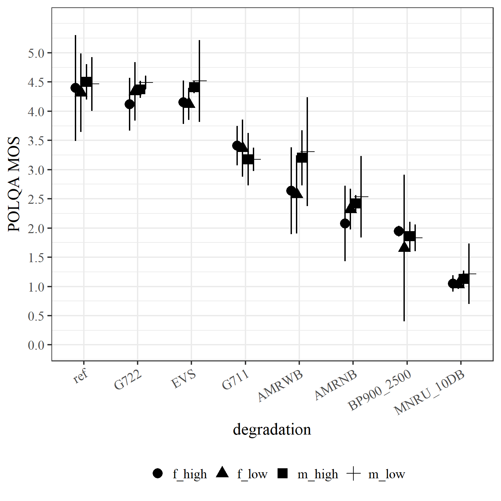
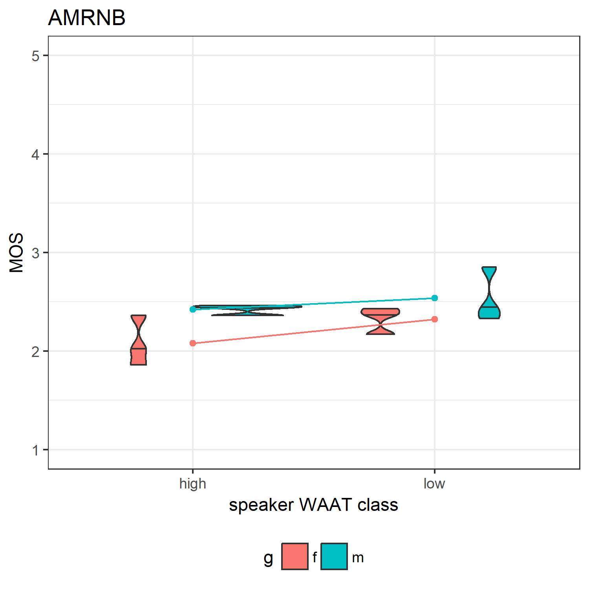
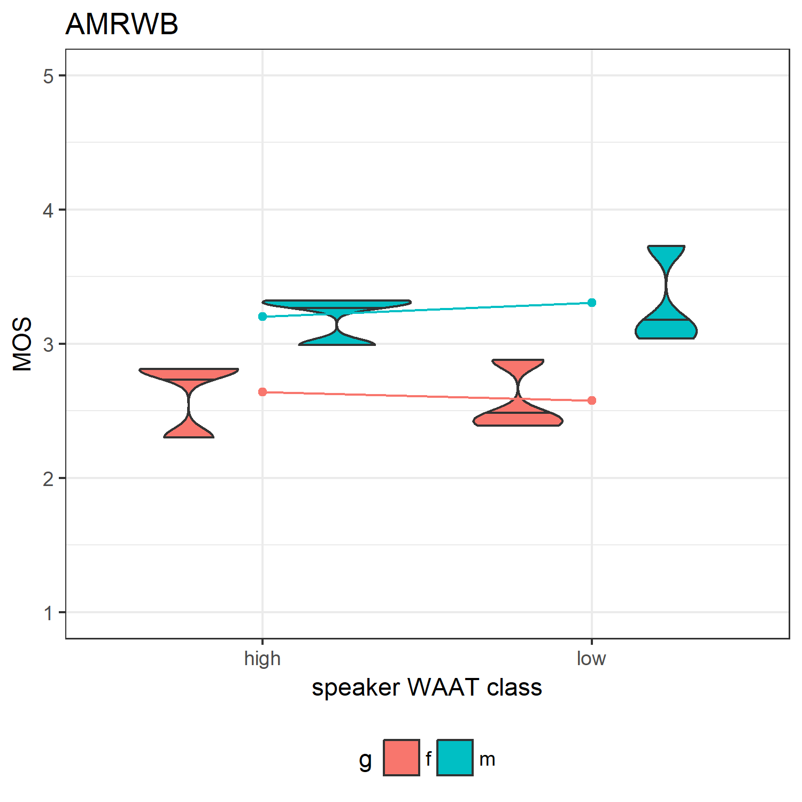
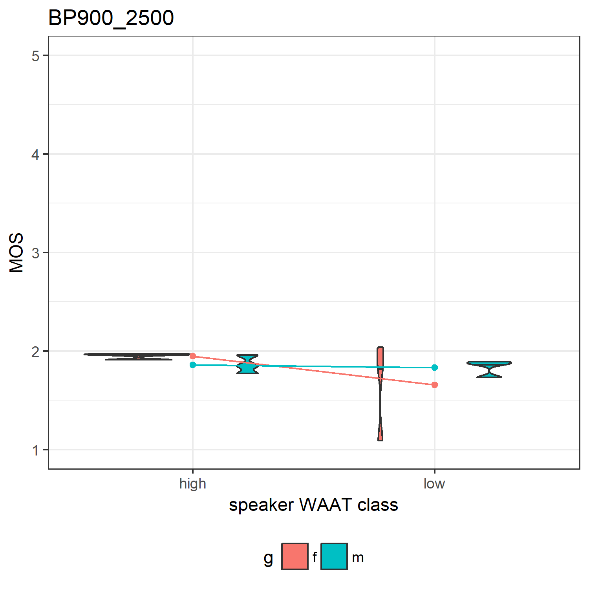
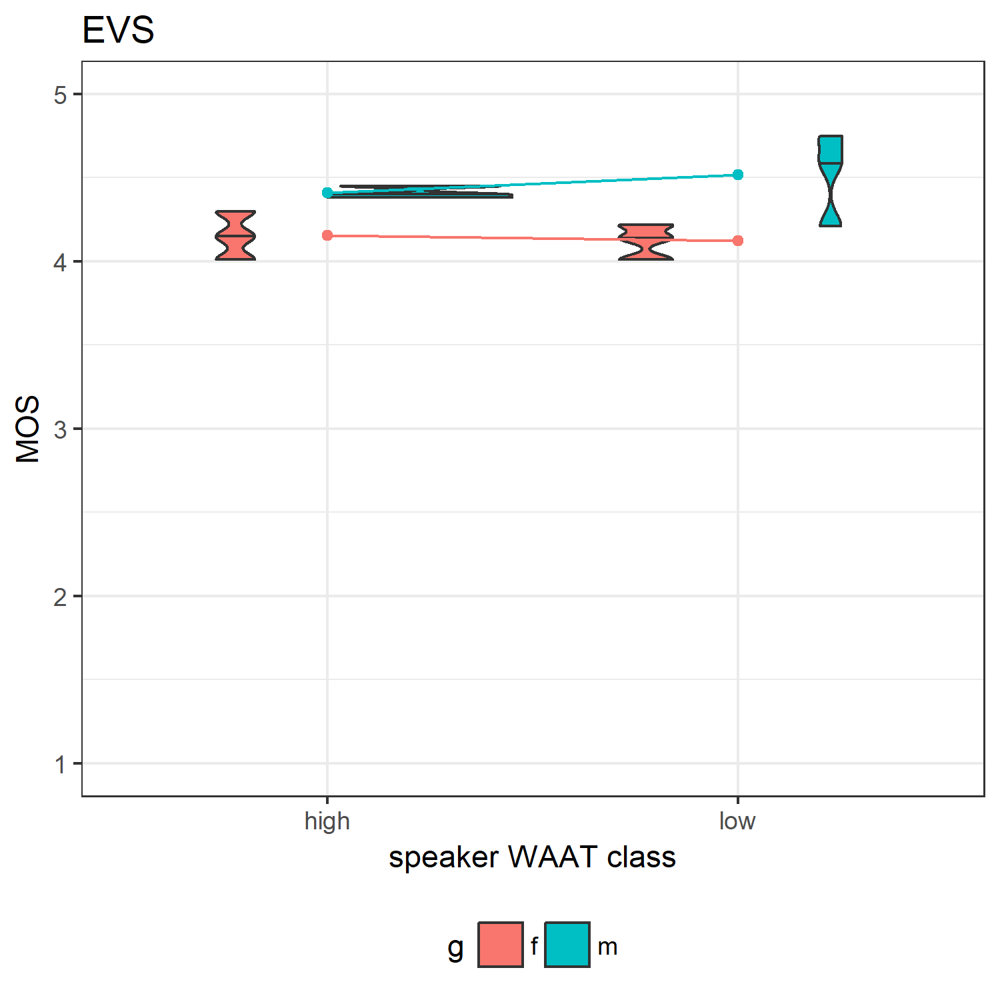
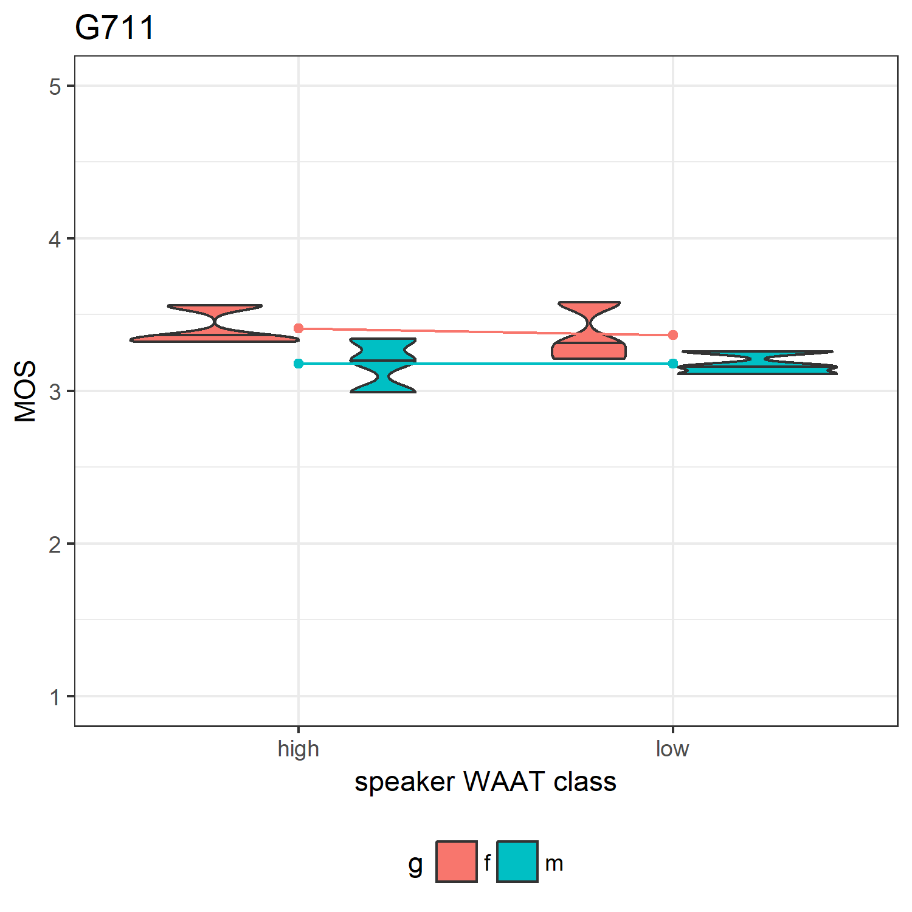
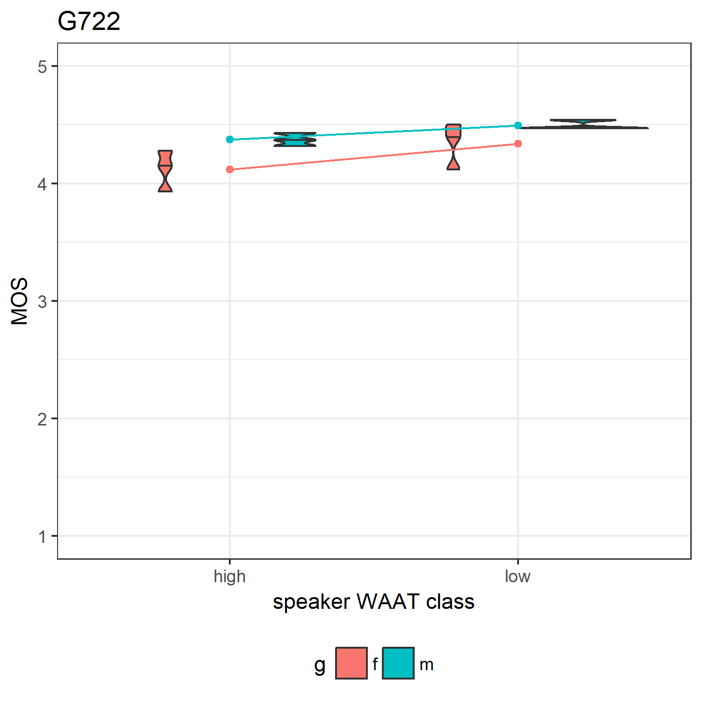
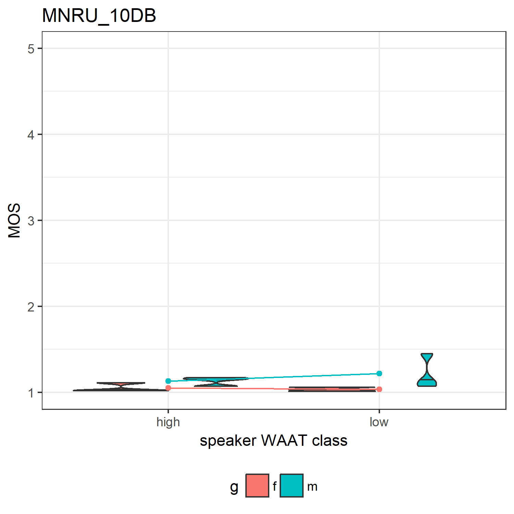
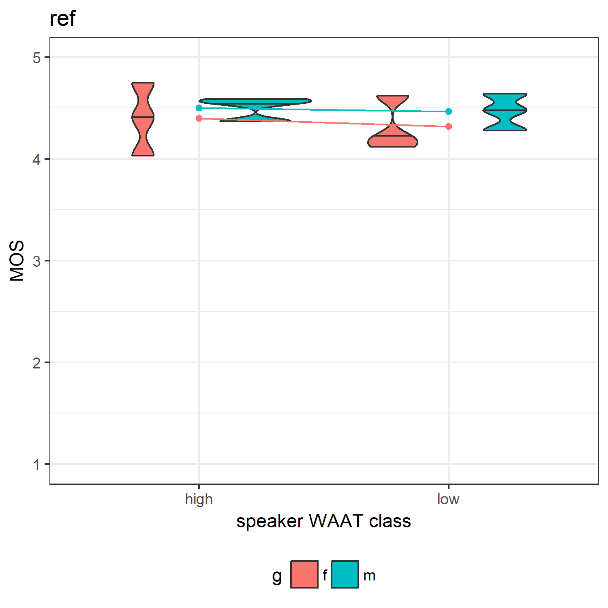

Effects of Speaker Likability on POLQA MOS
================
Laura Fernández Gallardo
December 2017

-   [Objectives](#objectives)
-   [Speech Material](#speech-material)
-   [POLQA MOS](#polqa-mos)
-   [Tables with MOS averaged](#tables-with-mos-averaged)
-   [Interaction plots](#interaction-plots)
-   [Two-way ANOVA](#two-way-anova)
-   [Two Sample T-Test](#two-sample-t-test)

### Objectives

We study the effects of speakers' warmth-attractiveness (WAAT) on transmitted speech quality given by POLQA (instrumental).

### Speech Material

-   12 speakers: 6 males (3 with high WAAT, 3 with low WAAT) and 6 females (3 with high WAAT, 3 with low WAAT)
-   Balanced content (8 sentences/speakers and no same wording so that the results are not dependent on one sentence)

-   Degradations:
-   downs8 + IRS + sv56 + c712 + G.711(at)64 + sv56
-   downs8 + IRS + sv56 + c712 + AMR-NB(at)4.65 + sv56
-   downs16 + HP135 + sv56 + P341 + G.722(at)64 + sv56
-   downs16 + HP135 + sv56 + P341 + AMR-WB(at)6.6 + sv56
-   downs32 + 14KBP + sv56 + SWV\_EVS(at)16.4 + sv56
-   MNRU 10 dB + sv56
-   NB filtering 900 - 2500 Hz + sv56
-   reference (48 kHz) + sv56

-   In the listening test: 8\*12 = 96 stimuli in total
-   mean length of the all selected 96 files: 8.7 s, sd = 1.1 s, min = 5.5 s, max = 12.0 s

-   POLQA model, applied (by Gabriel Mittag)

### POLQA MOS

Gabriel Mittag applied POLQAv2 with SQuadAnalyzer v.2.4.2.7 in SWB mode to the same speech files of the MOS test described before. To apply POLQA, two or more sentences are recommended, with a minimum amount of active speech in each file of 3 s, indicated in ITU-T Rec. P.863, Section 8.1.2. Our speech files meet these requirements.

The instrumental quality estimation with the intrusive POLQA model involves the use of a reference file without any degradation. We employed the unprocessed audio samples ("Reference" condition) sampled at 48 kHz. These files were band-pass filtered to 50-14,000 Hz, and level-equalized to 26 dBov.

The pre-processing applied to the degraded involved band-pass-filtering with the P.341 filter, resampling to 48 kHz, and level-equalizing as indicated before. Requirements regarding pre-processing of reference and of degraded files for POLQA can be found in ITU-T Rec. P.863, Sections 8.1 and 8.3.

``` r
# speech degradations
degradations = c('G711','AMRNB','G722','AMRWB','EVS','filtered','MNRU','ref','BP900_2500','MNRU_10DB')  

# load POLQA predictions
polqa_raw <- read.csv(text=getURL(paste0(path_github1,"/polqa_lik_results.csv")), header=TRUE, sep=";")  
names(polqa_raw) <- c( "reference" , "distorted" ,  "MOS")

## manipulate to add distortion and speaker scores and speaker class

pos = gregexpr('_', polqa_raw$reference)

for (i in 1:nrow(polqa_raw)){
  polqa_raw$spk_pseudonym[i] <- stri_sub(polqa_raw$reference[i], pos[[i]][1]+1,pos[[i]][2]-1)
}

polqa_raw$speaker <- substr(polqa_raw$reference,2,4)
polqa_raw$distortion <- 'ref'

for (i in 1:length(degradations)){
  pos_deg = grep(degradations[i] , polqa_raw$distorted) 
  polqa_raw$distortion[pos_deg]=degradations[i]
}


# From all POLQA scores, take only the stimuli used in the subjective experiment

finaltable_test <- read.csv(text=getURL(paste0(path_github1,"/finaltable_test.csv"))) # 96 stimui

# correcting spk helsinki 
finaltable_test$sentence<- as.character(finaltable_test$sentence)
finaltable_test$sentence[51] <- '3a'


polqa<-data.frame()

for (i in 1:nrow(finaltable_test)){
  
  pos_spk = grep(finaltable_test$speaker[i], polqa_raw$distorted) 
  pos_sent = grep(finaltable_test$sentence[i], polqa_raw$distorted) 
  pos_deg = grep(finaltable_test$degradation[i], polqa_raw$distortion)
  
  ii = intersect(intersect(pos_spk,pos_sent),pos_deg)
  
  # checking that speech file was tested with polqa
  if (length(ii)==0)    print(paste0('no intersection!!: i=',i))
  
  polqa <- rbind(polqa,polqa_raw[ii,]) # 96 observations
}

# convert to numeric values and factor values
polqa$MOS <- as.numeric(as.character(polqa$MOS))
polqa$distortion <- as.factor(polqa$distortion)   # levels(polqa$distortion)

# add speakers' WAAT info (class)
spk_class<- read.csv(text=getURL(paste0(path_github2,"/spk_class.csv"))) 


spk_class$speaker <-  str_pad(spk_class$speaker, 3, pad = "0")
polqa <- merge(spk_class, polqa)

# write.csv(polqa,paste0(path_R,'/MOS_POLQA.RData'))
```

### Tables with MOS averaged

No strong/consistent effects can be seen in this table. To be compared to the table generated with the results of the MOS listening test.

``` r
# aggregate MOS across speaker of same gender and WAAT class

polqa_agg <- group.CI(MOS~distortion+spk_gender+class, polqa, ci = 0.95)

mean_MOS <- dcast(polqa_agg, distortion ~ class + spk_gender, value.var = "MOS.mean")

# sort from high to low MOS
mean_MOS$mean <- rowMeans(mean_MOS[,2:5])
mean_MOS <- mean_MOS[order(mean_MOS$mean, decreasing = T),]
rownames(mean_MOS) <- mean_MOS$distortion
mean_MOS <- mean_MOS[,-1]

# print table
options(digits=3)
# xtable(mean_MOS[,c(2,1,4,3,5)])
kable(mean_MOS[,c(1:4)])
```

|             |  high\_f|  high\_m|  low\_f|  low\_m|
|-------------|--------:|--------:|-------:|-------:|
| ref         |     4.40|     4.50|    4.32|    4.47|
| G722        |     4.12|     4.37|    4.34|    4.49|
| EVS         |     4.15|     4.41|    4.12|    4.52|
| G711        |     3.41|     3.18|    3.37|    3.18|
| AMRWB       |     2.64|     3.20|    2.58|    3.31|
| AMRNB       |     2.08|     2.42|    2.32|    2.54|
| BP900\_2500 |     1.95|     1.86|    1.66|    1.83|
| MNRU\_10DB  |     1.05|     1.13|    1.03|    1.22|

``` r
# write.csv(mean_MOS,paste0(path_R,'/mean_MOS_POLQA.RData'))


# generate figure for paper
polqa_agg <- within(polqa_agg,  condition <- paste(spk_gender, class, sep="_"))

# The errorbars overlapped, so use position_dodge to move them horizontally
pd <- position_dodge(0.4) # move them to the left and right

# ggplot without lines, with black error bars
ggplot(polqa_agg, aes(x=reorder(distortion, -MOS.mean), y=MOS.mean, shape = condition, group=condition)) + 
    geom_errorbar(aes(ymin=MOS.lower, ymax=MOS.upper), colour="black", width=.1, position=pd) +
    geom_point(position=pd, size=3) + 
    scale_y_continuous(breaks = seq(0,5,0.5), limits = c(0, 5.5)) +
    ylab('POLQA MOS') +
    xlab('degradation') +
    theme_bw() + 
    theme(text=element_text(family="Times New Roman", size=12), axis.text.x = element_text(angle = 30, hjust = 1), legend.position = "bottom", legend.title=element_blank())
```



``` r
## checking mean of high WAAT vs. mean of low WAAT

mean_high <- rowMeans(mean_MOS[,1:2])
mean_low <- rowMeans(mean_MOS[,3:4])

rbind(mean_high , mean_low)
```

    ##            ref G722  EVS G711 AMRWB AMRNB BP900_2500 MNRU_10DB
    ## mean_high 4.45 4.25 4.28 3.29  2.92  2.25       1.90      1.09
    ## mean_low  4.39 4.42 4.32 3.27  2.94  2.43       1.74      1.12

``` r
mean_high - mean_low
```

    ##        ref       G722        EVS       G711      AMRWB      AMRNB 
    ##     0.0583    -0.1700    -0.0383     0.0217    -0.0200    -0.1800 
    ## BP900_2500  MNRU_10DB 
    ##     0.1600    -0.0350

``` r
min(abs(mean_high - mean_low))
```

    ## [1] 0.02

``` r
max(abs(mean_high - mean_low))
```

    ## [1] 0.18

``` r
median(abs(mean_high - mean_low))
```

    ## [1] 0.0483

``` r
## checking mean of males vs. mean of females

mean_f <- rowMeans(mean_MOS[,c(1,3)])
mean_m <- rowMeans(mean_MOS[,c(2,4)])

rbind(mean_m , mean_f)
```

    ##         ref G722  EVS G711 AMRWB AMRNB BP900_2500 MNRU_10DB
    ## mean_m 4.48 4.43 4.46 3.18  3.25  2.48       1.85      1.17
    ## mean_f 4.36 4.23 4.14 3.39  2.61  2.20       1.80      1.04

``` r
mean_m - mean_f
```

    ##        ref       G722        EVS       G711      AMRWB      AMRNB 
    ##     0.1283     0.2033     0.3250    -0.2117     0.6467     0.2767 
    ## BP900_2500  MNRU_10DB 
    ##     0.0433     0.1317

``` r
max(mean_m - mean_f)
```

    ## [1] 0.647

### Interaction plots

For each distortion separately, create interaction plot:

-   view effects of:
-   speaker gender (g)
-   speakers' WAAT class (class)
-   interaction (g:class)
-   if lines are parallel: there is no interaction effect

``` r
# rename "spk_gender" to "g"
names(polqa)[names(polqa)=='spk_gender'] = 'g'

# split for different distortions
mydata.split <- split(polqa, polqa$distortion)

# aggregate data
lapply(mydata.split, function(x){
  
  mydata_agg <- aggregate(x$MOS, by = list(x$g, x$class), mean)
  names(mydata_agg)[1]<-'g'
  names(mydata_agg)[2]<-'class' 
  names(mydata_agg)[3]<-'mean_MOS' 
  
  plot_jpg <- ggplot(x, aes(x = factor(class), y = MOS, fill = g)) + 
    geom_violin(adjust = .5, draw_quantiles = c(0.5)) + 
    geom_point(data = mydata_agg, aes_string(y = "mean_MOS", group = "g", color = "g")) + 
    geom_line(data = mydata_agg, aes_string(y = "mean_MOS", group = "g", color = "g")) + 
    theme_bw() +
    xlab("speaker WAAT class") +
    ylab("MOS") +  
    ggtitle(x$distortion) +
    scale_y_continuous(limits = c(1, 5)) +
    theme(legend.position = "bottom")
  
  #jpeg(paste0(path_figures,"/POLQA_violin_interaction_",x$distortion[1],".jpg"), family="Times") 
  #print(plot_jpg)
  #dev.off()

})
```

    ## $AMRNB



    ## 
    ## $AMRWB



    ## 
    ## $BP900_2500



    ## 
    ## $EVS



    ## 
    ## $G711



    ## 
    ## $G722



    ## 
    ## $MNRU_10DB



    ## 
    ## $ref



### Two-way ANOVA

For each distortion separately, we perform 2-way repeated measures, to test the effects of: speaker gender (g), speakers' WAAT class (class), and interaction (g:class)

``` r
# rename "speaker_gender" to "g"
names(polqa)[names(polqa)=='spk_gender'] = 'g'

# split for different distortions
polqa.split <- split(polqa, polqa$distortion)

res <- lapply(polqa.split, function(x){
  
  print(x$distortion[1], max.levels=0)
  
  #Shapiro-Wilk normality tests by spk_gender
  cat("Normality p-values by Factor spk_gender: ")
  for (i in unique(factor(x$g))){
    cat(shapiro.test(x[x$g==i, ]$MOS)$p.value," \n")
  }
  
  #Shapiro-Wilk normality tests by class
  cat("Normality p-values by Factor class: ")
  for (i in unique(factor(x$class))){
    cat(shapiro.test(x[x$class==i, ]$MOS)$p.value," \n")
  }
  
  # p-values > 0.05 -> "cannot reject the null hypothesis: that the sample comes from a population which has a normal distribution"
  
  
  #Variance tests for spk_gender and class factors
  bt_g <- bartlett.test(MOS~g,data = x)
  bt_c <- bartlett.test(MOS~class,data = x)
  
  print(paste0('bartlett.test gender: ',bt_g$p.value))
  print(paste0('bartlett.test class: ',bt_c$p.value))
  
  # p-values > 0.05 -> "cannot reject the null hypothesis: that the variance is the same"
  
  # build linear model: two indeoendent variables and interactions
  model.lm<- lm(MOS ~ g + class + g*class , x )
  # summary(model.lm)
  
  #Running and summarizing a general ANOVA on the linear model
  anova.res <- anova(model.lm)
  
})
```

    ## [1] AMRNB
    ## Normality p-values by Factor spk_gender: 0.402  
    ## 0.016  
    ## Normality p-values by Factor class: 0.0882  
    ## 0.188  
    ## [1] "bartlett.test gender: 0.699637981376126"
    ## [1] "bartlett.test class: 0.845248728229511"
    ## [1] AMRWB
    ## Normality p-values by Factor spk_gender: 0.16  
    ## 0.354  
    ## Normality p-values by Factor class: 0.452  
    ## 0.671  
    ## [1] "bartlett.test gender: 0.901327592758942"
    ## [1] "bartlett.test class: 0.577210752127167"
    ## [1] BP900_2500
    ## Normality p-values by Factor spk_gender: 0.00328  
    ## 0.873  
    ## Normality p-values by Factor class: 0.163  
    ## 0.032  
    ## [1] "bartlett.test gender: 0.00668152540116683"
    ## [1] "bartlett.test class: 0.00694379094879753"
    ## [1] EVS
    ## Normality p-values by Factor spk_gender: 0.511  
    ## 0.902  
    ## Normality p-values by Factor class: 0.398  
    ## 0.32  
    ## [1] "bartlett.test gender: 0.310948659121948"
    ## [1] "bartlett.test class: 0.275225964412948"
    ## [1] G711
    ## Normality p-values by Factor spk_gender: 0.249  
    ## 0.996  
    ## Normality p-values by Factor class: 0.711  
    ## 0.244  
    ## [1] "bartlett.test gender: 0.668844367181835"
    ## [1] "bartlett.test class: 0.793118015478218"
    ## [1] G722
    ## Normality p-values by Factor spk_gender: 0.949  
    ## 0.88  
    ## Normality p-values by Factor class: 0.417  
    ## 0.028  
    ## [1] "bartlett.test gender: 0.0544617055858955"
    ## [1] "bartlett.test class: 0.709145138237342"
    ## [1] MNRU_10DB
    ## Normality p-values by Factor spk_gender: 0.096  
    ## 0.0196  
    ## Normality p-values by Factor class: 0.398  
    ## 0.00989  
    ## [1] "bartlett.test gender: 0.0116216198625009"
    ## [1] "bartlett.test class: 0.0599492111859912"
    ## [1] ref
    ## Normality p-values by Factor spk_gender: 0.642  
    ## 0.725  
    ## Normality p-values by Factor class: 0.73  
    ## 0.409  
    ## [1] "bartlett.test gender: 0.132644785834965"
    ## [1] "bartlett.test class: 0.804292281833105"

``` r
res
```

    ## $AMRNB
    ## Analysis of Variance Table
    ## 
    ## Response: MOS
    ##           Df Sum Sq Mean Sq F value Pr(>F)  
    ## g          1  0.230  0.2296    5.65  0.045 *
    ## class      1  0.097  0.0972    2.39  0.161  
    ## g:class    1  0.012  0.0120    0.30  0.601  
    ## Residuals  8  0.325  0.0407                 
    ## ---
    ## Signif. codes:  0 '***' 0.001 '**' 0.01 '*' 0.05 '.' 0.1 ' ' 1
    ## 
    ## $AMRWB
    ## Analysis of Variance Table
    ## 
    ## Response: MOS
    ##           Df Sum Sq Mean Sq F value Pr(>F)   
    ## g          1  1.255   1.255   15.27 0.0045 **
    ## class      1  0.001   0.001    0.01 0.9068   
    ## g:class    1  0.021   0.021    0.25 0.6281   
    ## Residuals  8  0.657   0.082                  
    ## ---
    ## Signif. codes:  0 '***' 0.001 '**' 0.01 '*' 0.05 '.' 0.1 ' ' 1
    ## 
    ## $BP900_2500
    ## Analysis of Variance Table
    ## 
    ## Response: MOS
    ##           Df Sum Sq Mean Sq F value Pr(>F)
    ## g          1  0.006  0.0056    0.08   0.78
    ## class      1  0.077  0.0768    1.14   0.32
    ## g:class    1  0.051  0.0507    0.76   0.41
    ## Residuals  8  0.537  0.0671               
    ## 
    ## $EVS
    ## Analysis of Variance Table
    ## 
    ## Response: MOS
    ##           Df Sum Sq Mean Sq F value Pr(>F)   
    ## g          1  0.317   0.317   11.47 0.0095 **
    ## class      1  0.004   0.004    0.16 0.7000   
    ## g:class    1  0.014   0.014    0.51 0.4966   
    ## Residuals  8  0.221   0.028                  
    ## ---
    ## Signif. codes:  0 '***' 0.001 '**' 0.01 '*' 0.05 '.' 0.1 ' ' 1
    ## 
    ## $G711
    ## Analysis of Variance Table
    ## 
    ## Response: MOS
    ##           Df Sum Sq Mean Sq F value Pr(>F)  
    ## g          1 0.1344  0.1344    5.93  0.041 *
    ## class      1 0.0014  0.0014    0.06  0.809  
    ## g:class    1 0.0014  0.0014    0.06  0.809  
    ## Residuals  8 0.1812  0.0226                 
    ## ---
    ## Signif. codes:  0 '***' 0.001 '**' 0.01 '*' 0.05 '.' 0.1 ' ' 1
    ## 
    ## $G722
    ## Analysis of Variance Table
    ## 
    ## Response: MOS
    ##           Df Sum Sq Mean Sq F value Pr(>F)  
    ## g          1 0.1240  0.1240    6.64  0.033 *
    ## class      1 0.0867  0.0867    4.64  0.063 .
    ## g:class    1 0.0075  0.0075    0.40  0.544  
    ## Residuals  8 0.1495  0.0187                 
    ## ---
    ## Signif. codes:  0 '***' 0.001 '**' 0.01 '*' 0.05 '.' 0.1 ' ' 1
    ## 
    ## $MNRU_10DB
    ## Analysis of Variance Table
    ## 
    ## Response: MOS
    ##           Df Sum Sq Mean Sq F value Pr(>F)  
    ## g          1 0.0520  0.0520    4.35  0.071 .
    ## class      1 0.0037  0.0037    0.31  0.595  
    ## g:class    1 0.0080  0.0080    0.67  0.437  
    ## Residuals  8 0.0957  0.0120                 
    ## ---
    ## Signif. codes:  0 '***' 0.001 '**' 0.01 '*' 0.05 '.' 0.1 ' ' 1
    ## 
    ## $ref
    ## Analysis of Variance Table
    ## 
    ## Response: MOS
    ##           Df Sum Sq Mean Sq F value Pr(>F)
    ## g          1  0.049  0.0494    0.80   0.40
    ## class      1  0.010  0.0102    0.17   0.69
    ## g:class    1  0.001  0.0014    0.02   0.88
    ## Residuals  8  0.494  0.0618

Summary:

-   AMRNB: assumption not met (normality in gender). sig effect of gender \*
-   AMRWB: sig effect of gender \*\*
-   BP900\_2500: assumptions not met (normality in gender and bartlet tests). no effect found
-   EVS: sig effect of gender \*\*
-   G711: sig effect of gender \*
-   G722: assumption not met (normality in class not met). sig effect of gender \*
-   MNRU\_10DB: assumption not met (normality in gender, bartlet test gender). no effect found
-   ref: no effect found

Only gender effects are found. No class effects, no interaction effects. Significant gender effects (p&lt;0.01) for: AMR-WB and EVS. Weaker effects for other distortions.

Two Sample T-Test
-----------------

For the 8 channel conditions separately, we perform the Two-sample T-Test to test:

1.  effects of WAAT on POLQA MOS,

``` r
 # example: x <- polqa.split$BP900_2500

res <- lapply(polqa.split, function(x){

x1 = x[x$class=='high', ]$MOS
x2 = x[x$class=='low', ]$MOS


# test for normality
# Not needed: "The t-test for independent means is considered typically "robust" for violations of normal distribution"
#if (shapiro.test(x1)$p.value > 0.05 & shapiro.test(x2)$p.value > 0.05 ){

  # test for homogeneity of variance, else var.equal=F (the Welch (or Satterthwaite) approximation to the degrees of freedom is used.)
  
  if (bartlett.test(MOS~class,data = x)$p.value > 0.05 ){
    
    cat(as.character(x$distortion[1]),' -> p value = ', t.test(x1,x2, var.equal=T)$p.value,'\n')

  }else{
    
    cat(as.character(x$distortion[1]),' -> Welch, p value = ', t.test(x1,x2, var.equal=F)$p.value,'\n')
    
  }
    
#}else{
  #cat(as.character(x$distortion[1]), ' - Data not normal \n')
#}


})
```

    ## AMRNB  -> p value =  0.22 
    ## AMRWB  -> p value =  0.939 
    ## BP900_2500  -> Welch, p value =  0.302 
    ## EVS  -> p value =  0.783 
    ## G711  -> p value =  0.837 
    ## G722  -> p value =  0.11 
    ## MNRU_10DB  -> p value =  0.638 
    ## ref  -> p value =  0.674

and 2) effects of gender on POLQA MOS

``` r
 # example: x <- polqa.split$BP900_2500

res <- lapply(polqa.split, function(x){

x1 = x[x$g=='m', ]$MOS
x2 = x[x$g=='f', ]$MOS

  # test for homogeneity of variance, else var.equal=F (the Welch (or Satterthwaite) approximation to the degrees of freedom is used.)
  
  if (bartlett.test(MOS~g,data = x)$p.value > 0.05 ){
    
    cat(as.character(x$distortion[1]),' -> p value = ', t.test(x1,x2, var.equal=T)$p.value,'\n')

  }else{
    
    cat(as.character(x$distortion[1]),' -> Welch, p value = ', t.test(x1,x2, var.equal=F)$p.value,'\n')
    
  }

})
```

    ## AMRNB  -> p value =  0.0443 
    ## AMRWB  -> p value =  0.00157 
    ## BP900_2500  -> Welch, p value =  0.782 
    ## EVS  -> p value =  0.00455 
    ## G711  -> p value =  0.0222 
    ## G722  -> p value =  0.0477 
    ## MNRU_10DB  -> Welch, p value =  0.0724 
    ## ref  -> p value =  0.346
