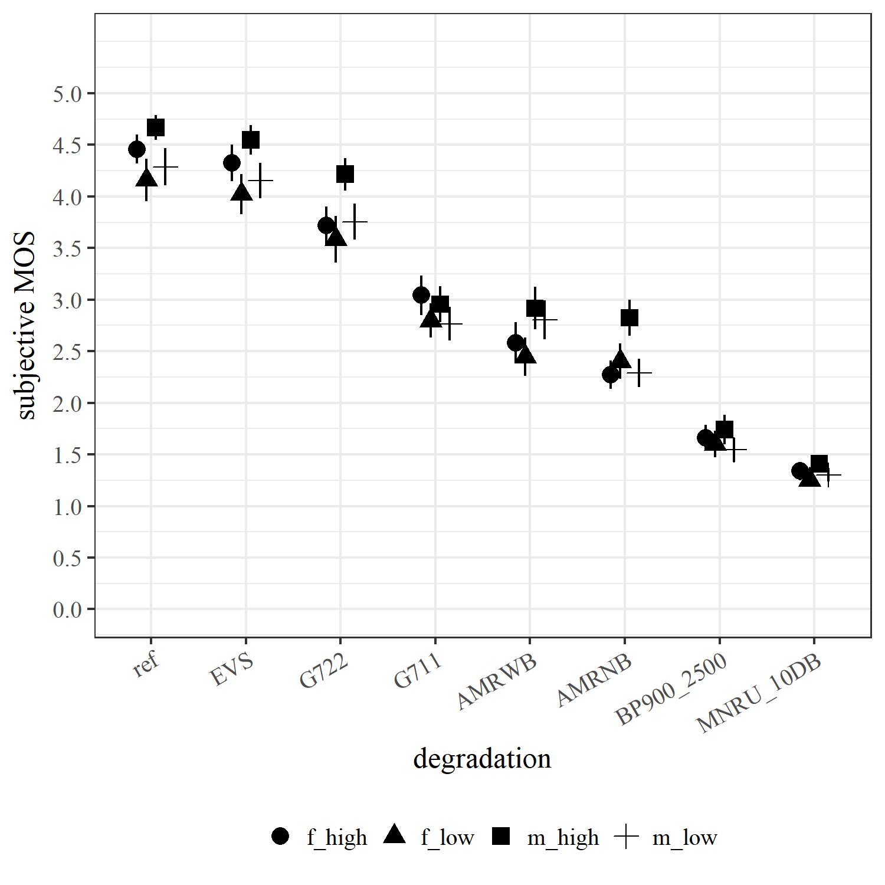
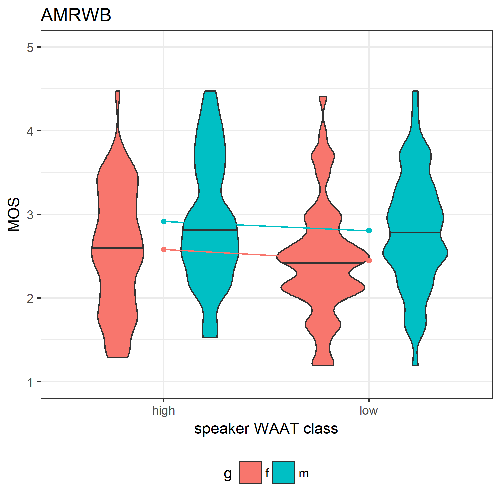
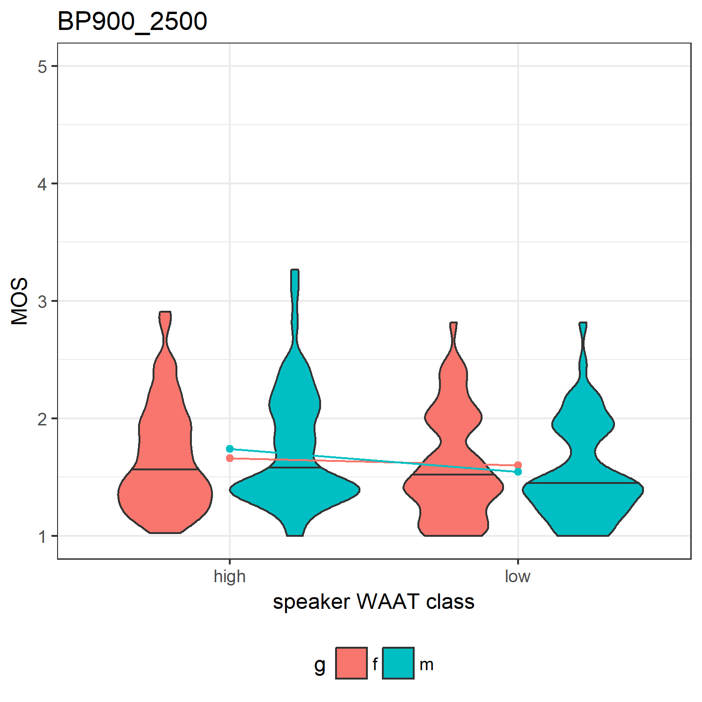
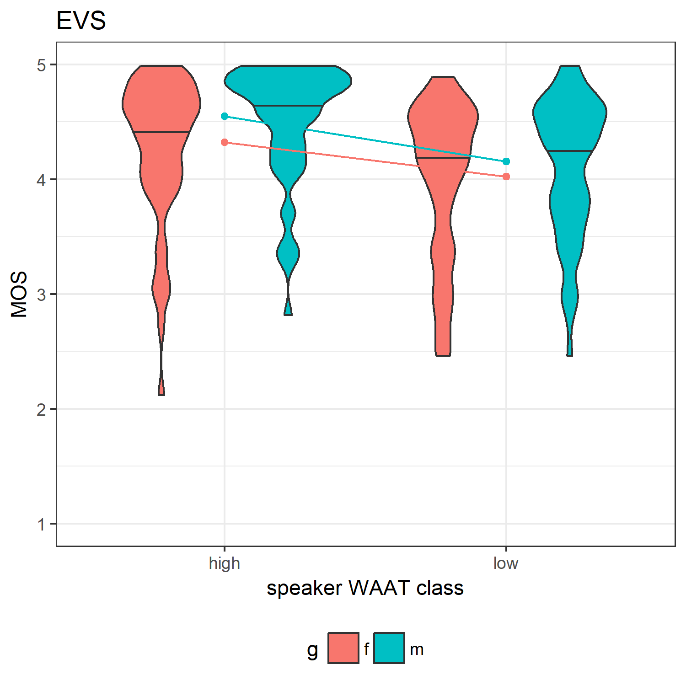
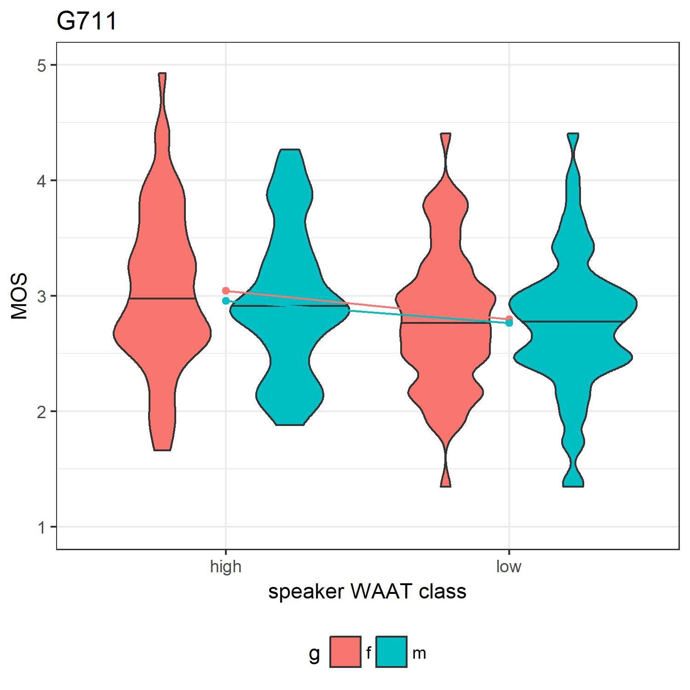
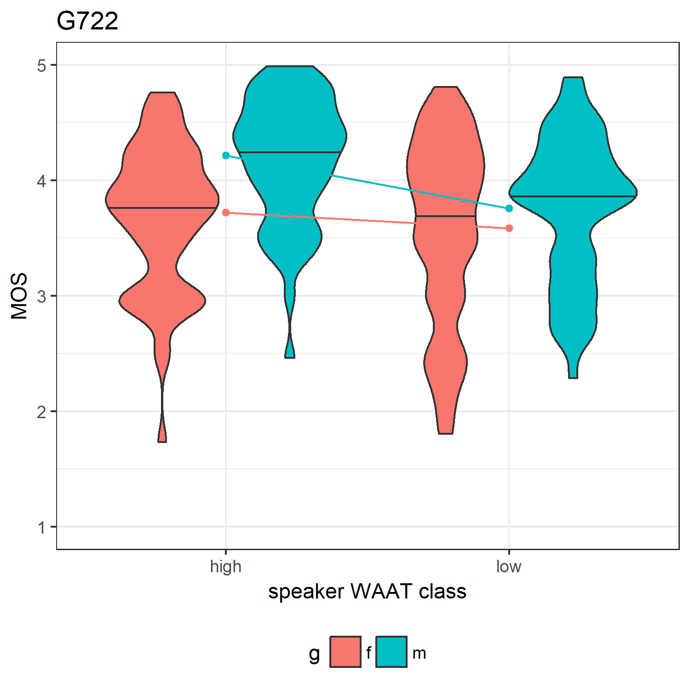
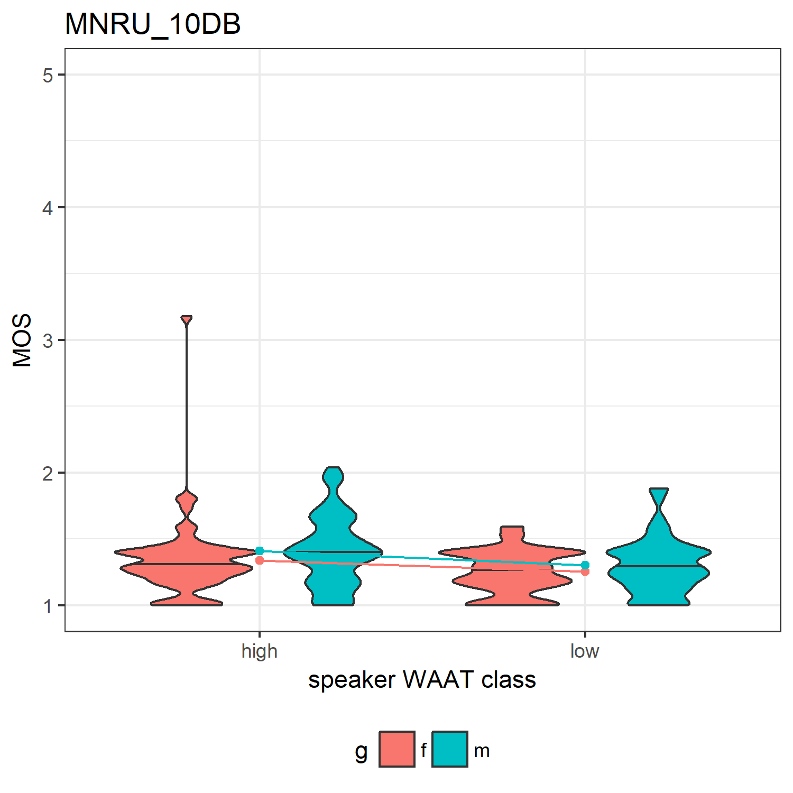
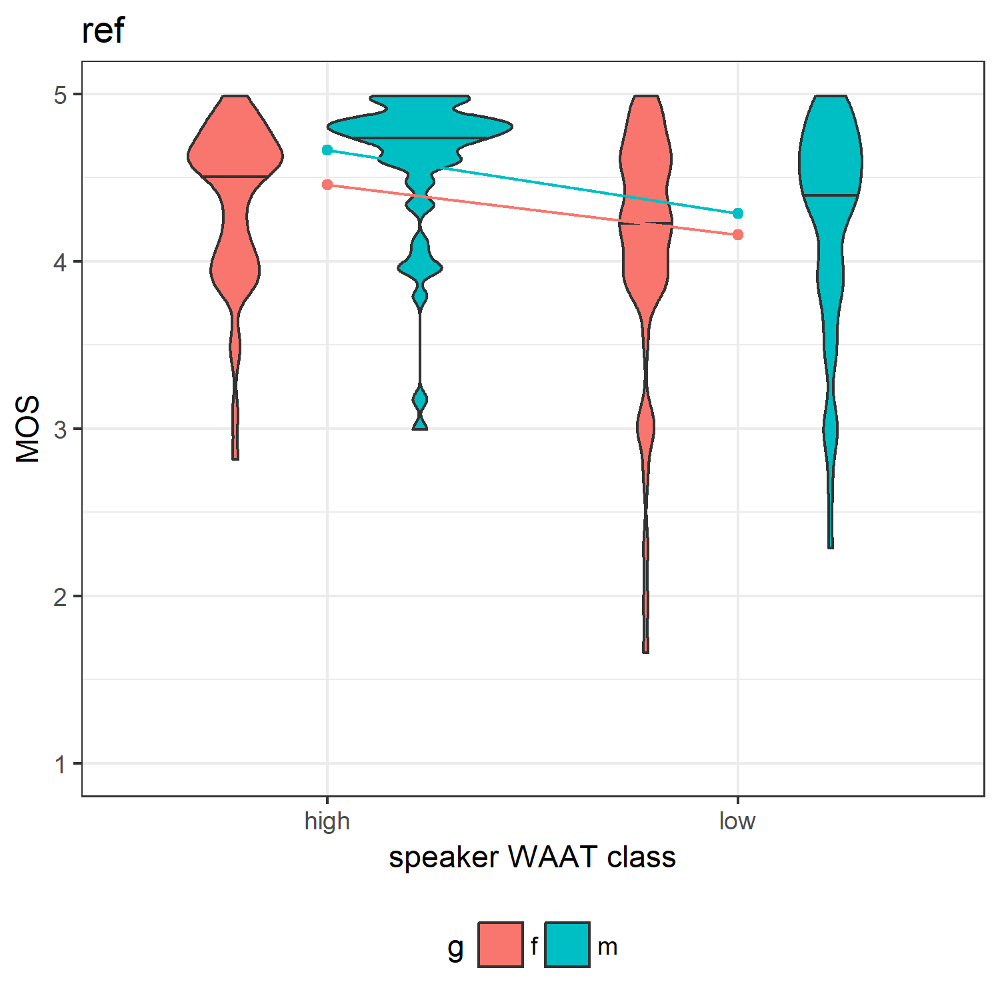

Effects of Speaker Likability on Subjetive MOS
================
Laura Fernández Gallardo
December 2017

-   [Objectives](#objectives)
-   [Speech Material](#speech-material)
-   [Listening test](#listening-test)
-   [Tables with MOS averaged](#tables-with-mos-averaged)
-   [Interaction plots](#interaction-plots)
-   [Two-way ANOVA](#two-way-anova)

### Objectives

Subjective MOS test to study the effects of speakers' warmth-attractiveness (WAAT) on perceived transmitted speech quality.

In particular, we examine whether there is a correspondence between more likable voices and higher MOS, for the same speech degradation. We attempt to highlight the importance of speaker selection for MOS tests with respect to the speakers' vocal attractiveness. To this end, 12 German speakers with extremely high or low warmth-attractiveness (WAAT, which can be seen as voice likability) were selected from the Nautilus Speaker Characterization (NSC) Corpus. We then performed a subjective speech quality assessment test with native German test participants. Finally, we applied POLQA to the same files used in the test to obtain the instrumental speech quality measures (see "polqa\_WAAT\_MOS").

### Speech Material

-   12 speakers: 6 males (3 with high WAAT, 3 with low WAAT) and 6 females (3 with high WAAT, 3 with low WAAT)
-   Balanced content (8 sentences/speakers and no same wording so that the results are not dependent on one sentence)

-   Degradations:
-   downs8 + IRS + sv56 + c712 + G.711(at)64 + sv56
-   downs8 + IRS + sv56 + c712 + AMR-NB(at)4.65 + sv56
-   downs16 + HP135 + sv56 + P341 + G.722(at)64 + sv56
-   downs16 + HP135 + sv56 + P341 + AMR-WB(at)6.6 + sv56
-   downs32 + 14KBP + sv56 + SWV\_EVS(at)16.4 + sv56
-   MNRU 10 dB + sv56
-   NB filtering 900 - 2500 Hz + sv56
-   reference (48 kHz) + sv56

-   Total: 8\*12 = 96 stimuli (played randomly)
-   mean length of the all selected 96 files: 8.7 s, sd = 1.1 s, min = 5.5 s, max = 12.0 s

### Listening test

``` r
# speech degradations
degradations = c('G711','AMRNB','G722','AMRWB','EVS','filtered','MNRU','ref','BP900_2500','MNRU_10DB')  

# load raw answers
mydata <- read.csv(text=getURL(paste0(path_github,"/MOS_Lik.csv")), header=TRUE, sep=";")  
mydata$MOS <- as.numeric(as.matrix(mydata$MOS))

# extract listener and stimulus information
mydata$listener <- substr(mydata$Participant,1,2)
mydata$listener_gender <- substr(mydata$Participant,4,4)
mydata$listener_age <- substr(mydata$Participant,6,7)

mydata$speaker <- substr(mydata$Filename,2,4)
mydata$speaker_gender <- substr(mydata$Filename,1,1)
# replacing female character from w (German) to f (English)
mydata$speaker_gender <- gsub('w', 'f', mydata$speaker_gender)

mydata$distortion='ref'
for (i in 1:length(degradations)){
  pos_deg = grep(degradations[i] , mydata$Filename) 
  mydata$distortion[pos_deg]=degradations[i]
}

# add speakers' WAAT info (class)
spk_class <- read.csv(text=getURL(paste0(path_github,"/spk_class.csv")))
spk_class$speaker <-  str_pad(spk_class$speaker, 3, pad = "0")
mydata <- merge(spk_class[,c(2,3)], mydata)

# get listeners' info
nstimuli = 96
table(mydata$listener_gender)/nstimuli
```

    ## 
    ##  m  w 
    ## 10 10

``` r
summary(as.numeric(mydata$listener_age))
```

    ##    Min. 1st Qu.  Median    Mean 3rd Qu.    Max. 
    ##   19.00   23.00   27.00   26.35   29.00   34.00

``` r
# save these data
write.csv(mydata, "../../data/generated_data/subjective_MOS.csv", row.names = F)
```

A group of 20 (10m, 10f) non-experts normal hearing listeners participated, aged 26.4 years on average (range: 19-34). Their mother tongue was German.

### Tables with MOS averaged

``` r
# aggregate (mean across listeners and speakers) and reshape

mydata_agg <- group.CI(MOS~distortion+speaker_gender+class, mydata, ci = 0.95)

mean_MOS <- dcast(mydata_agg , distortion ~ class + speaker_gender, value.var = "MOS.mean")

# sort from high to low MOS
mean_MOS$mean <- rowMeans(mean_MOS[,2:5])
mean_MOS <- mean_MOS[order(mean_MOS$mean, decreasing = T),]
rownames(mean_MOS) <- mean_MOS$distortion
mean_MOS <- mean_MOS[,-1]

# print table
options(digits=2)
# xtable(mean_MOS)
kable(mean_MOS[,c(1:4)])
```

|             |  high\_f|  high\_m|  low\_f|  low\_m|
|-------------|--------:|--------:|-------:|-------:|
| ref         |      4.5|      4.7|     4.2|     4.3|
| EVS         |      4.3|      4.5|     4.0|     4.2|
| G722        |      3.7|      4.2|     3.6|     3.8|
| G711        |      3.0|      3.0|     2.8|     2.8|
| AMRWB       |      2.6|      2.9|     2.4|     2.8|
| AMRNB       |      2.3|      2.8|     2.4|     2.3|
| BP900\_2500 |      1.7|      1.7|     1.6|     1.5|
| MNRU\_10DB  |      1.3|      1.4|     1.2|     1.3|

``` r
# write.csv(mean_MOS,paste0(path_data,"../../data/generated_data/mean_MOS_subjective.csv"))

# generate figure for paper
mydata_agg <- within(mydata_agg,  condition <- paste(speaker_gender, class, sep="_"))

# The errorbars overlapped, so use position_dodge to move them horizontally
pd <- position_dodge(0.4) # move them to the left and right

# ggplot without lines, with black error bars
ggplot(mydata_agg, aes(x=reorder(distortion, -MOS.mean), y=MOS.mean, shape = condition, group=condition)) + 
    geom_errorbar(aes(ymin=MOS.lower, ymax=MOS.upper), colour="black", width=.1, position=pd) +
    geom_point(position=pd, size=3) + 
    scale_y_continuous(breaks = seq(0,5,0.5), limits = c(0, 5.5)) +
    ylab('subjective MOS') +
    xlab('degradation') +
    theme_bw() + 
    theme(text=element_text(family="Times New Roman", size=12), axis.text.x = element_text(angle = 30, hjust = 1), legend.position = "bottom", legend.title=element_blank())
```



``` r
## checking mean of high WAAT vs. mean of low WAAT

mean_high <- rowMeans(mean_MOS[,1:2])
mean_low <- rowMeans(mean_MOS[,3:4])

rbind(mean_high , mean_low)
```

    ##           ref EVS G722 G711 AMRWB AMRNB BP900_2500 MNRU_10DB
    ## mean_high 4.6 4.4  4.0  3.0   2.7   2.5        1.7       1.4
    ## mean_low  4.2 4.1  3.7  2.8   2.6   2.3        1.6       1.3

``` r
mean_high - mean_low
```

    ##        ref        EVS       G722       G711      AMRWB      AMRNB 
    ##      0.339      0.348      0.298      0.218      0.122      0.200 
    ## BP900_2500  MNRU_10DB 
    ##      0.128      0.095

``` r
min(mean_high - mean_low)
```

    ## [1] 0.095

``` r
max(mean_high - mean_low)
```

    ## [1] 0.35

``` r
## checking mean of males vs. mean of females

mean_m <- rowMeans(mean_MOS[,c(1,3)])
mean_f <- rowMeans(mean_MOS[,c(2,4)])

rbind(mean_m , mean_f)
```

    ##        ref EVS G722 G711 AMRWB AMRNB BP900_2500 MNRU_10DB
    ## mean_m 4.3 4.2  3.7  2.9   2.5   2.3        1.6       1.3
    ## mean_f 4.5 4.4  4.0  2.9   2.9   2.6        1.6       1.4

``` r
mean_m - mean_f
```

    ##        ref        EVS       G722       G711      AMRWB      AMRNB 
    ##     -0.168     -0.178     -0.334      0.059     -0.348     -0.220 
    ## BP900_2500  MNRU_10DB 
    ##     -0.012     -0.060

``` r
max(mean_m - mean_f)
```

    ## [1] 0.059

### Interaction plots

For each distortion separately, create interaction plot:

-   view effects of:
-   speaker gender (g)
-   speakers' WAAT class (class)
-   interaction (g:class)
-   if lines are parallel: there is no interaction effect

``` r
# rename "speaker_gender" to "g"
names(mydata)[names(mydata)=='speaker_gender'] = 'g'

# split for different distortions
mydata.split <- split(mydata, mydata$distortion)

# aggregate data
lapply(mydata.split, function(x){
  
  mydata_agg <- aggregate(x$MOS, by = list(x$g, x$class), mean)
  names(mydata_agg)[1]<-'g'
  names(mydata_agg)[2]<-'class' 
  names(mydata_agg)[3]<-'mean_MOS' 
  
  plot_jpg <- ggplot(x, aes(x = factor(class), y = MOS, fill = g)) + 
    geom_violin(adjust = .5, draw_quantiles = c(0.5)) + 
    geom_point(data = mydata_agg, aes_string(y = "mean_MOS", group = "g", color = "g")) + 
    geom_line(data = mydata_agg, aes_string(y = "mean_MOS", group = "g", color = "g")) + 
    theme_bw() +
    xlab("speaker WAAT class") +
    ylab("MOS") +  
    ggtitle(x$distortion) +
    scale_y_continuous(limits = c(1, 5)) +
    theme(legend.position = "bottom")
  
  #jpeg(paste0(path_figures,"/violin_interaction_",x$distortion[1],".jpg"), family="Times") 
  #print(plot_jpg)
  #dev.off()

})
```

    ## $AMRNB


    ## 
    ## $AMRWB



    ## 
    ## $BP900_2500



    ## 
    ## $EVS



    ## 
    ## $G711



    ## 
    ## $G722



    ## 
    ## $MNRU_10DB



    ## 
    ## $ref



We observe that:

-   AMR-NB: interaction effect: higher MOS for males compared to females, only for high WAAT. Low WAAT females get slightly better MOS compared to high WAAT.
-   G.711: lower MOS for low WAAT speakers. no gender effect. no interaction effect.

-   AMR-WB: slightly lower MOS for low WAAT speakers. higher MOS for males. no interaction effect.
-   G.722: interaction effect: higher MOS for males compared to females, only for high WAAT. Similar behaviour as for AMR-NB.

-   BP900 - 2500 and MNRU 10 DB: lower MOS for low WAAT speakers. no or small gender effect. no or small interaction effect.

-   EVS and ref: lower MOS for low WAAT speakers. higher MOS for males. no interaction effect.

### Two-way ANOVA

For each distortion separately, we perform 2-way repeated measures, to test the effects of: speaker gender (g), speakers' WAAT class (class), and interaction (g:class)

We use the package ez to compute ezANOVA: Bakeman, R. (2005). Recommended effect size statistics for repeated measures designs. Behavior Research Methods, 37 (3), 379-384.

``` r
res <- sapply(mydata.split, function(x){
  
  output <- ezANOVA(data=x,
                    dv=MOS,
                    wid=listener,
                    within=.(g, class),
                    type = 2)
  
})

res
```

    ## $AMRNB.ANOVA
    ##    Effect DFn DFd  F       p p<.05   ges
    ## 2       g   1  19 14 1.4e-03     * 0.066
    ## 3   class   1  19 19 3.4e-04     * 0.056
    ## 4 g:class   1  19 30 2.9e-05     * 0.139
    ## 
    ## $AMRWB.ANOVA
    ##    Effect DFn DFd      F       p p<.05     ges
    ## 2       g   1  19 36.061 8.9e-06     * 8.7e-02
    ## 3   class   1  19  4.321 5.1e-02       1.2e-02
    ## 4 g:class   1  19  0.042 8.4e-01       8.2e-05
    ## 
    ## $BP900_2500.ANOVA
    ##    Effect DFn DFd   F     p p<.05     ges
    ## 2       g   1  19 0.2 0.656       0.00028
    ## 3   class   1  19 8.5 0.009     * 0.03134
    ## 4 g:class   1  19 2.8 0.108       0.00896
    ## 
    ## $EVS.ANOVA
    ##    Effect DFn DFd     F       p p<.05    ges
    ## 2       g   1  19 10.75 0.00395     * 0.0317
    ## 3   class   1  19 21.57 0.00018     * 0.1106
    ## 4 g:class   1  19  0.53 0.47367       0.0022
    ## 
    ## $G711.ANOVA
    ##    Effect DFn DFd    F      p p<.05     ges
    ## 2       g   1  19 0.68 0.4211       0.00382
    ## 3   class   1  19 9.02 0.0073     * 0.04986
    ## 4 g:class   1  19 0.16 0.6960       0.00077
    ## 
    ## $G722.ANOVA
    ##    Effect DFn DFd    F       p p<.05   ges
    ## 2       g   1  19 25.0 7.9e-05     * 0.108
    ## 3   class   1  19 25.9 6.5e-05     * 0.088
    ## 4 g:class   1  19  4.8 4.0e-02     * 0.028
    ## 
    ## $MNRU_10DB.ANOVA
    ##    Effect DFn DFd     F       p p<.05     ges
    ## 2       g   1  19  7.32 0.01400     * 0.02786
    ## 3   class   1  19 17.75 0.00047     * 0.06676
    ## 4 g:class   1  19  0.18 0.67771       0.00092
    ## 
    ## $ref.ANOVA
    ##    Effect DFn DFd     F       p p<.05    ges
    ## 2       g   1  19  5.94 0.02477     * 0.0319
    ## 3   class   1  19 17.19 0.00055     * 0.1186
    ## 4 g:class   1  19  0.94 0.34514       0.0019

The effects observed in the interaction plots are confirmed with the ANOVA tests.

Significant effects (p&lt;0.01) of speaker WAAT (class) or interactions (g:class) are found for:

-   AMR-NB (g, class, g:class)
-   BP (class)
-   EVS (g, class)
-   G.711 (class)
-   G.722 (g, class)
-   MNRU (class)
-   ref (class)

Not found for:

-   AMR-WB (g)

Three main remarks can be made from these results:

1.  Consistently across our wide range of degradations, the test participants perceived higher (lower) quality when speakers' WAAT was also high (low). Averaging the MOS of each speaker gender across distortions, the difference in MOS ranges from 0.10 to 0.35, with median = 0.21. Presumably, the higher MOS ratings can be attributed to the fact that the listeners also detected higher voice likability in these samples. This result manifests the importance of speakers' warmth-attractiveness for subjective speech quality assessments.

2.  Averaging the MOS of each WAAT across distortions, male speech is always rated with higher quality than female speech, except for when the speech is transmitted through G.711 at 64.

3.  Interestingly, the effect of speaker WAAT is stronger than that of speaker gender, according to the F-values of our ANOVA significance tests. The effect of WAAT was significant for all degradations except for AMR-WB at 6.6, whereas the effect of gender was significant for fewer degradations.
