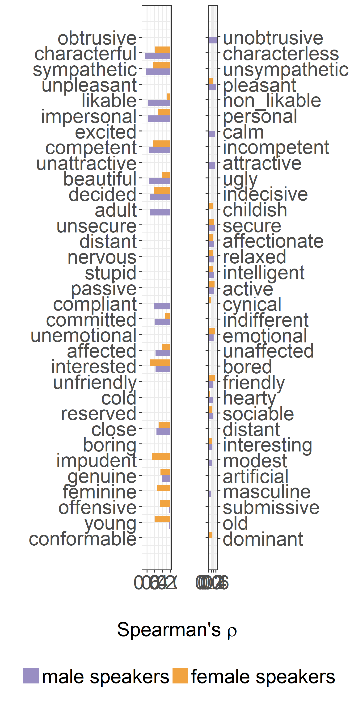

Correlations between MOS and speaker characteristics
================
Laura Fernández Gallardo
December 2017

-   [Objectives](#objectives)
-   [Load and arrage data](#load-and-arrage-data)
-   [Spearman correlations](#spearman-correlations)
    -   [Male speakers](#male-speakers)
    -   [Female speakers](#female-speakers)
    -   [Generate figure (barchart)](#generate-figure-barchart)
-   [Comments on these correlations](#comments-on-these-correlations)

``` r
# clear
rm(list=ls())

# needed libraries
library(ggplot2) 
library(grid) # for aligned plots (textGrob)
library(gridExtra) # for aligned plots
library(knitr) # for kable in rmd
library(reshape2) # for melt (wide to long format)
library(extrafont) # font in plot
library(Cairo) # for CairoPDF() , create pdf with fonts embeeded
```

Objectives
----------

The goal of this analysis is to evaluate the differences between the narrowband and wideband effects on the human impressions of speaker characteristics, related to perceived signal quality, which might also assist decisions in the communication channel design process.

We determine whether there are relationships between subjective speech quality (given in terms of mean opinion scores, MOS) and attributed characteristics to male and to female speakers. We should note that there were two different listener panels performing such subjective assessments.

Load and arrage data
--------------------

``` r
# aggregate data MOS per distortion, per speaker and pick only G711, G722

data.MOS.agg <- aggregate(data.MOS$MOS, by = list(data.MOS$speaker, data.MOS$distortion), mean)

# pick only G711, G722

data.MOS.agg.G <- rbind(data.MOS.agg[grep('G711',data.MOS.agg$Group.2),],
                        data.MOS.agg[grep('G722',data.MOS.agg$Group.2),])

names(data.MOS.agg.G) <- c('spk','bw','MOS')

# aggregate data SC per distortion, per speaker
mydata.agg <- aggregate(mydata[9:(9+33)], by = list(mydata$spk_ID, mydata$spk_gender, mydata$bw), mean)
names(mydata.agg)[1:3] <- c('spk','g','bw')
levels(mydata.agg$bw) <- c('G711','G722')

# merge both datasets (SC and MOS) (11 common speakers, 6m and 5f, in 2 bandwidths)
data.mergedSC <- merge(mydata.agg, data.MOS.agg.G)
```

Load translations of questionnaire items, for table output.

``` r
# load translations
ques <- read.csv(paste0("../../../data/subjective_ratings/SC_Questionnaire.csv"), header=T)
names(ques)[3]<-'item'
names(ques)[4]<-'left'
names(ques)[5]<-'right'
```

Spearman correlations
---------------------

For each SC item and speaker gender separately, Spearman rank correlations were performed between the MOS given to each of the speakers for each channel degradation and the corresponding ratings of each item averaged over listeners (the number of data points was \[number of speakers x 2 degradations x 2 score series\]). This resulted on the Spearman's *ρ* shown in the generated figure, accounting for monotonic correspondences of MOS with speaker characteristics.

Left and right adjectives of the 34-item SC semantic differential questionnaire are displayed, translated to English. For instance, MOS of male (female) speech correlate with *ρ* = 0.65 (*ρ* = 0.38) with *characterful*, which can also be seen as a correlation of *ρ* = −0.65 (*ρ* = −0.38) with *characterless*. It should be noted that SC items are sorted from highest to lowest *ρ* for male speakers, and that adjectives with positive or negative associations are not always located on the left or on the right side.

### Male speakers

``` r
## male speakers only

correl.SC_m <- sapply(names(data.mergedSC)[4:(4+33)], function(x){
  
  data_gender = data.mergedSC[data.mergedSC$g=='m',]
  
  cor(data_gender$MOS, data_gender[[x]], method = 'spearman')
  })

correl.SC_m <- as.data.frame(correl.SC_m)
correl.SC_m$item <- rownames(correl.SC_m)
rownames(correl.SC_m) <- NULL

correl.SC_m <-merge(correl.SC_m,ques[,c(3,4,5)])
 
 
#kable(correl.SC_m[order(abs(correl.SC_m$correl.SC_m), decreasing = T),], row.names = F)

kable(correl.SC_m[order(abs(correl.SC_m$correl.SC_m), decreasing = T),c(3,2,4)], row.names = F)
```

| left         |  correl.SC\_m| right         |
|:-------------|-------------:|:--------------|
| obtrusive    |     0.6713287| unobtrusive   |
| characterful |    -0.6503497| characterless |
| sympathetic  |    -0.6223776| unsympathetic |
| unpleasant   |     0.6013986| pleasant      |
| likable      |    -0.5804196| non\_likable  |
| impersonal   |    -0.5734266| personal      |
| unattractive |     0.5454545| attractive    |
| competent    |    -0.5454545| incompetent   |
| excited      |     0.5454545| calm          |
| beautiful    |    -0.5384615| ugly          |
| adult        |    -0.5174825| childish      |
| decided      |    -0.5174825| indecisive    |
| unsecure     |     0.5034965| secure        |
| distant      |     0.4693527| affectionate  |
| nervous      |     0.4475524| relaxed       |
| passive      |     0.4125874| active        |
| stupid       |     0.4125874| intelligent   |
| compliant    |    -0.4063054| cynical       |
| committed    |    -0.4055944| indifferent   |
| unemotional  |     0.3986014| emotional     |
| interested   |    -0.3776224| bored         |
| affected     |    -0.3776224| unaffected    |
| unfriendly   |     0.3706294| friendly      |
| cold         |     0.3636364| hearty        |
| close        |    -0.3566434| distant       |
| reserved     |     0.3566434| sociable      |
| boring       |     0.3076923| interesting   |
| impudent     |     0.2727273| modest        |
| genuine      |    -0.2097902| artificial    |
| feminine     |     0.1894749| masculine     |
| young        |    -0.0279720| old           |
| offensive    |    -0.0279720| submissive    |
| conformable  |    -0.0139860| dominant      |

### Female speakers

``` r
## female speakers only

correl.SC_w <- sapply(names(data.mergedSC)[4:(4+33)], function(x){
  
  data_gender = data.mergedSC[data.mergedSC$g=='w',]
  
  cor(data_gender$MOS, data_gender[[x]], method = 'spearman')
  })

correl.SC_w <- as.data.frame(correl.SC_w)
correl.SC_w$item <- rownames(correl.SC_w)
rownames(correl.SC_w) <- NULL

correl.SC_w <-merge(correl.SC_w,ques[,c(3,4,5)])
 
#kable(correl.SC_w[order(abs(correl.SC_w$correl.SC_w), decreasing = T),c(4,2)], row.names = F)


kable(correl.SC_w[order(abs(correl.SC_w$correl.SC_w), decreasing = T),], row.names = F)
```

| item            |  correl.SC\_w| left         | right         |
|:----------------|-------------:|:-------------|:--------------|
| freundlich      |     0.5272727| unfriendly   | friendly      |
| gelangweilt     |    -0.5151515| interested   | bored         |
| emotional       |     0.4909091| unemotional  | emotional     |
| aktiv           |     0.4787879| passive      | active        |
| bescheiden      |    -0.4666667| impudent     | modest        |
| inkompetent     |    -0.4545455| competent    | incompetent   |
| sicher          |     0.4545455| unsecure     | secure        |
| verstaendnislos |    -0.4424242| sympathetic  | unsympathetic |
| unentschieden   |    -0.4181818| decided      | indecisive    |
| alt             |    -0.4060606| young        | old           |
| charakterlos    |    -0.3818182| characterful | characterless |
| intelligent     |     0.3696970| stupid       | intelligent   |
| entspannt       |     0.3454545| nervous      | relaxed       |
| maennlich       |    -0.3454545| feminine     | masculine     |
| angenehm        |     0.3333333| unpleasant   | pleasant      |
| kindlich        |     0.3282690| adult        | childish      |
| mitfuehlend     |     0.3212121| distant      | affectionate  |
| dominant        |     0.3090909| conformable  | dominant      |
| gesellig        |     0.3090909| reserved     | sociable      |
| unsachlich      |    -0.3090909| impersonal   | personal      |
| distanziert     |    -0.2969697| close        | distant       |
| interessant     |     0.2727273| boring       | interesting   |
| gehorsam        |    -0.2606061| offensive    | submissive    |
| aufgesetzt      |    -0.2484848| genuine      | artificial    |
| haesslich       |    -0.2121212| beautiful    | ugly          |
| unaffektiert    |    -0.2121212| affected     | unaffected    |
| zynisch         |     0.2121212| compliant    | cynical       |
| gleichgueltig   |    -0.1337392| committed    | indifferent   |
| herzlich        |     0.0909091| cold         | hearty        |
| unsympathisch   |    -0.0787879| likable      | non\_likable  |
| attraktiv       |     0.0424242| unattractive | attractive    |
| ruhig           |     0.0303030| excited      | calm          |
| unaufdringlich  |    -0.0060606| obtrusive    | unobtrusive   |

### Generate figure (barchart)

Barchart to show correlations alog all items.

The figure generated by "Knit" does not have good formatting. See Figure in pdf.

``` r
# re-arrange data

df <- merge(correl.SC_m, correl.SC_w)
df <- df[order(abs(df$correl.SC_m)),]
names(df) <- c("right_German", "left", "right", "male speakers", "female speakers")

df_long <- melt(df)
```

    ## Using right_German, left, right as id variables

``` r
names(df_long) <- c("item_German", "left", "right", "gender", "r")


df_long$right <- factor(df_long$right, levels = df$right)
```

Plot only positive correlations, and display left and right questionnaire items.

``` r
# df_long <- df_long[order(abs(df_long$correl.SC_m)),]
# df_long$right <- factor(df_long$right, levels = df$right)

# plot left adjectives

#df_long.left <- df_long[df_long$r<0,]

 
df_long$left <- factor(df_long$left, levels = df$left)
 
plot_left <- ggplot(df_long, aes(y= -1*r, x = as.numeric(left), fill = factor(gender))) + 
  geom_bar(stat = "identity", width = 0.8 , position = position_dodge(width = 0.8) ) +
  scale_fill_manual(values=c("#998ec3", "#f1a340")) + 
  coord_flip() +
  scale_y_reverse( lim=c(0.7,0)) + 
  scale_x_continuous(breaks = 1:(length(df$left)), labels = df$left) +
  xlab('') + #xlab('Left adjectives (English)') +  
  ylab('') + 
  theme_bw() +
  theme(legend.title = element_blank(), legend.position = "bottom", text=element_text(size=25))


plot_right <- ggplot(df_long, aes(y= r, x = as.numeric(right), fill = factor(gender))) + 
  geom_bar(stat = "identity", width = 0.8 , position = position_dodge(width = 0.8) ) +
  scale_fill_manual(values=c("#998ec3", "#f1a340")) + 
  coord_flip() +
  scale_y_continuous( lim=c(0, 0.7)) + 
  
  scale_x_continuous(breaks = 1:(length(df$left)), labels = NULL,
                   sec.axis =  sec_axis(~., breaks = 1:(length(df$right)), labels = df$right) )  +
  xlab('') +
  ylab('') + 
  theme_bw()  +
  theme(legend.title = element_blank(), legend.position = "bottom", text=element_text(size=25))


#extract legend
#https://github.com/hadley/ggplot2/wiki/Share-a-legend-between-two-ggplot2-graphs
g_legend<-function(a.gplot){
  tmp <- ggplot_gtable(ggplot_build(a.gplot))
  leg <- which(sapply(tmp$grobs, function(x) x$name) == "guide-box")
  legend <- tmp$grobs[[leg]]
  return(legend)}

mylegend <- g_legend(plot_left)
```

    ## Warning: Removed 32 rows containing missing values (geom_bar).

``` r
# 
```

``` r
# save combined plot to pdf file

CairoPDF("correl_spearman_MOS_SC.pdf", family="Times", width=8, height=15) 
#png(paste0(path_figures,"/correl_spearman.png"), family="Times") 
grid.arrange(arrangeGrob(plot_left + theme(legend.position="none"),
                         plot_right + theme(legend.position="none"),
                         nrow=1, 
                         bottom = textGrob( expression(paste('Spearman\'s ', rho)),  gp = gpar(fontsize = 20) ) 
                         ),
             mylegend, nrow=2,heights=c(10, 1) )
```

    ## Warning: Removed 32 rows containing missing values (geom_bar).

    ## Warning: Removed 34 rows containing missing values (geom_bar).



``` r
# grid.arrange(plot_left, plot_right, ncol=2)
dev.off()
```

    ## png 
    ##   2

Comments on these correlations
------------------------------

For male speakers, relatively high correlations of MOS-SC were found for:

-   warmth (*ρ* = 0.67 for *unobtrusive*, *ρ* = 0.65 for *characterful*, *ρ* = 0.62 for *sympathetic*, *ρ* = 0.58 for *likable*),
-   attractiveness (*ρ* = 0.60 for *pleasant*, *ρ* = 0.55 for *attractive*, *ρ* = 0.54 for *beautiful*),
-   maturity and assertiveness (*ρ* = 0.57 for *impersonal/objective*, *ρ* = 0.55 for *competent*, *ρ* = 0.55 for *calm*, *ρ* = 0.52 for *adult*, *ρ* = 0.52 for *decided*, *ρ* = 0.50 for *secure*),

For female speakers, high perceived speech quality seems to contribute to higher perceived:

-   warmth (*ρ* = 0.53 for *friendly*, *ρ* = 0.44 for *sympathetic*, *ρ* = 0.38 for *characterful*),
-   enthusiasm and youth (*ρ* = 0.52 for *interested*, *ρ* = 0.49 for *emotional*, *ρ* = 0.48 for *active*, *ρ* = 0.41 for *young*),
-   brashness (*ρ* = 0.47 for *impudent*),
-   competence and confidence (*ρ* = 0.45 for *competent*, *ρ* = 0.45 for *secure*, *ρ* = 0.42 for *decided*, *ρ* = 0.37 for *intelligent*).

The primary differences between male and female speech have been found for *adult--childish*, *compliant--cynical*, *impudent--modest*, and *feminine--masculine* (expected). Hence, with higher MOS, males are perceived more adult, compliant, and modest, while females more childish, cynical, and impudent. It seems that the characteristics attributed to males with higher perceived speech quality are positive whereas for females these have negative connotations.
