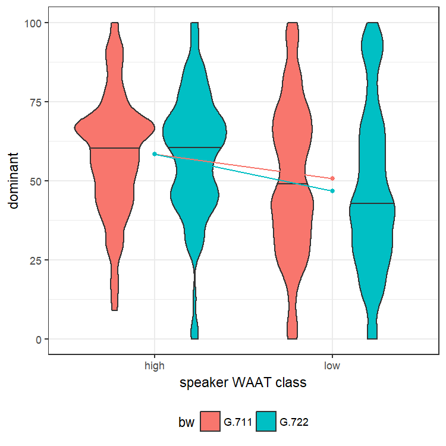
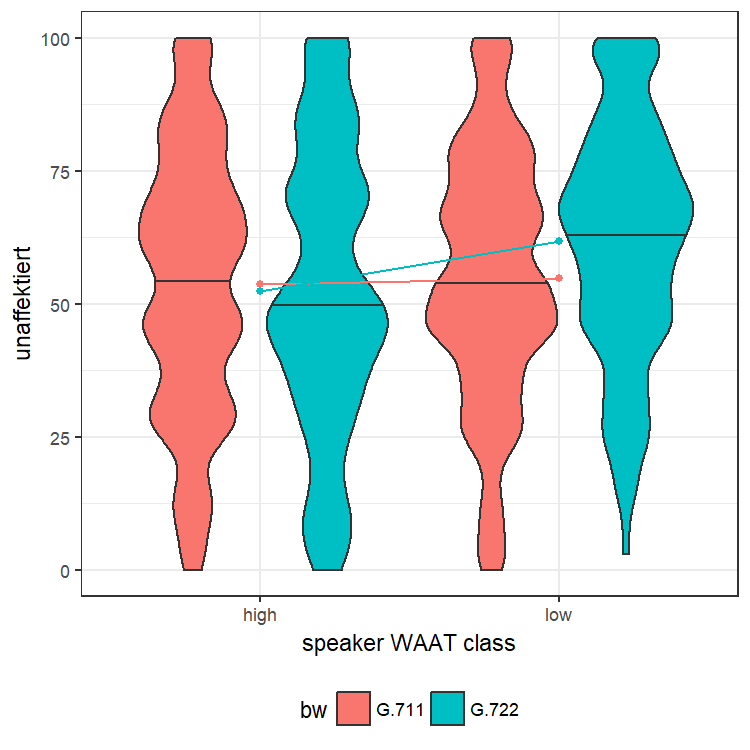
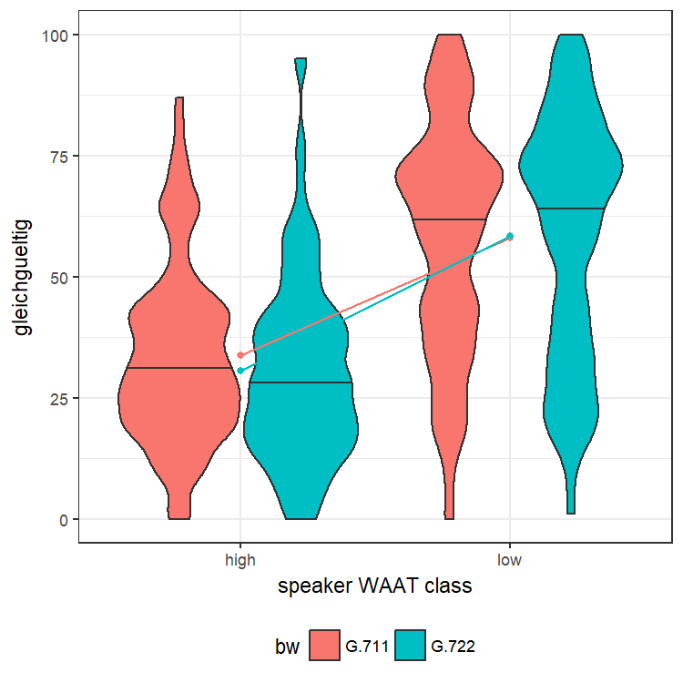
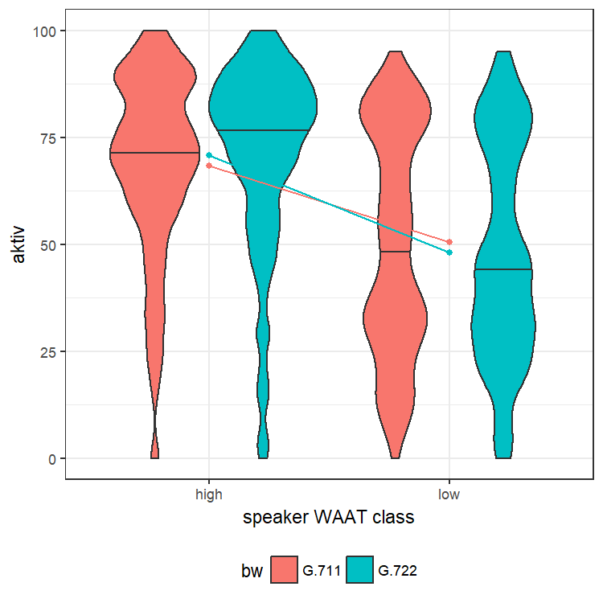
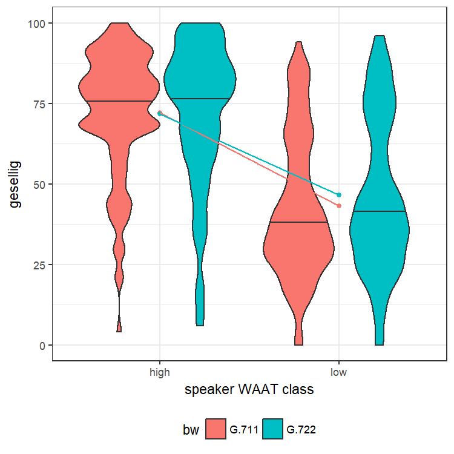
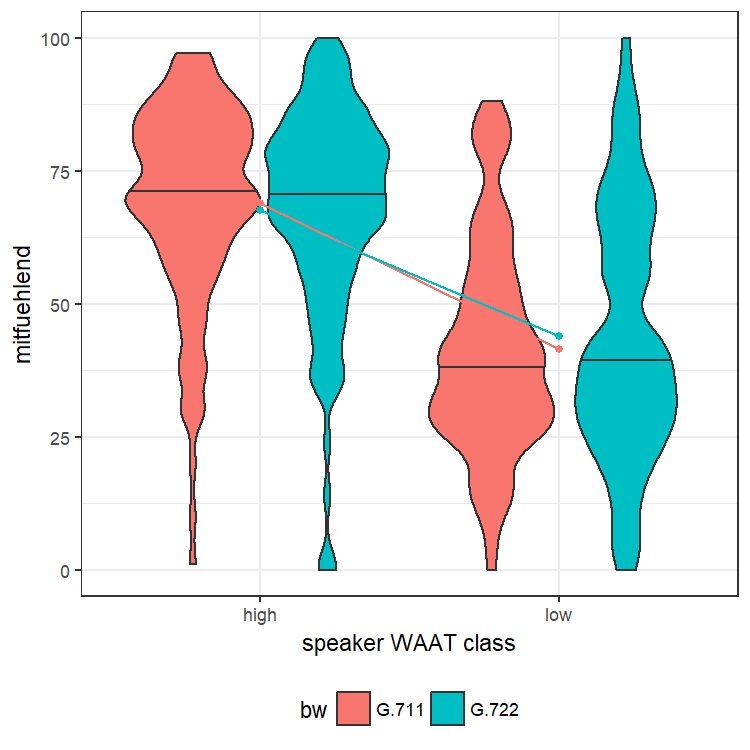
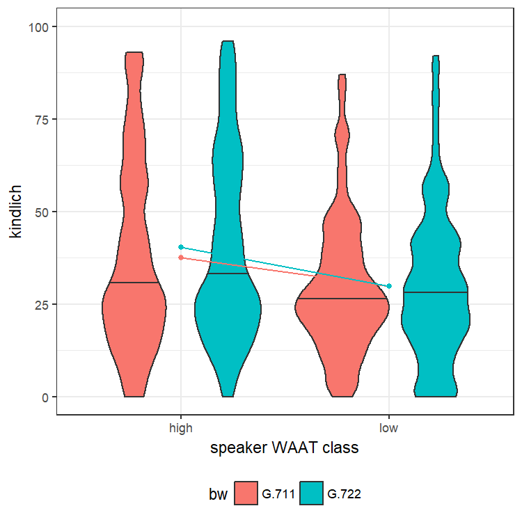

Effects of speech bandwidth on perceived speaker characteristics (ANOVA)
================
Laura Fernández Gallardo
December 2017

-   [Objectives](#objectives)
-   [2-way repeated measures ANOVA](#way-repeated-measures-anova)
    -   [Interaction plots](#interaction-plots)
    -   [Speaker Characteristics](#speaker-characteristics)
        -   [SC: Male speakers](#sc-male-speakers)
        -   [SC: Female speakers](#sc-female-speakers)
    -   [Discussion](#discussion)

``` r
# Libraries needed:

library(ggplot2) # for plots
library(ez) # for ezANOVA
library(data.table) # for dt significance
library(knitr) # for kable
library(xtable) # for table for LaTeX
```

Objectives
----------

The goal of this analysis is to evaluate the differences between the narrowband and wideband effects on the human impressions of speaker characteristics speaker characteristics, related to perceived signal quality, which might also assist decisions in the communication channel design process.

To examine the influence of both, channel bandwidth and speakers' WAAT, and their interaction effects, two-way repeated measures ANOVA significance tests have been conducted for each of the speaker traits, and separately for each speaker gender.

2-way repeated measures ANOVA
=============================

-   For each speaker gender:
-   For each item of speaker characteristics (SC):
-   We perform 2-way repeated measures, to test the effects of
    -   channel bandwidth (bw)
    -   speakers' WAAT class (class)
    -   interaction (bw:class)

We use the package ez to compute ezANOVA: Bakeman, R. (2005). Recommended effect size statistics for repeated measures designs. Behavior Research Methods, 37 (3), 379-384.

``` r
# input: ratings (VD or SC) corresponding to the same speaker gender
#    and item names 
#    p-value of the significance effects required
# output: table with booleans for each item with effects found

# example input:
# data <- mydata_m
# itemnames <- items.SC
# pvalue <- 0.01

perform.ezANOVA <- function(data, itemnames, pvalue){
  
 
all_effects <- NULL

# (workaround to assign dv dinamically)

for (x in itemnames){
  eval(parse(text=
               paste0('ezANOVA2.output <- ezANOVA(data=data,
                      dv=', x,',
                      wid=nameListener,
                      within=.(bw, class),
                      type = 2)')
  ))

  all_effects <- rbind(all_effects,data.frame(x,rbind(ezANOVA2.output$ANOVA$p)))

}

names(all_effects)<-c("item","bw", "class","bw:class")

# assign unique group of effects to each item 

signif <- data.frame(item=all_effects$item, all_effects[2:4] < pvalue)

dt <- as.data.table(signif[2:4])[, list(list(.I)), by = signif[2:4]]

signif$group<-NA
for (i in c(1:length(dt$V1))){
  
  indexes <- dt$V1[[i]]
  signif[indexes,]$group <- i
  
}

# sort dataframe by unique effects
signif <- signif[order(signif$group),]

return(signif)


}
```

Interaction plots
-----------------

For each speaker gender, create interaction plot:

-   view effects of:
    -   speech bandwidth (bw)
    -   speakers' WAAT class (WAAT)
    -   interaction (bw:WAAT)
-   if lines are parallel: there is no interaction effect

``` r
# input d: data corresponding to one speaker gender: mydata_m or mydata_f
create.interaction_plots <-  function(d){
    
  for (item in items.SC){  
    
    mydata_agg <- aggregate(d[item], by = list(d$bw, d$class), mean)
    names(mydata_agg)[1]<-'bw'
    names(mydata_agg)[2]<-'class' 
    names(mydata_agg)[3]<-'mean' 
    
    mplot <- ggplot(d, aes(x = factor(class), y = d[item], fill = bw)) + 
      geom_violin(adjust = .5, draw_quantiles = c(0.5)) + 
      geom_point(data = mydata_agg, aes_string(y = "mean", group = "bw", color = "bw")) + 
      geom_line(data = mydata_agg, aes_string(y = "mean", group = "bw", color = "bw")) + 
      theme_bw() +
      xlab("speaker WAAT class") +
      ylab(item) +  
      scale_y_continuous(limits = c(0, 100)) +
      theme(legend.position = "bottom")
    
    print(mplot)
  }
}
```

Speaker Characteristics
-----------------------

Analyze ANOVA significant effects for male and for female speech

``` r
# get item names
items.SC <- names(mydata)[9:(9+33)]

# split by gender
mydata_split = split(mydata, mydata$spk_gender)
mydata_m <- mydata_split$m # male speakers
mydata_f <- mydata_split$w # female speakers
```

Exploring mean ratings for each gender, for each class, for each bandwidth. "G.711" is a narrowband codec, while "G.722" is a wideband codec.

``` r
mydata.agg <- aggregate(mydata[,c(9:(9+33))], by=list(mydata$bw, mydata$spk_gender, mydata$class), mean)

kable(t(mydata.agg))
```

|                 |          |          |          |          |          |          |          |          |
|:----------------|:---------|:---------|:---------|:---------|:---------|:---------|:---------|:---------|
| Group.1         | G.711    | G.722    | G.711    | G.722    | G.711    | G.722    | G.711    | G.722    |
| Group.2         | m        | m        | w        | w        | m        | m        | w        | w        |
| Group.3         | high     | high     | high     | high     | low      | low      | low      | low      |
| unsympathisch   | 37.73043 | 32.92174 | 28.48696 | 27.07826 | 63.01739 | 63.30435 | 57.26957 | 57.87826 |
| sicher          | 70.90435 | 75.31304 | 67.60000 | 70.61739 | 47.09565 | 46.00870 | 54.81739 | 51.52174 |
| attraktiv       | 58.45217 | 64.70435 | 69.46087 | 69.10435 | 32.44348 | 35.21739 | 38.93043 | 37.64348 |
| verstaendnislos | 34.16522 | 28.93043 | 29.14783 | 29.22609 | 49.26087 | 47.23478 | 49.30435 | 46.24348 |
| unentschieden   | 30.36522 | 24.58261 | 30.93913 | 32.65217 | 43.35652 | 48.54783 | 41.89565 | 39.66957 |
| unaufdringlich  | 61.43478 | 69.46087 | 71.44348 | 70.42609 | 58.73913 | 66.58261 | 59.72174 | 62.35652 |
| distanziert     | 33.42609 | 30.60000 | 29.36522 | 31.99130 | 59.80870 | 61.73043 | 58.72174 | 56.45217 |
| gelangweilt     | 31.33043 | 28.85217 | 27.18261 | 25.50435 | 60.83478 | 63.86957 | 55.76522 | 55.76522 |
| emotional       | 65.73913 | 66.46957 | 68.73913 | 70.96522 | 36.81739 | 34.78261 | 43.30435 | 45.00000 |
| nicht.genervt   | 72.71304 | 73.53043 | 75.39130 | 78.17391 | 50.83478 | 54.00870 | 52.19130 | 54.70435 |
| aktiv           | 69.80000 | 72.05217 | 68.40870 | 70.83478 | 39.69565 | 37.85217 | 50.40870 | 48.00870 |
| angenehm        | 63.45217 | 70.51304 | 70.83478 | 71.94783 | 37.79130 | 40.40870 | 44.74783 | 46.79130 |
| charakterlos    | 34.57391 | 32.26957 | 30.89565 | 28.21739 | 60.46957 | 59.33913 | 54.03478 | 51.45217 |
| gesellig        | 71.00870 | 72.57391 | 72.17391 | 71.70435 | 39.57391 | 37.34783 | 43.16522 | 46.60000 |
| entspannt       | 65.61739 | 69.85217 | 68.08696 | 66.99130 | 53.05217 | 58.45217 | 57.19130 | 57.07826 |
| mitfuehlend     | 61.67826 | 64.79130 | 68.86087 | 67.49565 | 36.73913 | 38.18261 | 41.54783 | 43.88696 |
| dominant        | 58.45217 | 58.41739 | 53.89565 | 56.86087 | 50.59130 | 46.73043 | 52.46087 | 48.34783 |
| unaffektiert    | 53.72174 | 52.30435 | 53.25217 | 54.51304 | 54.79130 | 61.78261 | 57.65217 | 55.53913 |
| herzlich        | 66.68696 | 69.22609 | 70.38261 | 71.56522 | 39.68696 | 42.93043 | 46.72174 | 47.33043 |
| alt             | 36.45217 | 37.99130 | 34.46087 | 30.94783 | 40.13043 | 41.22609 | 49.22609 | 48.99130 |
| unsachlich      | 32.64348 | 27.52174 | 28.87826 | 26.02609 | 34.26957 | 32.74783 | 31.86087 | 32.00870 |
| ruhig           | 60.10435 | 66.41739 | 63.59130 | 61.00000 | 65.63478 | 63.85217 | 58.41739 | 64.33043 |
| inkompetent     | 33.46087 | 29.43478 | 35.53913 | 30.86957 | 49.24348 | 50.62609 | 46.74783 | 47.20000 |
| haesslich       | 39.90435 | 35.40870 | 30.54783 | 28.23478 | 61.38261 | 59.05217 | 52.46087 | 55.39130 |
| freundlich      | 71.77391 | 74.26087 | 73.86957 | 76.06957 | 51.81739 | 52.45217 | 50.76522 | 54.29565 |
| maennlich       | 84.93913 | 85.86957 | 10.40870 | 11.29565 | 83.26957 | 84.17391 | 16.63478 | 16.39130 |
| gehorsam        | 49.55652 | 49.65217 | 54.17391 | 52.59130 | 53.23478 | 56.83478 | 51.31304 | 56.62609 |
| gleichgueltig   | 33.77391 | 30.47826 | 28.56522 | 28.98261 | 58.06087 | 58.36522 | 50.64348 | 53.75652 |
| interessant     | 62.11304 | 64.66957 | 65.02609 | 65.66087 | 35.39130 | 31.53913 | 37.96522 | 37.94783 |
| zynisch         | 42.88696 | 44.12174 | 40.45217 | 43.50435 | 42.69565 | 41.79130 | 48.74783 | 43.27826 |
| aufgesetzt      | 37.40870 | 33.36522 | 34.75652 | 35.03478 | 35.66957 | 36.70435 | 38.87826 | 36.84348 |
| intelligent     | 64.96522 | 67.22609 | 61.84348 | 65.32174 | 43.46957 | 43.00870 | 44.65217 | 45.00000 |
| kindlich        | 30.93043 | 25.12174 | 37.58261 | 40.25217 | 37.96522 | 37.26087 | 29.73913 | 29.84348 |
| bescheiden      | 50.79130 | 53.04348 | 50.81739 | 49.27826 | 53.53043 | 59.77391 | 51.22609 | 50.54783 |

Obtain the significant effects by calling our function. Generate tables for LaTeX.

``` r
# male speakers
effects.SC_m <- perform.ezANOVA(mydata_m, items.SC, 0.01)

# female speakers
effects.SC_f <- perform.ezANOVA(mydata_f, items.SC, 0.01)

# generate tables for latex
# load translations
ques.SC <- read.csv(paste0("../../../data/subjective_ratings/SC_Questionnaire.csv"), header=T)
names(ques.SC)[3]<-'item'
effects.SC_m <-merge(effects.SC_m,ques.SC[,c(3,5)])
effects.SC_f <-merge(effects.SC_f,ques.SC[,c(3,5)])

# sort English items alphabetically
effects.SC_m <- effects.SC_m[order(effects.SC_m$right_English),]
effects.SC_f <- effects.SC_f[order(effects.SC_f$right_English),]

# display table (3 first columns correspond to male speakers and the rest to female speakers)
mftable <- cbind(effects.SC_m[,c(6,2,3,4)],effects.SC_f[,c(2,3,4)])
kable(mftable)
```

|     | right\_English | bw    | class | bw.class | bw    | class | bw.class |
|-----|:---------------|:------|:------|:---------|:------|:------|:---------|
| 1   | active         | FALSE | TRUE  | FALSE    | FALSE | TRUE  | FALSE    |
| 24  | affectionate   | FALSE | TRUE  | FALSE    | FALSE | TRUE  | FALSE    |
| 5   | artificial     | FALSE | FALSE | FALSE    | FALSE | FALSE | FALSE    |
| 4   | attractive     | FALSE | TRUE  | FALSE    | FALSE | TRUE  | FALSE    |
| 14  | bored          | FALSE | TRUE  | FALSE    | FALSE | TRUE  | FALSE    |
| 25  | calm           | FALSE | FALSE | FALSE    | FALSE | FALSE | FALSE    |
| 7   | characterless  | FALSE | TRUE  | FALSE    | FALSE | TRUE  | FALSE    |
| 22  | childish       | TRUE  | TRUE  | FALSE    | FALSE | FALSE | FALSE    |
| 33  | cynical        | FALSE | FALSE | FALSE    | FALSE | FALSE | FALSE    |
| 8   | distant        | FALSE | TRUE  | FALSE    | FALSE | TRUE  | FALSE    |
| 9   | dominant       | FALSE | TRUE  | FALSE    | FALSE | FALSE | FALSE    |
| 10  | emotional      | FALSE | TRUE  | FALSE    | FALSE | TRUE  | FALSE    |
| 12  | friendly       | FALSE | TRUE  | FALSE    | FALSE | TRUE  | FALSE    |
| 18  | hearty         | FALSE | TRUE  | FALSE    | FALSE | TRUE  | FALSE    |
| 19  | incompetent    | FALSE | TRUE  | FALSE    | FALSE | TRUE  | TRUE     |
| 29  | indecisive     | FALSE | TRUE  | TRUE     | FALSE | TRUE  | FALSE    |
| 16  | indifferent    | FALSE | TRUE  | FALSE    | FALSE | TRUE  | FALSE    |
| 20  | intelligent    | FALSE | TRUE  | FALSE    | FALSE | TRUE  | FALSE    |
| 21  | interesting    | FALSE | TRUE  | FALSE    | FALSE | TRUE  | FALSE    |
| 23  | masculine      | FALSE | FALSE | FALSE    | FALSE | TRUE  | FALSE    |
| 6   | modest         | TRUE  | FALSE | FALSE    | FALSE | FALSE | FALSE    |
| 31  | non\_likable   | FALSE | TRUE  | FALSE    | FALSE | TRUE  | FALSE    |
| 2   | old            | FALSE | FALSE | FALSE    | FALSE | TRUE  | FALSE    |
| 30  | personal       | FALSE | FALSE | FALSE    | FALSE | FALSE | FALSE    |
| 3   | pleasant       | FALSE | TRUE  | FALSE    | FALSE | TRUE  | FALSE    |
| 11  | relaxed        | FALSE | TRUE  | FALSE    | FALSE | TRUE  | FALSE    |
| 26  | secure         | FALSE | TRUE  | FALSE    | FALSE | TRUE  | FALSE    |
| 15  | sociable       | FALSE | TRUE  | FALSE    | FALSE | TRUE  | FALSE    |
| 13  | submissive     | FALSE | FALSE | FALSE    | FALSE | FALSE | TRUE     |
| 17  | ugly           | FALSE | TRUE  | FALSE    | FALSE | TRUE  | TRUE     |
| 27  | unaffected     | FALSE | FALSE | FALSE    | FALSE | FALSE | FALSE    |
| 28  | unobtrusive    | TRUE  | FALSE | FALSE    | FALSE | TRUE  | FALSE    |
| 32  | unsympathetic  | TRUE  | TRUE  | FALSE    | FALSE | TRUE  | FALSE    |

``` r
#print(xtable(mftable),include.rownames=FALSE)
```

In contrast to *WAAT* effects, the influence of bandwidth has only been detected for a few speaker attributes.

### SC: Male speakers

View items, only when significant effect found for bw or for bw:class

``` r
# effects.SC_m <- effects.SC_m[,-ncol(effects.SC_m)]

effects.SC_m_BW <- effects.SC_m[which(effects.SC_m$bw==T | effects.SC_m$bw.class==T), ]
effects.SC_m_BW <- effects.SC_m[which(effects.SC_m$bw==T | effects.SC_m$bw.class==T), ]

kable(effects.SC_m_BW, row.names = FALSE)
```

| item            | bw    | class | bw.class |  group| right\_English |
|:----------------|:------|:------|:---------|------:|:---------------|
| kindlich        | TRUE  | TRUE  | FALSE    |      2| childish       |
| unentschieden   | FALSE | TRUE  | TRUE     |      3| indecisive     |
| bescheiden      | TRUE  | FALSE | FALSE    |      4| modest         |
| unaufdringlich  | TRUE  | FALSE | FALSE    |      4| unobtrusive    |
| verstaendnislos | TRUE  | TRUE  | FALSE    |      2| unsympathetic  |

Interaction plots for male speakers.

``` r
create.interaction_plots( mydata_m )
```



### SC: Female speakers

View items, only when significant effect found for bw or for bw:class

``` r
# effects.SC_f <- effects.SC_f[,-ncol(effects.SC_f)]

effects.SC_f_BW <- effects.SC_f[which(effects.SC_f$bw==T | effects.SC_f$bw.class==T), ]
effects.SC_f_BW <- effects.SC_f[which(effects.SC_f$bw==T | effects.SC_f$bw.class==T), ]

kable(effects.SC_f_BW, row.names = FALSE)
```

| item        | bw    | class | bw.class |  group| right\_English |
|:------------|:------|:------|:---------|------:|:---------------|
| inkompetent | FALSE | TRUE  | TRUE     |      3| incompetent    |
| gehorsam    | FALSE | FALSE | TRUE     |      4| submissive     |
| haesslich   | FALSE | TRUE  | TRUE     |      3| ugly           |

Interaction plots for female speakers.

``` r
create.interaction_plots( mydata_f )
```



Discussion
----------

The effects of bandwidth in isolation (*bw*, regardless of WAAT) can be observed for male speakers only. When voices are transmitted through WB instead of NB, our results suggest that male speakers are perceived as:

-   more modest and more unobtrusive,
-   less childish and less unsympathetic,
-   more decided if their WAAT is high, and more indecisive if their WAAT is low (interaction effect).

For female speakers, only *WAAT* or *bw:WAAT* effects have been detected. The following female speaker characteristics are perceived with WB- instead of NB-transmitted speech:

-   less incompetent if their WAAT is high, and same level of incompetence as in NB if their WAAT is low (interaction effect),
-   more submissive if their WAAT is low, and same level of submissiveness as in NB if their WAAT is high (interaction effect),
-   less ugly if their WAAT is high, and more ugly if their WAAT is low (interaction effect).
