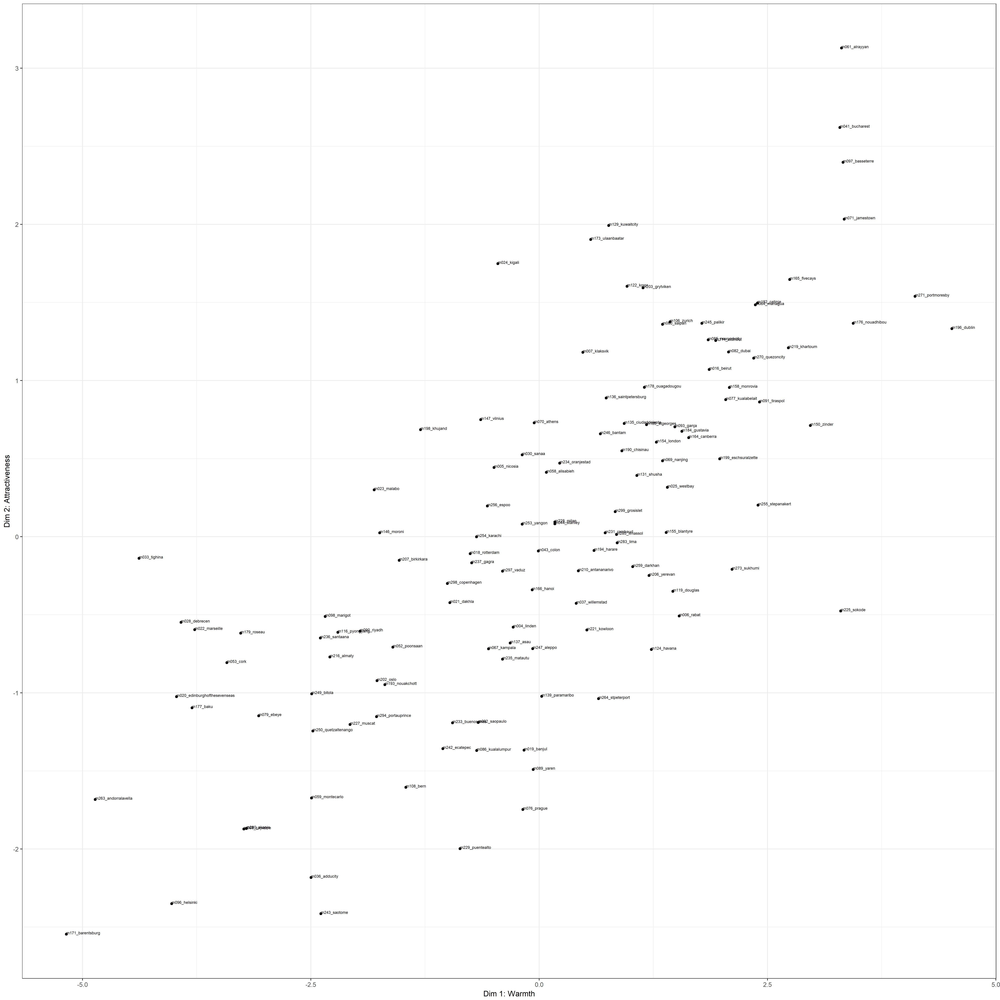
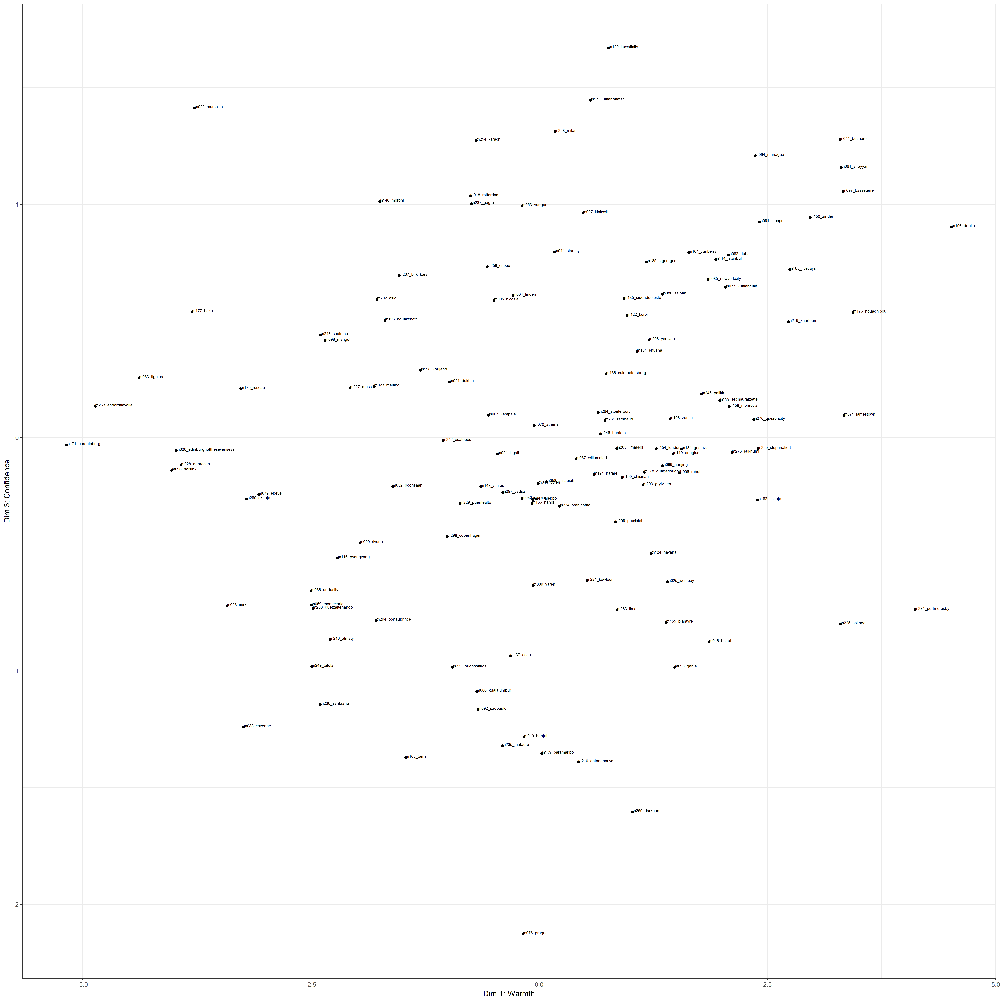
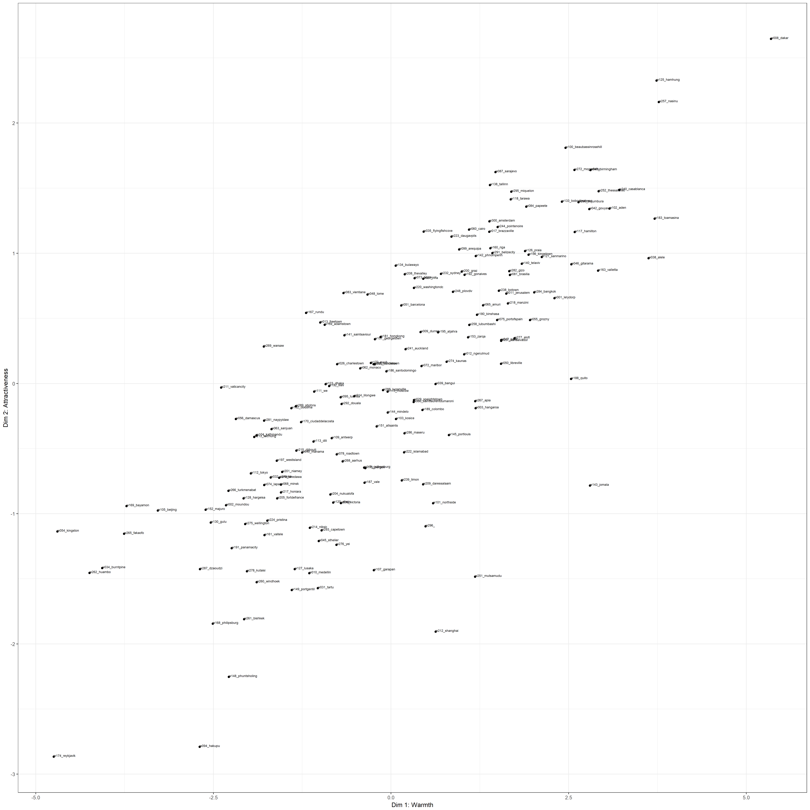
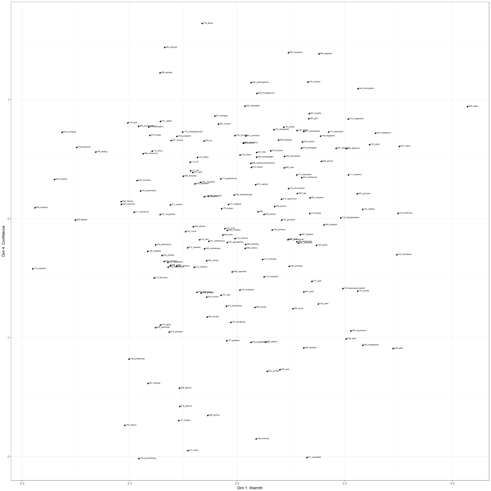

Plots of mean ratings for each item of speaker characteristics
================
Laura Fernández Gallardo
June 2017

-   [1) Load subjective ratings](#load-subjective-ratings)
-   [2) Generate Biplots](#generate-biplots)

After conducting factor analysis, plot speakers in the space of the resulting traits: warmth, attractiveness, confidence, compliance, maturity.

1) Load subjective ratings
--------------------------

Clear workspace.

Load necessary libraries.

``` r
library(RCurl) # to read raw data from repo
library(stringi) # install.packages("stringi")
library(ggplot2) # install.packages("ggplot2")
```

Set paths and read data.

2) Generate Biplots
-------------------

For male and female speakers:

-   attractiveness vs. warmth
-   warmth vs. confidence

``` r
# prepare speaker pseudonym - text next to each point

data_m$speaker_ID2 = stri_sub(data_m$sample_heard, 1, -14)
data_f$speaker_ID2 = stri_sub(data_f$sample_heard, 1, -14)


# plots for male speakers

plot_m_d1_d2_names <- ggplot(data=data_m, aes(y=dim2, x=dim1)) +
  geom_point() +
  geom_text(aes(label=speaker_ID2), hjust=0, vjust=0, size=2) +
  theme_bw() +
  xlab("Dim 1: Warmth") +
  ylab("Dim 2: Attractiveness") 

print(plot_m_d1_d2_names)
```



``` r
plot_m_d1_d4_names <- ggplot(data=data_m, aes(y=dim3, x=dim1)) +
  geom_point() +
  geom_text(aes(label=speaker_ID2), hjust=0, vjust=0, size=2) +
  theme_bw() +
  xlab("Dim 1: Warmth") +
  ylab("Dim 3: Confidence") 

print(plot_m_d1_d4_names)
```



``` r
# plots for female speakers

plot_f_d1_d2_names <- ggplot(data=data_f, aes(y=dim2, x=dim1)) +
  geom_point() +
  geom_text(aes(label=speaker_ID2), hjust=0, vjust=0, size=2) +
  theme_bw() +
  xlab("Dim 1: Warmth") +
  ylab("Dim 2: Attractiveness") 

print(plot_f_d1_d2_names)
```



``` r
plot_f_d1_d4_names <- ggplot(data=data_f, aes(y=dim4, x=dim1)) +
  geom_point() +
  geom_text(aes(label=speaker_ID2), hjust=0, vjust=0, size=2) +
  theme_bw() +
  xlab("Dim 1: Warmth") +
  ylab("Dim 4: Confidence") 

print(plot_f_d1_d4_names)
```


