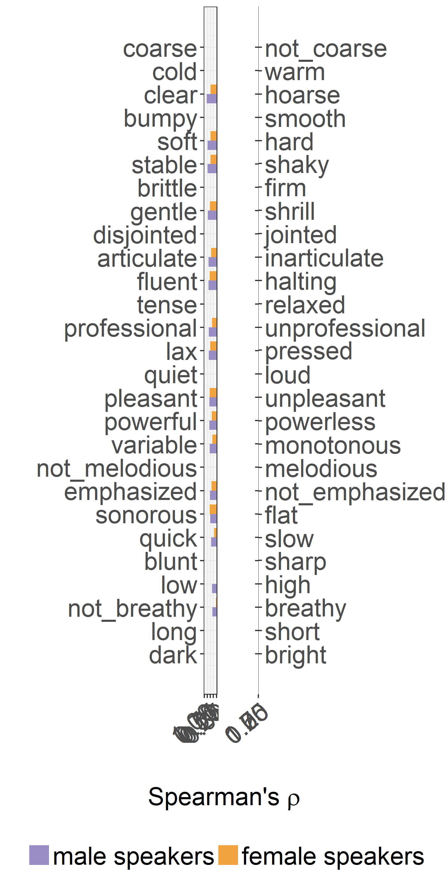

Correlations between MOS and voice descriptions
================
Laura Fernández Gallardo
December 2017

-   [Objectives](#objectives)
-   [Load and arrage data](#load-and-arrage-data)
-   [Spearman correlations](#spearman-correlations)
    -   [Male speakers](#male-speakers)
    -   [Female speakers](#female-speakers)
    -   [Generate figure (barchart)](#generate-figure-barchart)
-   [Comments on these correlations](#comments-on-these-correlations)

``` r
# clear
rm(list=ls())

# needed libraries
library(ggplot2) 
library(grid) # for aligned plots (textGrob)
library(gridExtra) # for aligned plots
library(knitr) # for kable in rmd
library(reshape2) # for melt (wide to long format)
library(extrafont) # font in plot
library(Cairo) # for CairoPDF() , create pdf with fonts embeeded
```

Objectives
----------

The goal of this analysis is to evaluate the differences between the narrowband and wideband effects on the human impressions of voices, related to perceived signal quality, which might also assist decisions in the communication channel design process.

We determine whether there are relationships between subjective speech quality (given in terms of mean opinion scores, MOS) and voice desriptions of male and of female speakers. We should note that there were two different listener panels performing such subjective assessments.

This study is similar to what was done for speaker characteristics in:

Fernández Gallardo, L., "Effects of Transmitted Speech Bandwidth on Subjective Assessments of Speaker Characteristics," Int. Conf. on Quality of Multimedia Experience (QoMEX), 2018.

Load and arrage data
--------------------

``` r
# aggregate data MOS per distortion, per speaker and pick only G711, G722

data.MOS.agg <- aggregate(data.MOS$MOS, by = list(data.MOS$speaker, data.MOS$distortion), mean)

# pick only G711, G722

data.MOS.agg.G <- rbind(data.MOS.agg[grep('G711',data.MOS.agg$Group.2),],
                        data.MOS.agg[grep('G722',data.MOS.agg$Group.2),])

names(data.MOS.agg.G) <- c('spk','bw','MOS')

# aggregate data SC per distortion, per speaker
mydata.agg <- aggregate(mydata[9:(9+33)], by = list(mydata$spk_ID, mydata$spk_gender, mydata$bw), mean)
names(mydata.agg)[1:3] <- c('spk','g','bw')
levels(mydata.agg$bw) <- c('G711','G722')

# merge both datasets (voice descriptions and MOS) (11 common speakers, 6m and 5f, in 2 bandwidths)
data.mergedSC <- merge(mydata.agg, data.MOS.agg.G)
```

Load translations of questionnaire items, for table output.

``` r
# load translations
ques <- read.csv(paste0("../../../data/subjective_ratings/VD_Questionnaire.csv"), header=T)
names(ques)[3]<-'item'
names(ques)[4]<-'left'
names(ques)[5]<-'right'
```

Spearman correlations
---------------------

For each voice description item and speaker gender separately, Spearman rank correlations were performed between the MOS given to each of the speakers for each channel degradation and the corresponding ratings of each item averaged over listeners (the number of data points was \[number of speakers x 2 degradations x 2 score series\]). This resulted on the Spearman's *ρ* shown in the generated figure, accounting for monotonic correspondences of MOS with voice descriptions.

Left and right adjectives of the 34-item VD semantic differential questionnaire are displayed, translated to English.

### Male speakers

``` r
## male speakers only

correl.SC_m <- sapply(names(data.mergedSC)[4:(4+33)], function(x){
  
  data_gender = data.mergedSC[data.mergedSC$g=='m',]
  
  cor(data_gender$MOS, data_gender[[x]], method = 'spearman')
  })

correl.SC_m <- as.data.frame(correl.SC_m)
correl.SC_m$item <- rownames(correl.SC_m)
rownames(correl.SC_m) <- NULL

correl.SC_m <-merge(correl.SC_m,ques[,c(3,4,5)])
 
 
#kable(correl.SC_m[order(abs(correl.SC_m$correl.SC_m), decreasing = T),], row.names = F)

kable(correl.SC_m[order(abs(correl.SC_m$correl.SC_m), decreasing = T),c(3,2,4)], row.names = F, digits=2)
```

| left           |  correl.SC\_m| right           |
|:---------------|-------------:|:----------------|
| coarse         |          0.84| not\_coarse     |
| cold           |          0.81| warm            |
| clear          |         -0.80| hoarse          |
| bumpy          |          0.76| smooth          |
| soft           |         -0.73| hard            |
| stable         |         -0.71| shaky           |
| brittle        |          0.71| firm            |
| gentle         |         -0.69| shrill          |
| disjointed     |          0.66| jointed         |
| fluent         |         -0.66| halting         |
| articulate     |         -0.66| inarticulate    |
| tense          |          0.64| relaxed         |
| lax            |         -0.63| pressed         |
| professional   |         -0.63| unprofessional  |
| quiet          |          0.62| loud            |
| powerful       |         -0.57| powerless       |
| pleasant       |         -0.57| unpleasant      |
| not\_melodious |          0.56| melodious       |
| variable       |         -0.56| monotonous      |
| emphasized     |         -0.52| not\_emphasized |
| sonorous       |         -0.50| flat            |
| quick          |         -0.44| slow            |
| blunt          |          0.43| sharp           |
| low            |         -0.37| high            |
| not\_breathy   |         -0.34| breathy         |
| long           |          0.29| short           |
| dark           |          0.06| bright          |

### Female speakers

``` r
## female speakers only

correl.SC_w <- sapply(names(data.mergedSC)[4:(4+33)], function(x){
  
  data_gender = data.mergedSC[data.mergedSC$g=='w',]
  
  cor(data_gender$MOS, data_gender[[x]], method = 'spearman')
  })

correl.SC_w <- as.data.frame(correl.SC_w)
correl.SC_w$item <- rownames(correl.SC_w)
rownames(correl.SC_w) <- NULL

correl.SC_w <-merge(correl.SC_w,ques[,c(3,4,5)])
 
#kable(correl.SC_w[order(abs(correl.SC_w$correl.SC_w), decreasing = T),c(4,2)], row.names = F)

kable(correl.SC_w[order(abs(correl.SC_w$correl.SC_w), decreasing = T),], row.names = F, digits=2)
```

| item            |  correl.SC\_w| left           | right           |
|:----------------|-------------:|:---------------|:----------------|
| gleitend        |          0.65| bumpy          | smooth          |
| klanglos        |         -0.56| sonorous       | flat            |
| stockend        |         -0.56| fluent         | halting         |
| unangenehm      |         -0.56| pleasant       | unpleasant      |
| schrill         |         -0.54| gentle         | shrill          |
| glatt           |          0.52| coarse         | not\_coarse     |
| gepresst        |         -0.50| lax            | pressed         |
| heiser          |         -0.49| clear          | hoarse          |
| zittrig         |         -0.49| stable         | shaky           |
| hart            |         -0.48| soft           | hard            |
| fest            |          0.47| brittle        | firm            |
| undeutlich      |         -0.43| articulate     | inarticulate    |
| melodisch       |          0.41| not\_melodious | melodious       |
| unbetont        |         -0.41| emphasized     | not\_emphasized |
| entspannt       |          0.39| tense          | relaxed         |
| kraftlos        |         -0.38| powerful       | powerless       |
| kurz            |          0.37| long           | short           |
| unprofessionell |         -0.37| professional   | unprofessional  |
| monoton         |         -0.35| variable       | monotonous      |
| warm            |          0.33| cold           | warm            |
| laut            |          0.28| quiet          | loud            |
| scharf          |          0.28| blunt          | sharp           |
| verbunden       |          0.27| disjointed     | jointed         |
| hell            |          0.24| dark           | bright          |
| langsam         |         -0.19| quick          | slow            |
| behaucht        |         -0.04| not\_breathy   | breathy         |
| hoch            |          0.02| low            | high            |

### Generate figure (barchart)

Barchart to show correlations alog all items.

The figure generated by "Knit" does not have good formatting. See Figure in pdf.

``` r
# re-arrange data

df <- merge(correl.SC_m, correl.SC_w)
df <- df[order(abs(df$correl.SC_m)),]
names(df) <- c("right_German", "left", "right", "male speakers", "female speakers")

df_long <- melt(df)
```

    ## Using right_German, left, right as id variables

``` r
names(df_long) <- c("item_German", "left", "right", "gender", "r")


df_long$right <- factor(df_long$right, levels = df$right)
```

Plot only positive correlations, and display left and right questionnaire items.

``` r
# df_long <- df_long[order(abs(df_long$correl.SC_m)),]
# df_long$right <- factor(df_long$right, levels = df$right)

# plot left adjectives

#df_long.left <- df_long[df_long$r<0,]

 
df_long$left <- factor(df_long$left, levels = df$left)
 
plot_left <- ggplot(df_long, aes(y= -1*r, x = as.numeric(left), fill = factor(gender))) + 
  geom_bar(stat = "identity", width = 0.8 , position = position_dodge(width = 0.8) ) +
  scale_fill_manual(values=c("#998ec3", "#f1a340")) + 
  coord_flip() +
  scale_y_reverse( lim=c(1,0)) + 
  scale_x_continuous(breaks = 1:(length(df$left)), labels = df$left) +
  xlab('') + #xlab('Left adjectives (English)') +  
  ylab('') + 
  theme_bw() +
  theme(legend.title = element_blank(), legend.position = "bottom", text=element_text(size=25), axis.text.x = element_text(angle = 40, hjust = 1))


plot_right <- ggplot(df_long, aes(y= r, x = as.numeric(right), fill = factor(gender))) + 
  geom_bar(stat = "identity", width = 0.8 , position = position_dodge(width = 0.8) ) +
  scale_fill_manual(values=c("#998ec3", "#f1a340")) + 
  coord_flip() +
  scale_y_continuous( lim=c(0, 1)) + 
  scale_x_continuous(breaks = 1:(length(df$left)), labels = NULL,
                   sec.axis =  sec_axis(~., breaks = 1:(length(df$right)), labels = df$right) )  +
  xlab('') +
  ylab('') + 
  theme_bw()  +
  theme(legend.title = element_blank(), legend.position = "bottom", text=element_text(size=25), axis.text.x = element_text(angle = 40, hjust = 1))


#extract legend
#https://github.com/hadley/ggplot2/wiki/Share-a-legend-between-two-ggplot2-graphs
g_legend<-function(a.gplot){
  tmp <- ggplot_gtable(ggplot_build(a.gplot))
  leg <- which(sapply(tmp$grobs, function(x) x$name) == "guide-box")
  legend <- tmp$grobs[[leg]]
  return(legend)}

mylegend <- g_legend(plot_left)
```

    ## Warning: Removed 23 rows containing missing values (geom_bar).

``` r
# 
```

``` r
# save combined plot to pdf file

CairoPDF("correl_spearman_MOS_SC.pdf", family="Times", width=8, height=15) 
#png(paste0(path_figures,"/correl_spearman.png"), family="Times") 
grid.arrange(arrangeGrob(plot_left + theme(legend.position="none"),
                         plot_right + theme(legend.position="none"),
                         nrow=1, 
                         bottom = textGrob( expression(paste('Spearman\'s ', rho)),  gp = gpar(fontsize = 20) ) 
                         ),
             mylegend, nrow=2,heights=c(10, 1) )
```

    ## Warning: Removed 23 rows containing missing values (geom_bar).

    ## Warning: Removed 31 rows containing missing values (geom_bar).



``` r
# grid.arrange(plot_left, plot_right, ncol=2)
dev.off()
```

    ## png 
    ##   2

Comments on these correlations
------------------------------

With communication channels that offer better perceived quality, these voice descriptions are highlighted:

For male speakers:

-   not\_coarse (*ρ* = 0.84), warm (*ρ* = 0.81), smooth (*ρ* = 0.76), soft (*ρ* = 0.73), gentle (*ρ* = 0.69), lax (*ρ* = 0.63), relaxed (*ρ* = 0.64)
-   clear (*ρ* = −0.805), stable (*ρ* = 0.71), firm (*ρ* = 0.71), articulate (*ρ* = 0.66), professional (*ρ* = 0.63)
-   jointed (*ρ* = 0.66), fluent (*ρ* = 0.66)
-   loud (*ρ* = 0.62), powerful (*ρ* = 0.57)
-   pleasant (*ρ* = 0.57)
-   melodious (*ρ* = 0.56), variable, not monotonous (*ρ* = 0.56)

For female speakers:

-   smooth (*ρ* = 0.65), gentle (*ρ* = 0.54), soft (*ρ* = 0.48), not coarse (*ρ* = 0.52), lax (*ρ* = 0.50), relaxed (*ρ* = 0.39)
-   sonorous (*ρ* = 0.56), melodious (*ρ* = 0.41)
-   fluent (*ρ* = 0.56)
-   pleasant (*ρ* = 0.56)
-   clear (*ρ* = 0.49), stable (*ρ* = 0.49), articulate (*ρ* = 0.43), firm (*ρ* = 0.47), emphasized (*ρ* = 0.41), powerful (*ρ* = 0.38)

In view of these results, male and female voices are perceived more positively when they are transmitted through wideband in comparison to narrowband.
