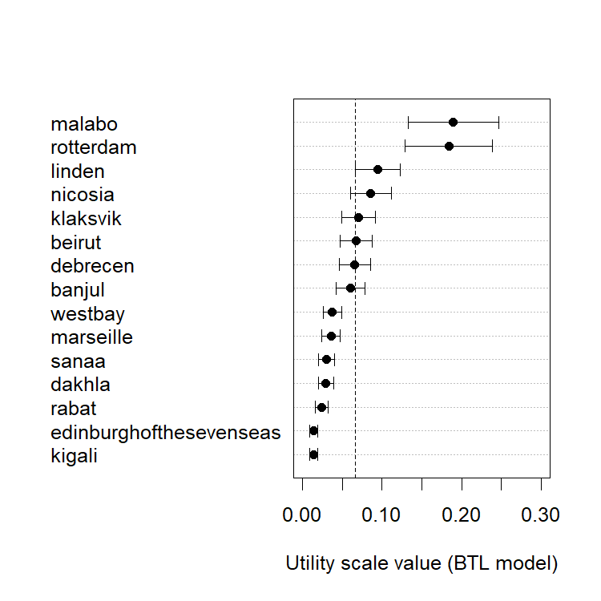
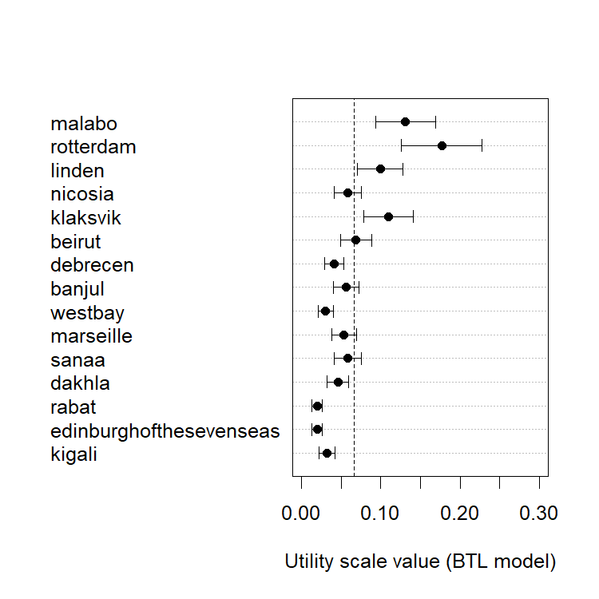

Applying BTL model to paired-comparison data
================
Laura Fernández Gallardo
May 2016

-   [Objectives](#objectives)
-   [Preference matrix from the paired-comparison test](#preference-matrix-from-the-paired-comparison-test)
    -   [Consistency checks](#consistency-checks)
    -   [Scaling listeners' preferences](#scaling-listeners-preferences)
-   [Preference matrix from the direct scaling test](#preference-matrix-from-the-direct-scaling-test)
    -   [Consistency checks](#consistency-checks-1)
    -   [Scaling listeners' preferences](#scaling-listeners-preferences-1)
-   [Raw data from the direct scaling test](#raw-data-from-the-direct-scaling-test)
-   [Comparing direct scaling and pair comparison data](#comparing-direct-scaling-and-pair-comparison-data)
-   [Conclusions](#conclusions)

Clear and set path.

``` r
# clear
rm(list=ls())

path_github <- "https://raw.githubusercontent.com/laufergall/Subjective_Speaker_Characteristics/master/data/subjective_ratings/data_listeningtest7"
```

``` r
# Libraries needed:

library(RCurl) # to read raw data from repo
library(eba) # BTL model
```

Objectives
----------

A paired-comparison listening test has been conducted for obtaining listeners' likability ratings. This test avoids the use of a Likert scale and overcomes its associated difficulties:

-   disagreement between raters
-   raters are biased. Some tend to rate positively and some negatively
-   lack of reference voices representing likability or non-likability
-   unknown range of likability spanned by the stimuli

In this work, the listener compares the likability of two presented speech stimuli and decides which one is more likable and to which extent, i.e. how much likable is the preferred utterance over the other. This is done for all unique pairs from the considered set of voices.

Our main interest is to assess the possible advantages of this method with respect to the direct scaling test described in Fernández Gallardo and Weiss (2016) (first test part, wideband quality). The same speech is employed again as audio stimuli, presented in pairs, and the same listeners were recruited to perform this second test.

Once their answers are collected, the the Bradley-Terry-Luce (BTL) probabilistic choice model Bradley and Terry (1952) Luce (1959) is applied to the preference choice matrix and a ratio scale of preference is estimated.

Preference matrix from the paired-comparison test
-------------------------------------------------

Preference matrix, combined from listeners' preferences. Row and column names are speaker pseudonyms.

``` r
matrix <- read.csv(text=getURL(paste0(path_github,"/preferencematrix_total.csv")), header=TRUE, sep=",")

rownames(matrix) <- colnames(matrix)
```

### Consistency checks

#### Transitivity violations

The BTL model implies a very strong form of stochastic transitivity. Given a triple of voices x, y, z for which the preference is determined as x &gt; y and y &gt; z, a transitivity is violated if x &lt; z. Transitivity violations reflect individually inconsistent choice behavior or disagreement between raters.

The BTL model can only be fit if no systematic violations of the stochastic transitivity occur. We hypothesized that the ratio scale measures derived by the BTL model, if successful, could more reliably represent the voices' likability compared to direct scaling tests, yielding greater agreement between listeners.

``` r
strans(matrix)
```

    ## 
    ## Stochastic Transitivity
    ## 
    ##          Violations ErrorRatio MeanDev MaxDev Deviance Df Pr(>Chi)
    ## Weak             10     0.0220  0.0385 0.0385     2.98  6    0.811
    ## Moderate         28     0.0615  0.0852 0.1538       NA NA       NA
    ## Strong          134     0.2945  0.1292 0.3846       NA NA       NA
    ## ---
    ## Number of Tests: 455

It can be seen that very few WST violations out of the binom{15}{3}=455 possible tests have been encountered. The likelihood ratio test of the BTL model fit was performed to determine whether the transitivity violations encountered were systematic, and therefore critical, or random. Because this test did not result to be significant (p&gt;0.05), the restrictive BTL model could be fit, and therefore the transitivity violations can be attributed to randomness Wickelmaier and Schmid (2004).

A meaningful ordering of listeners' preferences could then be derived by probabilistic choice modeling, shown in the following.

#### Concordance among listeners' preferences

In addition, the Kendall's coefficient of agreement *u* (se Kendall (1970), Section 11.8) was calculated as a check for concordance among listeners' preferences.

``` r
kendall.u(matrix)
```

    ## 
    ## Kendall's u coefficient of agreement
    ## 
    ## u = 0.1892552, minimum u = -0.07692308
    ## chi2 = 417.1901, df = 135, p-value = 0
    ## alternative hypothesis: between-judges agreement is not by chance
    ## correction for continuity has not been applied

This coefficient, computed from the preference matrix, was u=0.19. The extreme values u\_{max}=1 and u\_{min}=-1/M=-0.08, where M=13 listeners, would indicate complete agreement and evenly distributed answers, respectively. A chi2 test suggested that this value is significantly different to the u value if the agreement between raters were caused by chance (p&lt;0.001). However, the low u coefficient obtained manifests the subjectivity of the task. Listeners seem not to apply the same criteria when assessing the likability of the voices.

### Scaling listeners' preferences

Since the BTL model has been shown to hold, utility scale (upsilon-scale) values were assigned to each speaker, representing their voice likability.

``` r
## Fit BTL
btl1 <- eba(matrix) # fit Bradley-Terry-Luce model
btl1
```

    ## 
    ## Elimination by aspects (EBA) models
    ## 
    ## Parameter estimates:
    ##       1        2        3        4        5        6        7        8  
    ## 0.07771  0.07034  0.01968  0.05792  0.05521  0.15104  0.04904  0.01093  
    ##       9       10       11       12       13       14       15  
    ## 0.02405  0.02920  0.15588  0.01092  0.03062  0.05391  0.02465  
    ## 
    ## Goodness of fit (-2 log likelihood ratio):
    ##  G2(91) = 66.08, p = 0.9772

``` r
# G2(91) = 66.08, p = 0.9772 , indicates that it fits

btl1$coefficients
```

    ##          1          2          3          4          5          6 
    ## 0.07771397 0.07034096 0.01968099 0.05791577 0.05521295 0.15104354 
    ##          7          8          9         10         11         12 
    ## 0.04903975 0.01092516 0.02405487 0.02919682 0.15587516 0.01092485 
    ##         13         14         15 
    ## 0.03062295 0.05391389 0.02465213

Deriving utility scale values.

``` r
# ordering from most liked to least liked

usr <- uscale(btl1) # not normalized

iir <- order(usr)
usr[iir]
```

    ##                  kigali edinburghofthesevenseas                   rabat 
    ##              0.01330492              0.01330530              0.02396865 
    ##                  dakhla                   sanaa               marseille 
    ##              0.02929542              0.03002279              0.03555758 
    ##                 westbay                  banjul                debrecen 
    ##              0.03729441              0.05972345              0.06565947 
    ##                  beirut                klaksvik                 nicosia 
    ##              0.06724153              0.07053318              0.08566530 
    ##                  linden               rotterdam                  malabo 
    ##              0.09464458              0.18394959              0.18983382

``` r
# 95% CI for utility scale values
cir <- 1.96 * sqrt(diag(cov.u(btl1))) 
# cbind(cir[iir])
```

Generating plot: ratio scale preferences estimated by the BTL model. Error bars show 95% confidence intervals. The indifference line is plotted as y=1/15.

``` r
# plotting utility scale values and conf interval
dotchart(usr[iir], xlim=c(0, .3),
         xlab="Utility scale value (BTL model)", pch=16) # plot the scale
arrows(usr[iir]-cir[iir], 1:15, usr[iir]+cir[iir], 1:15, .05, 90, 3) # error bars
abline(v=1/15, lty=2) # indifference line
```



Preference matrix from the direct scaling test
----------------------------------------------

The results from the paired-comparison test are now compared to those obtained from the direct scaling test in Fernández Gallardo and Weiss (2016) (Listening Test 6).

Simulated paired-comparison data are obtained from this test as follows, based on the approach in Lee, Goldmann, and Ebrahimi (2013). All ratings on the continuous likability scale were confronted in pairs. The higher of the two ratings was considered the winner of the comparison and the value in the corresponding cell of the simulated preference matrix (of size 15 x 15, initialized with zeros) was incremented by unity. This process was repeated for the same 13 female listeners who also participated in the paired-comparison test. 22 ties out of the 1365 (13 x 105) rating comparisons were detected, for which a random winner was selected.

``` r
# matrix2 of choice frequencies 
# Pairs of 15 stimuli: only WB, only male speakers, only the 13 female listeners who participated in the paired-comparison test
# Row stimuli are chosen over column stimuli


path_github2 <- "https://raw.githubusercontent.com/laufergall/Subjective_Speaker_Characteristics/master/data/generated_data"

matrix2 <- read.csv(text=getURL(paste0(path_github2,"/preferencematrix_from_directscaling_FemalesRateMales.csv")), header=TRUE, sep=",")

#rownames(matrix) <- colnames(matrix)
```

### Consistency checks

The consistency of the ratings was analyzed similarly as before.

#### Transitivity violations

``` r
## Analysis of consistency

strans(matrix2)
```

    ## 
    ## Stochastic Transitivity
    ## 
    ##          Violations ErrorRatio MeanDev MaxDev Deviance Df Pr(>Chi)
    ## Weak              8     0.0176  0.0385 0.0385     2.98  6    0.811
    ## Moderate         18     0.0396  0.0812 0.1538       NA NA       NA
    ## Strong          127     0.2791  0.0975 0.3077       NA NA       NA
    ## ---
    ## Number of Tests: 455

#### Concordance among listeners' preferences

``` r
## Agreement
kendall.u(matrix2)
```

    ## 
    ## Kendall's u coefficient of agreement
    ## 
    ## u = 0.1101343, minimum u = -0.07692308
    ## chi2 = 299.3719, df = 135, p-value = 1.754152e-14
    ## alternative hypothesis: between-judges agreement is not by chance
    ## correction for continuity has not been applied

The Kendall's u coefficient was found to be lower than that computed from the paired-comparison test.

### Scaling listeners' preferences

A lower number of violations was detected compared to the paired-comparison test. Notwithstanding, the BTL model could fit the data well (p&gt;0.05) and hence these violations could also be categorized as random.

``` r
## Fit BTL
btl2 <- eba(matrix2) # fit Bradley-Terry-Luce model
btl2
```

    ## 
    ## Elimination by aspects (EBA) models
    ## 
    ## Parameter estimates:
    ##       1        2        3        4        5        6        7        8  
    ## 0.09151  0.05388  0.01799  0.10087  0.06309  0.16266  0.05151  0.01799  
    ##       9       10       11       12       13       14       15  
    ## 0.04208  0.04925  0.12036  0.02910  0.02774  0.03757  0.05388  
    ## 
    ## Goodness of fit (-2 log likelihood ratio):
    ##  G2(91) = 34.66, p = 1

``` r
# G2(91) = 34.83, p = 1, it fits

btl2$coefficients
```

    ##          1          2          3          4          5          6 
    ## 0.09151450 0.05388056 0.01798550 0.10086786 0.06309352 0.16266438 
    ##          7          8          9         10         11         12 
    ## 0.05151466 0.01798550 0.04207798 0.04925285 0.12036483 0.02909558 
    ##         13         14         15 
    ## 0.02773770 0.03756619 0.05388056

Utility scale values and confidence intervals from these "simulated" data.

``` r
# utility scale values 
usr2 <-uscale(btl2)

# 95% CI for utility scale values
cir2 <- 1.96 * sqrt(diag(cov.u(btl2))) 
# cbind(cis[ii]) 
```

Plot with the same speaker ordering as with the data from the paired-comparison test.

``` r
# Plot

dotchart(usr2[iir], xlim=c(0, .3),
         xlab="Utility scale value (BTL model)", pch=16) # plot the scale
arrows(usr2[iir] - cir2[iir], 1:15, usr2[iir] + cir2[iir], 1:15, .05, 90, 3) # error bars
abline(v=1/15, lty=2) # indifference line
```



Raw data from the direct scaling test
-------------------------------------

Get averaged ratings on the continuous scale (Listening Test 6, Fernández Gallardo and Weiss (2016)) to check ranking of speakers. Consider only the same listeners who participated in the paired-comparison experiment and the WB stimuli only.

``` r
# load data direct scaling
data_lik <- read.csv(text=getURL(paste0(path_github,"/../data_listeningtest6_likabilityRatings_NAs.csv")), header=TRUE, sep=",")  
participants <- read.csv(text=getURL(paste0(path_github,"/../data_listeningtest6_participants.csv")), header=TRUE, sep=";")  

# same listeners as in Listening Test 7
data_lik_split <- split(data_lik, data_lik$stimulusDistortion)
data_lik_WB <- data_lik_split[[2]] # wideband stimuli
IDMales <- participants$ID[participants$gender == 'm'] 
IDFemales <- participants$ID[participants$gender == 'f'] 

# remove female IDs who did not participate: (ID=3 and ID=12)
IDFemales <- IDFemales[!IDFemales %in% c(3,12)]

# average ratings
data_lik_WB_only_f_m <- subset(data_lik_WB, IDListener %in% IDFemales & IDSpeaker %in% IDMales)
ratings.mean <- aggregate(data_lik_WB_only_f_m$Rating_Likability, by=list(data_lik_WB_only_f_m$IDSpeaker), mean, na.rm=T) # mean per speaker
names(ratings.mean) <- c('speaker_ID','mean') 

# confidence intervals
ratings.sd<- aggregate(data_lik_WB_only_f_m$Rating_Likability, by=list(data_lik_WB_only_f_m$IDSpeaker), sd, na.rm=T) # sd per speaker
N<-13 # Number of listeners
ratings.se <- ratings.sd$x / sqrt(N)  # Calculate standard error of the mean
ratings.ci <- 1.96*ratings.sd$x/sqrt(N) # = 1.96*ratings.se
```

Comparing direct scaling and pair comparison data
-------------------------------------------------

We have 3 sets of likability scores:

-   utility scale values from paired-comparison test
-   utility scale values from direct scaling test (after simulating paired-comparison data)
-   raw direct scaling test data (0 - 100), averaged across listeners

Combining these sets of scores in a data frame, sorted by most to least liked according to the paired-comparison test.

``` r
df <- data.frame(ratings.mean[iir,]$speaker_ID, 
                 participants$spk_pseudonym[ratings.mean[iir,]$speaker_ID], 
                 usr[iir], 
                 usr2[iir],
                 ratings.mean[iir,]$mean)

names(df) <- c('speaker_ID', 'spk_pseudonym', 'uscale_vals_paired_comparison', 'uscale_vals_direct_scaling', 'direct_scaling_mean')
```

Perform Pearson correlations across the sets of scores.

``` r
# Correlations

# between scale and simulated pair comparison data
cor(df$direct_scaling_mean, df$uscale_vals_direct_scaling)
```

    ## [1] 0.8890299

``` r
# between scale and real pair comparison data
cor(df$direct_scaling_mean, df$uscale_vals_paired_comparison)
```

    ## [1] 0.7877601

``` r
# between simulated and real pair comparison data
cor(df$uscale_vals_direct_scaling, df$uscale_vals_paired_comparison)
```

    ## [1] 0.9008715

It can be thus asserted that the direct scaling and the paired-comparison tests provide very similar likability scores. In other words, the likability measures derived from both test paradigms converge to almost the same indicators of the listeners' preferences.

Conclusions
-----------

A paired-comparison listening test has been presented in this paper for collecting subjective voice likability ratings and contrasted to the direct scaling test in Fernández Gallardo and Weiss (2016). In view of our results, paired-comparison constitutes a reliable method for voice likability assessment while enabling simple comparative judgments. The BTL probabilistic choice model could be successfully applied and ratio scale preference measures were derived.

It has been shown that, when direct scaling ratings are transformed into (simulated) paired-comparison data, similar likability measures (r = 0.90) are obtained as when using the real paired-comparison data. However, the lower Kendall's u obtained with the direct scaling data suggests that this test leads to a somewhat lesser agreement between raters. Still, given the considerable amount of time that would be required for a paired-comparison listening test with more speakers (our test sessions took 30 minutes for 15 voices), direct scaling tests, which have been shown to provide similar scores, may be generally preferred despite the detriment to raters' agreement.

Bradley, R. A., and M. E. Terry. 1952. “Rank Analysis of Incomplete Block Designs: I. The Method of Paired Comparisons.” *Biometrika* 39 (3/4): 324–45.

Fernández Gallardo, L., and B. Weiss. 2016. “Speech Likability and Personality-Based Social Relations: A Round-Robin Analysis over Communication Channels.” In *Annual Conference of the International Speech Communication Association (Interspeech)*, 903–7.

Kendall, M. G. 1970. *Rank Correlation Methods*. 4th ed. London, UK: Charles Griffin.

Lee, J.-S., L. Goldmann, and T. Ebrahimi. 2013. “Paired Comparison-Based Subjective Quality Assessment of Stereoscopic Images.” *Multimedia Tools and Applications* 67 (1): 31–48.

Luce, R. D. 1959. *Individual Choice Behavior: A Theoretical Analysis*. New York, USA: Wiley.

Wickelmaier, F., and C. Schmid. 2004. “A Matlab Function to Estimate Choice Model Parameters from Paired-Comparison Data.” *Behavior Research Methods, Instruments, and Computers* 36 (1): 29–40.
