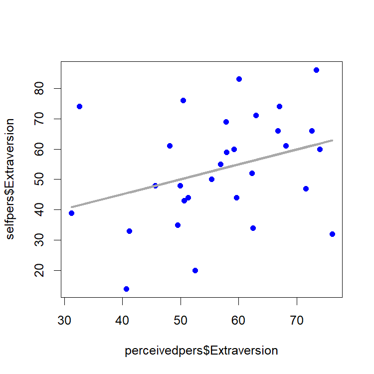
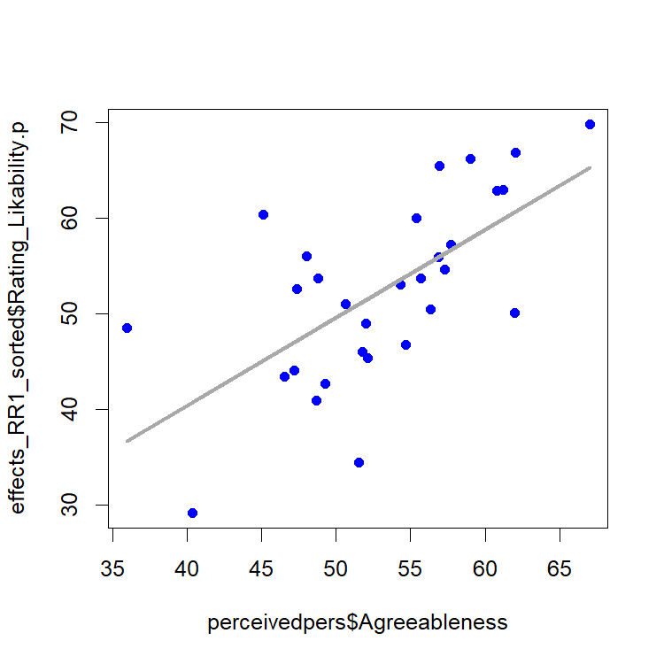

Effects of speakers' personality on the SRM variances
================
Laura Fernández Gallardo
April 2016

-   [Objectives](#objectives)
-   [Load data from listening test](#load-data-from-listening-test)
-   [Self- and externally-assessed personality traits](#self--and-externally-assessed-personality-traits)
-   [Self- and externally-assessed voice likability](#self--and-externally-assessed-voice-likability)
-   [SRM: Univariate analysis of likabiliy ratings](#srm-univariate-analysis-of-likabiliy-ratings)
    -   [Effects of self-assessed personality on the perceiver's variance for liking assessments](#effects-of-self-assessed-personality-on-the-perceivers-variance-for-liking-assessments)
    -   [Effects of "externally"-assessed personality on the target's variance for liking assessments](#effects-of-externally-assessed-personality-on-the-targets-variance-for-liking-assessments)
    -   [Relationship effects](#relationship-effects)

Clear and set path.

Objectives
----------

Analyzing listeners' responses of listening test "Round Robin". Effects of the self-assessed personality on the SRM perceiver variance, and effects of the externally assessed personality on the SRM target variance.

The [SRM model](http://davidakenny.net/srm/soremo.htm) by D. A. Kenny: Kenny (1994).

Load data from listening test
-----------------------------

``` r
## Read raw results

path_github <- "https://raw.githubusercontent.com/laufergall/Subjective_Speaker_Characteristics/master/data/subjective_ratings"
  
data_self <- read.csv(text=getURL(paste0(path_github,"/data_listeningtest6_selfRatings.csv")), header=TRUE, sep=",")  

data_lik <- read.csv(text=getURL(paste0(path_github,"/data_listeningtest6_likabilityRatings_NAs.csv")), header=TRUE, sep=",")  

data_likper <- read.csv(text=getURL(paste0(path_github,"/data_listeningtest6_likabilityPersonalityRatings_NAs.csv")), header=TRUE, sep=",")  

participants <- read.csv(text=getURL(paste0(path_github,"/data_listeningtest6_participants.csv")), header=TRUE, sep=";")  
```

Self- and externally-assessed personality traits
------------------------------------------------

``` r
## Get the self-assessed traits for all participants
selfpers <- data_self[c(19:23)]

## Get the average externally perceived traits for all participants
perceivedpers <- aggregate(data_likper[c(28:32)], by=list(data_likper$IDSpeaker), mean, na.rm=T)

## Correlate self personality and assessed personality, per trait
# Extraversion
fitE <- lm(selfpers$Extraversion ~ perceivedpers$Extraversion)
summary(fitE)       # R-squared ~ 0.11
```

    ## 
    ## Call:
    ## lm(formula = selfpers$Extraversion ~ perceivedpers$Extraversion)
    ## 
    ## Residuals:
    ##     Min      1Q  Median      3Q     Max 
    ## -31.498  -9.932  -0.868  10.822  32.436 
    ## 
    ## Coefficients:
    ##                            Estimate Std. Error t value Pr(>|t|)  
    ## (Intercept)                 25.5923    15.7240   1.628   0.1148  
    ## perceivedpers$Extraversion   0.4896     0.2706   1.809   0.0812 .
    ## ---
    ## Signif. codes:  0 '***' 0.001 '**' 0.01 '*' 0.05 '.' 0.1 ' ' 1
    ## 
    ## Residual standard error: 17.21 on 28 degrees of freedom
    ## Multiple R-squared:  0.1047, Adjusted R-squared:  0.07269 
    ## F-statistic: 3.273 on 1 and 28 DF,  p-value: 0.08116

``` r
plot(perceivedpers$Extraversion, selfpers$Extraversion, pch=19, col="blue" ) 
lines(perceivedpers$Extraversion, fitE$fitted, lwd=3, col="darkgrey")
```



``` r
# Agreeableness
fitA <- lm(selfpers$Agreeableness ~ perceivedpers$Agreeableness)
summary(fitA)
```

    ## 
    ## Call:
    ## lm(formula = selfpers$Agreeableness ~ perceivedpers$Agreeableness)
    ## 
    ## Residuals:
    ##     Min      1Q  Median      3Q     Max 
    ## -41.129  -7.298   1.254  16.168  28.699 
    ## 
    ## Coefficients:
    ##                             Estimate Std. Error t value Pr(>|t|)
    ## (Intercept)                  41.6682    25.2849   1.648    0.111
    ## perceivedpers$Agreeableness   0.2781     0.4726   0.589    0.561
    ## 
    ## Residual standard error: 17.21 on 28 degrees of freedom
    ## Multiple R-squared:  0.01222,    Adjusted R-squared:  -0.02306 
    ## F-statistic: 0.3463 on 1 and 28 DF,  p-value: 0.5609

``` r
# Conscientiousness
fitC <- lm(selfpers$Conscientiousness ~ perceivedpers$Conscientiousness)
summary(fitC)
```

    ## 
    ## Call:
    ## lm(formula = selfpers$Conscientiousness ~ perceivedpers$Conscientiousness)
    ## 
    ## Residuals:
    ##     Min      1Q  Median      3Q     Max 
    ## -21.232  -8.643  -3.982   9.733  38.196 
    ## 
    ## Coefficients:
    ##                                 Estimate Std. Error t value Pr(>|t|)  
    ## (Intercept)                      40.8179    15.5917   2.618   0.0141 *
    ## perceivedpers$Conscientiousness   0.2441     0.2626   0.930   0.3604  
    ## ---
    ## Signif. codes:  0 '***' 0.001 '**' 0.01 '*' 0.05 '.' 0.1 ' ' 1
    ## 
    ## Residual standard error: 13.49 on 28 degrees of freedom
    ## Multiple R-squared:  0.02995,    Adjusted R-squared:  -0.004691 
    ## F-statistic: 0.8646 on 1 and 28 DF,  p-value: 0.3604

``` r
# Neuroticism
fitN <- lm(selfpers$Neuroticism ~ perceivedpers$Neuroticism)
summary(fitN)
```

    ## 
    ## Call:
    ## lm(formula = selfpers$Neuroticism ~ perceivedpers$Neuroticism)
    ## 
    ## Residuals:
    ##     Min      1Q  Median      3Q     Max 
    ## -26.725  -5.256   0.365   6.359  29.192 
    ## 
    ## Coefficients:
    ##                           Estimate Std. Error t value Pr(>|t|)
    ## (Intercept)                17.5957    18.7301   0.939    0.356
    ## perceivedpers$Neuroticism   0.4079     0.3984   1.024    0.315
    ## 
    ## Residual standard error: 13.66 on 28 degrees of freedom
    ## Multiple R-squared:  0.03608,    Adjusted R-squared:  0.001655 
    ## F-statistic: 1.048 on 1 and 28 DF,  p-value: 0.3147

``` r
# Openness
fitO <- lm(selfpers$Openness ~ perceivedpers$Openness)
summary(fitO)
```

    ## 
    ## Call:
    ## lm(formula = selfpers$Openness ~ perceivedpers$Openness)
    ## 
    ## Residuals:
    ##     Min      1Q  Median      3Q     Max 
    ## -48.133  -5.303  -0.616  10.096  27.883 
    ## 
    ## Coefficients:
    ##                        Estimate Std. Error t value Pr(>|t|)   
    ## (Intercept)             79.7706    25.3818   3.143  0.00393 **
    ## perceivedpers$Openness  -0.1521     0.4764  -0.319  0.75191   
    ## ---
    ## Signif. codes:  0 '***' 0.001 '**' 0.01 '*' 0.05 '.' 0.1 ' ' 1
    ## 
    ## Residual standard error: 17.69 on 28 degrees of freedom
    ## Multiple R-squared:  0.003627,   Adjusted R-squared:  -0.03196 
    ## F-statistic: 0.1019 on 1 and 28 DF,  p-value: 0.7519

No correlation has been found between self- and externally-assessed personality for any personality trait.

Self- and externally-assessed voice likability
----------------------------------------------

``` r
## Mean of likability for clean data
mean_44100 <- mean(data_likper$Rating_Likability)
ratingsSpk <- aggregate(data_likper$Rating_Likability, by=list(data_likper$IDSpeaker), mean, na.rm=T)


# self-assessed likability
selflik<- data_self$Rating_Likability


# mean assessed likability for NB and for WB
data_lik_split<-split(data_lik, data_lik$stimulusDistortion)
data_lik_NB<-data_lik_split[[1]]
data_lik_WB<-data_lik_split[[2]]
ratingsSpk_NB <- aggregate(data_lik_NB$Rating_Likability, by=list(data_lik_NB$IDSpeaker), mean, na.rm=T)
ratingsSpk_WB <- aggregate(data_lik_WB$Rating_Likability, by=list(data_lik_WB$IDSpeaker), mean, na.rm=T)

# Correlations
fit_lik_clean <- lm(ratingsSpk$x ~ selflik)
summary(fit_lik_clean) # no fit
```

    ## 
    ## Call:
    ## lm(formula = ratingsSpk$x ~ selflik)
    ## 
    ## Residuals:
    ##      Min       1Q   Median       3Q      Max 
    ## -23.0929  -6.7954  -0.4967   5.9605  17.1286 
    ## 
    ## Coefficients:
    ##             Estimate Std. Error t value Pr(>|t|)    
    ## (Intercept) 55.98222    7.57449   7.391 4.76e-08 ***
    ## selflik     -0.05915    0.12277  -0.482    0.634    
    ## ---
    ## Signif. codes:  0 '***' 0.001 '**' 0.01 '*' 0.05 '.' 0.1 ' ' 1
    ## 
    ## Residual standard error: 9.753 on 28 degrees of freedom
    ## Multiple R-squared:  0.008223,   Adjusted R-squared:  -0.0272 
    ## F-statistic: 0.2322 on 1 and 28 DF,  p-value: 0.6337

``` r
fit_lik_NB <- lm(ratingsSpk_NB$x ~ selflik)
summary(fit_lik_NB) # no fit
```

    ## 
    ## Call:
    ## lm(formula = ratingsSpk_NB$x ~ selflik)
    ## 
    ## Residuals:
    ##      Min       1Q   Median       3Q      Max 
    ## -10.8710  -5.5911  -0.6744   2.9766  15.1744 
    ## 
    ## Coefficients:
    ##             Estimate Std. Error t value Pr(>|t|)    
    ## (Intercept) 53.20372    5.37673   9.895 1.21e-10 ***
    ## selflik     -0.12913    0.08715  -1.482     0.15    
    ## ---
    ## Signif. codes:  0 '***' 0.001 '**' 0.01 '*' 0.05 '.' 0.1 ' ' 1
    ## 
    ## Residual standard error: 6.923 on 28 degrees of freedom
    ## Multiple R-squared:  0.07271,    Adjusted R-squared:  0.03959 
    ## F-statistic: 2.196 on 1 and 28 DF,  p-value: 0.1496

``` r
fit_lik_WB <- lm(ratingsSpk_WB$x ~ selflik)
summary(fit_lik_WB) # R-squared ~ 0.1
```

    ## 
    ## Call:
    ## lm(formula = ratingsSpk_WB$x ~ selflik)
    ## 
    ## Residuals:
    ##     Min      1Q  Median      3Q     Max 
    ## -15.187  -5.863  -1.403   8.436  17.795 
    ## 
    ## Coefficients:
    ##             Estimate Std. Error t value Pr(>|t|)    
    ## (Intercept)  67.4094     7.4469   9.052 8.27e-10 ***
    ## selflik      -0.2354     0.1207  -1.950   0.0612 .  
    ## ---
    ## Signif. codes:  0 '***' 0.001 '**' 0.01 '*' 0.05 '.' 0.1 ' ' 1
    ## 
    ## Residual standard error: 9.589 on 28 degrees of freedom
    ## Multiple R-squared:  0.1196, Adjusted R-squared:  0.08816 
    ## F-statistic: 3.804 on 1 and 28 DF,  p-value: 0.06121

No correlation has been found between self- and externally-assessed voice likability, for any channel quality.

SRM: Univariate analysis of likabiliy ratings
---------------------------------------------

Applying the SRM model. Likability ratings given to clean speech (sampled at 44.1 kHz) are analyzed.

``` r
## Round-robin - univariate analysis for "Rating_Likability" in likper data
RR1 <- RR(Rating_Likability ~ IDListener*IDSpeaker, data=data_likper, na.rm=TRUE)
```

The SRM variance components on the likability variable:

``` r
RR1$varComp
```

    ##                             type   estimate standardized       se    SEVAR
    ## sesaa2            actor variance  78.327183   0.14806483 23.14826 535.8420
    ## sesbb2          partner variance  79.139009   0.14959946 23.35439 545.4275
    ## sescc2     relationship variance 371.539807   0.70233572 18.53750 343.6389
    ##                   error variance         NA           NA       NA       NA
    ## sesab2  actor-partner covariance   1.572918   0.01997811 16.73803 280.1616
    ## sesccs2  relationship covariance -45.076634  -0.12132383 18.53750 343.6389
    ##             t.value     p.value
    ## sesaa2   3.38371775 0.001033137
    ## sesbb2   3.38861405 0.001020056
    ## sescc2  20.04260671 0.000000000
    ##                  NA          NA
    ## sesab2   0.09397269 0.925777123
    ## sesccs2 -2.43164589 0.010719655

The distribution of variance is comparable to other studies (e.g.Back, Schmukle, and Egloff (2011)), with a similar low amount of perceiver and target variance and a high amount of relationship variance.

The perceiver effect reflects the participant's tendency to rate positively or negatively, whereas the target effect measures how likable a speaker is on average (the most common data analyzed). The remaining variance in the ratings comprises the effect of individual dyadic relationships.

In the following, we conduct correlation analyses separately for these three effects.

### Effects of self-assessed personality on the perceiver's variance for liking assessments

Perceiver effects: "What is the personality of people who like others?"

``` r
# self-assessed personality: 
selfpers
```

    ##    Extraversion Agreeableness Conscientiousness Neuroticism Openness
    ## 1            32            76                43          38       62
    ## 2            76            41                65          14       72
    ## 3            66            48                52          44       99
    ## 4            43            73                63          40       68
    ## 5            52            60                63          21       71
    ## 6            86            56                71          39       80
    ## 7            44            51                40          61       97
    ## 8            60            89                54          38       75
    ## 9            39            38                62          31       84
    ## 10           35            23                45          49       39
    ## 11           69            66                51          38       88
    ## 12           66            64                41          67       64
    ## 13           14            15                49          10       77
    ## 14           61            69                94          35       99
    ## 15           59            72                67          48       66
    ## 16           74            55                51          38       69
    ## 17           71            51                49          28       78
    ## 18           47            73                42          32       44
    ## 19           74            65                40          35       44
    ## 20           50            50                45          43       72
    ## 21           48            38                69          51       58
    ## 22           60            57                70          15       77
    ## 23           33            76                46          14       83
    ## 24           34            73                30          29       68
    ## 25           55            74                49          33       23
    ## 26           20            52                53          40       69
    ## 27           83            38                75          26       82
    ## 28           44            34                60          47       72
    ## 29           48            56                48          57       82
    ## 30           61            60                67          37       90

``` r
# perceiver/actor variance:
effects_RR1 <- RR1$effects.gm

# sorting perceiver's variance per participant ID
effects_RR1_sorted <- effects_RR1[order(as.numeric(rownames(effects_RR1))),,drop=FALSE]
names_sorted<-participants[participants$ID %in% effects_RR1_sorted$id, ]$spk_pseudonym
data.frame(names_sorted,effects_RR1_sorted)
```

    ##               names_sorted id Rating_Likability.a Rating_Likability.p
    ## 1                 lelydorp  1            57.27308            45.37308
    ## 2                  moundou  2            35.32665            40.92665
    ## 3                 hangaroa  3            40.11355            42.74689
    ## 4                   linden  4            73.43260            50.99927
    ## 5                  nicosia  5            67.10998            52.64332
    ## 6                    rabat  6            59.36902            34.48568
    ## 7                 klaksvik  7            45.72427            65.45760
    ## 8                    dakar  8            57.83974            69.80641
    ## 9                   durres  9            55.75998            50.49332
    ## 10                medellin 10            54.43379            46.03379
    ## 11               jerusalem 11            52.49808            66.89808
    ## 12               ngerulmud 12            53.83498            54.66832
    ## 13                freetown 13            40.63855            48.97189
    ## 14                lilongwe 14            52.49212            53.72546
    ## 15             francistown 15            61.88687            56.00355
    ## 16                  beirut 16            52.13022            57.23022
    ## 17             brazzaville 17            53.43855            66.17189
    ## 18               rotterdam 18            27.54808            60.34808
    ## 19                  banjul 19            56.02189            50.08855
    ## 20 edinburghofthesevenseas 20            55.71593            29.21593
    ## 21                  dakhla 21            41.87308            46.77308
    ## 22               marseille 22            42.58855            48.52189
    ## 23                  malabo 23            44.28379            53.68379
    ## 24                  kigali 24            55.82665            43.42665
    ## 25                 westbay 25            60.50522            53.10522
    ## 26             charlestown 26            51.81117            59.97784
    ## 27                   riffa 27            49.49808            62.89808
    ## 28                debrecen 28            54.81474            44.08141
    ## 29            speightstown 29            56.18974            62.95641
    ## 30                   sanaa 30            63.63617            55.90284

``` r
effects_RR1_sorted$Rating_Likability.a 
```

    ##  [1] 57.27308 35.32665 40.11355 73.43260 67.10998 59.36902 45.72427
    ##  [8] 57.83974 55.75998 54.43379 52.49808 53.83498 40.63855 52.49212
    ## [15] 61.88687 52.13022 53.43855 27.54808 56.02189 55.71593 41.87308
    ## [22] 42.58855 44.28379 55.82665 60.50522 51.81117 49.49808 54.81474
    ## [29] 56.18974 63.63617

``` r
# Correlations per personality trait
# Extraversion
fit_perceiver_E <- lm(effects_RR1_sorted$Rating_Likability.a ~ selfpers$Extraversion)
summary(fit_perceiver_E)
```

    ## 
    ## Call:
    ## lm(formula = effects_RR1_sorted$Rating_Likability.a ~ selfpers$Extraversion)
    ## 
    ## Residuals:
    ##     Min      1Q  Median      3Q     Max 
    ## -24.761  -5.793   1.747   4.894  21.213 
    ## 
    ## Coefficients:
    ##                       Estimate Std. Error t value Pr(>|t|)    
    ## (Intercept)           51.25527    5.67390   9.034 8.64e-10 ***
    ## selfpers$Extraversion  0.02242    0.10081   0.222    0.826    
    ## ---
    ## Signif. codes:  0 '***' 0.001 '**' 0.01 '*' 0.05 '.' 0.1 ' ' 1
    ## 
    ## Residual standard error: 9.705 on 28 degrees of freedom
    ## Multiple R-squared:  0.001763,   Adjusted R-squared:  -0.03389 
    ## F-statistic: 0.04945 on 1 and 28 DF,  p-value: 0.8256

``` r
# Agreeableness
fit_perceiver_A <- lm(effects_RR1_sorted$Rating_Likability.a ~ selfpers$Agreeableness)
summary(fit_perceiver_A)
```

    ## 
    ## Call:
    ## lm(formula = effects_RR1_sorted$Rating_Likability.a ~ selfpers$Agreeableness)
    ## 
    ## Residuals:
    ##      Min       1Q   Median       3Q      Max 
    ## -27.7744  -4.0151   0.3701   5.9364  18.1101 
    ## 
    ## Coefficients:
    ##                        Estimate Std. Error t value Pr(>|t|)    
    ## (Intercept)             42.6820     5.9353   7.191 7.94e-08 ***
    ## selfpers$Agreeableness   0.1732     0.1008   1.717    0.097 .  
    ## ---
    ## Signif. codes:  0 '***' 0.001 '**' 0.01 '*' 0.05 '.' 0.1 ' ' 1
    ## 
    ## Residual standard error: 9.239 on 28 degrees of freedom
    ## Multiple R-squared:  0.09528,    Adjusted R-squared:  0.06297 
    ## F-statistic: 2.949 on 1 and 28 DF,  p-value: 0.09699

``` r
# Conscientiousness
fit_perceiver_C <- lm(effects_RR1_sorted$Rating_Likability.a ~ selfpers$Conscientiousness)
summary(fit_perceiver_C)
```

    ## 
    ## Call:
    ## lm(formula = effects_RR1_sorted$Rating_Likability.a ~ selfpers$Conscientiousness)
    ## 
    ## Residuals:
    ##     Min      1Q  Median      3Q     Max 
    ## -23.885  -5.290   2.231   5.437  20.367 
    ## 
    ## Coefficients:
    ##                            Estimate Std. Error t value Pr(>|t|)    
    ## (Intercept)                48.16911    7.55147   6.379 6.65e-07 ***
    ## selfpers$Conscientiousness  0.07772    0.13318   0.584    0.564    
    ## ---
    ## Signif. codes:  0 '***' 0.001 '**' 0.01 '*' 0.05 '.' 0.1 ' ' 1
    ## 
    ## Residual standard error: 9.655 on 28 degrees of freedom
    ## Multiple R-squared:  0.01201,    Adjusted R-squared:  -0.02327 
    ## F-statistic: 0.3405 on 1 and 28 DF,  p-value: 0.5642

``` r
# Neuroticism
fit_perceiver_N <- lm(effects_RR1_sorted$Rating_Likability.a ~ selfpers$Neuroticism)
summary(fit_perceiver_N)
```

    ## 
    ## Call:
    ## lm(formula = effects_RR1_sorted$Rating_Likability.a ~ selfpers$Neuroticism)
    ## 
    ## Residuals:
    ##      Min       1Q   Median       3Q      Max 
    ## -24.1243  -4.1939   0.2903   4.6433  20.4012 
    ## 
    ## Coefficients:
    ##                      Estimate Std. Error t value Pr(>|t|)    
    ## (Intercept)           46.2364     4.9893   9.267 5.02e-10 ***
    ## selfpers$Neuroticism   0.1699     0.1280   1.328    0.195    
    ## ---
    ## Signif. codes:  0 '***' 0.001 '**' 0.01 '*' 0.05 '.' 0.1 ' ' 1
    ## 
    ## Residual standard error: 9.422 on 28 degrees of freedom
    ## Multiple R-squared:  0.05922,    Adjusted R-squared:  0.02562 
    ## F-statistic: 1.762 on 1 and 28 DF,  p-value: 0.195

``` r
# Openness
fit_perceiver_O <- lm(effects_RR1_sorted$Rating_Likability.a ~ selfpers$Openness)
summary(fit_perceiver_O)
```

    ## 
    ## Call:
    ## lm(formula = effects_RR1_sorted$Rating_Likability.a ~ selfpers$Openness)
    ## 
    ## Residuals:
    ##     Min      1Q  Median      3Q     Max 
    ## -25.887  -5.025   1.157   4.381  20.847 
    ## 
    ## Coefficients:
    ##                   Estimate Std. Error t value Pr(>|t|)    
    ## (Intercept)       54.99259    7.62480   7.212 7.52e-08 ***
    ## selfpers$Openness -0.03539    0.10339  -0.342    0.735    
    ## ---
    ## Signif. codes:  0 '***' 0.001 '**' 0.01 '*' 0.05 '.' 0.1 ' ' 1
    ## 
    ## Residual standard error: 9.693 on 28 degrees of freedom
    ## Multiple R-squared:  0.004167,   Adjusted R-squared:  -0.0314 
    ## F-statistic: 0.1172 on 1 and 28 DF,  p-value: 0.7347

Correlating the Big-Five self reports with perceiver variance yields no significant result, although an effect of the Agreeableness trait was hypothesized.

Collecting additional personality profiles on the participants from close friends might have improved the validity and reliability of the personality traits. However, such a study was not conducted and the personality attributions from the other participants cannot be considered as they do not know each other. These are, in turn, relevant for the target effects.

### Effects of "externally"-assessed personality on the target's variance for liking assessments

Target effects: "Does attributed personality affect likability ratings?"

``` r
# "externally"-assessed personality
perceivedpers
```

    ##    Group.1 Extraversion Agreeableness Conscientiousness Neuroticism
    ## 1        1     76.10345      52.13793          64.65517    55.03448
    ## 2        2     50.44828      48.68966          59.75862    47.86207
    ## 3        3     72.65517      49.27586          62.31034    48.03448
    ## 4        4     50.62069      50.62069          66.48276    54.89655
    ## 5        5     62.27586      47.34483          58.10345    40.00000
    ## 6        6     73.35714      51.53571          62.46429    50.71429
    ## 7        7     59.62069      56.93103          60.48276    37.13793
    ## 8        8     73.96552      67.00000          72.93103    37.75862
    ## 9        9     31.24138      56.34483          57.41379    54.55172
    ## 10      10     49.48276      51.79310          61.86207    48.31034
    ## 11      11     57.82759      62.03448          65.55172    47.37931
    ## 12      12     66.75862      57.27586          66.37931    49.55172
    ## 13      13     40.65517      52.00000          58.10345    46.89655
    ## 14      14     68.17241      48.82759          61.37931    37.13793
    ## 15      15     57.92857      48.03571          67.17857    53.14286
    ## 16      16     67.00000      57.68966          50.79310    43.34483
    ## 17      17     63.00000      59.00000          69.68966    36.96552
    ## 18      18     71.58621      45.13793          60.58621    38.37931
    ## 19      19     32.62069      62.00000          54.68966    52.41379
    ## 20      20     55.34483      40.34483          33.24138    54.06897
    ## 21      21     45.62069      54.68966          48.03448    45.34483
    ## 22      22     59.24138      36.00000          68.20690    39.37931
    ## 23      23     41.13793      55.68966          49.62069    50.41379
    ## 24      24     62.48276      46.51724          42.65517    40.20690
    ## 25      25     56.89655      54.34483          66.58621    50.86207
    ## 26      26     52.48276      55.41379          54.55172    46.51724
    ## 27      27     60.10345      60.79310          62.68966    42.20690
    ## 28      28     51.31034      47.20690          34.00000    39.93103
    ## 29      29     49.89655      61.20690          61.79310    57.37931
    ## 30      30     48.10345      56.89655          56.82759    51.89655
    ##    Openness
    ## 1  54.48276
    ## 2  52.24138
    ## 3  56.89655
    ## 4  51.72414
    ## 5  48.41379
    ## 6  56.10714
    ## 7  51.65517
    ## 8  67.34483
    ## 9  52.13793
    ## 10 60.13793
    ## 11 61.58621
    ## 12 62.79310
    ## 13 51.65517
    ## 14 53.89655
    ## 15 55.00000
    ## 16 54.75862
    ## 17 61.17241
    ## 18 52.44828
    ## 19 54.55172
    ## 20 36.75862
    ## 21 45.41379
    ## 22 48.82759
    ## 23 45.20690
    ## 24 44.55172
    ## 25 56.79310
    ## 26 51.20690
    ## 27 60.75862
    ## 28 37.41379
    ## 29 51.55172
    ## 30 47.82759

``` r
# target's variance
effects_RR1_sorted$Rating_Likability.p
```

    ##  [1] 45.37308 40.92665 42.74689 50.99927 52.64332 34.48568 65.45760
    ##  [8] 69.80641 50.49332 46.03379 66.89808 54.66832 48.97189 53.72546
    ## [15] 56.00355 57.23022 66.17189 60.34808 50.08855 29.21593 46.77308
    ## [22] 48.52189 53.68379 43.42665 53.10522 59.97784 62.89808 44.08141
    ## [29] 62.95641 55.90284

``` r
# Correlations per personality trait
# Extraversion
fit_target_E <- lm(effects_RR1_sorted$Rating_Likability.p ~ perceivedpers$Extraversion)
summary(fit_target_E)  # no correlation
```

    ## 
    ## Call:
    ## lm(formula = effects_RR1_sorted$Rating_Likability.p ~ perceivedpers$Extraversion)
    ## 
    ## Residuals:
    ##      Min       1Q   Median       3Q      Max 
    ## -23.1168  -5.5932   0.2068   6.1127  16.0528 
    ## 
    ## Coefficients:
    ##                            Estimate Std. Error t value Pr(>|t|)    
    ## (Intercept)                 48.1098     8.8726   5.422 8.75e-06 ***
    ## perceivedpers$Extraversion   0.0763     0.1527   0.500    0.621    
    ## ---
    ## Signif. codes:  0 '***' 0.001 '**' 0.01 '*' 0.05 '.' 0.1 ' ' 1
    ## 
    ## Residual standard error: 9.714 on 28 degrees of freedom
    ## Multiple R-squared:  0.008839,   Adjusted R-squared:  -0.02656 
    ## F-statistic: 0.2497 on 1 and 28 DF,  p-value: 0.6212

``` r
# Agreeableness
fit_target_A <- lm(effects_RR1_sorted$Rating_Likability.p ~ perceivedpers$Agreeableness)
summary(fit_target_A) # Multiple R-squared:  0.4152,    Adjusted R-squared:  0.3943, F-statistic: 19.88 on 1 and 28 DF,  p-value: 0.0001216
```

    ## 
    ## Call:
    ## lm(formula = effects_RR1_sorted$Rating_Likability.p ~ perceivedpers$Agreeableness)
    ## 
    ## Residuals:
    ##      Min       1Q   Median       3Q      Max 
    ## -16.5367  -5.1566  -0.2743   5.3406  15.2082 
    ## 
    ## Coefficients:
    ##                             Estimate Std. Error t value Pr(>|t|)    
    ## (Intercept)                   3.6378    10.9110   0.333 0.741309    
    ## perceivedpers$Agreeableness   0.9195     0.2039   4.509 0.000106 ***
    ## ---
    ## Signif. codes:  0 '***' 0.001 '**' 0.01 '*' 0.05 '.' 0.1 ' ' 1
    ## 
    ## Residual standard error: 7.426 on 28 degrees of freedom
    ## Multiple R-squared:  0.4207, Adjusted R-squared:    0.4 
    ## F-statistic: 20.33 on 1 and 28 DF,  p-value: 0.000106

``` r
plot(perceivedpers$Agreeableness, effects_RR1_sorted$Rating_Likability.p, pch=19, col="blue" ) 
lines(perceivedpers$Agreeableness, fit_target_A$fitted, lwd=3, col="darkgrey")
```



``` r
# Conscientiousness
fit_target_C <- lm(effects_RR1_sorted$Rating_Likability.p ~ perceivedpers$Conscientiousness)
summary(fit_target_C) # Multiple R-squared:  0.2774,    Adjusted R-squared:  0.2516, F-statistic: 10.75 on 1 and 28 DF,  p-value: 0.00279
```

    ## 
    ## Call:
    ## lm(formula = effects_RR1_sorted$Rating_Likability.p ~ perceivedpers$Conscientiousness)
    ## 
    ## Residuals:
    ##      Min       1Q   Median       3Q      Max 
    ## -19.9547  -5.0123  -0.2513   7.7084  12.0449 
    ## 
    ## Coefficients:
    ##                                 Estimate Std. Error t value Pr(>|t|)   
    ## (Intercept)                      22.0429     9.6554   2.283  0.03023 * 
    ## perceivedpers$Conscientiousness   0.5187     0.1626   3.190  0.00349 **
    ## ---
    ## Signif. codes:  0 '***' 0.001 '**' 0.01 '*' 0.05 '.' 0.1 ' ' 1
    ## 
    ## Residual standard error: 8.356 on 28 degrees of freedom
    ## Multiple R-squared:  0.2665, Adjusted R-squared:  0.2403 
    ## F-statistic: 10.17 on 1 and 28 DF,  p-value: 0.003495

``` r
# Neuroticism
fit_target_N <- lm(effects_RR1_sorted$Rating_Likability.p ~ perceivedpers$Neuroticism)
summary(fit_target_N) # Multiple R-squared:  0.1136,    Adjusted R-squared:  0.08193, F-statistic: 3.588 on 1 and 28 DF,  p-value: 0.06857
```

    ## 
    ## Call:
    ## lm(formula = effects_RR1_sorted$Rating_Likability.p ~ perceivedpers$Neuroticism)
    ## 
    ## Residuals:
    ##     Min      1Q  Median      3Q     Max 
    ## -19.364  -6.127   2.505   6.757  16.091 
    ## 
    ## Coefficients:
    ##                           Estimate Std. Error t value Pr(>|t|)    
    ## (Intercept)                76.5863    12.5606   6.097 1.41e-06 ***
    ## perceivedpers$Neuroticism  -0.5180     0.2672  -1.939   0.0627 .  
    ## ---
    ## Signif. codes:  0 '***' 0.001 '**' 0.01 '*' 0.05 '.' 0.1 ' ' 1
    ## 
    ## Residual standard error: 9.161 on 28 degrees of freedom
    ## Multiple R-squared:  0.1183, Adjusted R-squared:  0.08684 
    ## F-statistic: 3.758 on 1 and 28 DF,  p-value: 0.0627

``` r
# Openness
fit_target_O <- lm(effects_RR1_sorted$Rating_Likability.p ~ perceivedpers$Openness)
summary(fit_target_O) # Multiple R-squared:  0.2995,    Adjusted R-squared:  0.2745, F-statistic: 11.97 on 1 and 28 DF,  p-value: 0.001748
```

    ## 
    ## Call:
    ## lm(formula = effects_RR1_sorted$Rating_Likability.p ~ perceivedpers$Openness)
    ## 
    ## Residuals:
    ##      Min       1Q   Median       3Q      Max 
    ## -20.4192  -3.4359   0.1903   6.8397  13.8965 
    ## 
    ## Coefficients:
    ##                        Estimate Std. Error t value Pr(>|t|)   
    ## (Intercept)             12.7641    11.7850   1.083  0.28801   
    ## perceivedpers$Openness   0.7511     0.2212   3.395  0.00207 **
    ## ---
    ## Signif. codes:  0 '***' 0.001 '**' 0.01 '*' 0.05 '.' 0.1 ' ' 1
    ## 
    ## Residual standard error: 8.212 on 28 degrees of freedom
    ## Multiple R-squared:  0.2917, Adjusted R-squared:  0.2664 
    ## F-statistic: 11.53 on 1 and 28 DF,  p-value: 0.002067

Significant correlations found for Agreeableness, Conscientiousness, and Openness.

The ratings of the Big-Five traits (z-normalized for better comparability) were correlated with target variance. Two effects have been found. Assumed extrovert and agreeable speakers are rated more positively. This is a well known effect for acquainted people Linden et al. (2010), Wortman and Wood (2011).

However, for unacquainted people, the study in Back, Schmukle, and Egloff (2011) reports only a positive effect of Extroversion on target effects, whereas Agreeableness was not correlated. Still, there is sufficient evidence suggesting a positive effect of perceived benevolence on liking and social attractiveness for the acoustic domain and unacquainted people, e.g. (<span class="citeproc-not-found" data-reference-id="670">**???**</span>).

### Relationship effects

Relationship effects: The remaining variance after controlling for target and perceiver.

``` r
# calculate individual similarities between raters self and targets peceived personality 
vector_diss_pers <- data_likper[,c(8,28:32,1,3,10)] 

# diss_pers$IDListener is already sorted vector_diss_pers$IDSpeaker #so sort by IDspeaker/Target as well 

vector_diss_pers <- vector_diss_pers[order(vector_diss_pers$IDListener,vector_diss_pers$IDSpeaker),]
vector_diss_pers <- cbind(vector_diss_pers, rep(data_self[,19], each=29),rep(data_self[,20], each=29),rep(data_self[,21], each=29),rep(data_self[,22], each=29),rep(data_self[,22], each=29)) 
names(vector_diss_pers)[10:14] <- c("S.Extraversion","S.Agreeableness","S.Conscientiousness","S.Neuroticism","S.Openness")

vector_diss_pers$simE <- abs(vector_diss_pers$Extraversion-vector_diss_pers$S.Extraversion)*-1
vector_diss_pers$simA <- abs(vector_diss_pers$Agreeableness-vector_diss_pers$S.Agreeableness)*-1
vector_diss_pers$simC <- abs(vector_diss_pers$Conscientiousness-vector_diss_pers$S.Conscientiousness)*-1
vector_diss_pers$simN <- abs(vector_diss_pers$Neuroticism-vector_diss_pers$S.Neuroticism)*-1
vector_diss_pers$simO <- abs(vector_diss_pers$Openness-vector_diss_pers$S.Openness)*-1

# sort for actor/perveiver
relEffects_RR1 <- RR1$effectsRel 
relEffects_RR1_sorted <- relEffects_RR1[order(relEffects_RR1$actor.id,relEffects_RR1$partner.id),,drop=FALSE]

# merge rel-variance from RR and individual personality differences 
relEffects_RR1_sorted <- cbind(relEffects_RR1_sorted, vector_diss_pers)

# normalize
relEffects_RR1_sorted[,c(4:9)] <- scale(relEffects_RR1_sorted[,c(4:9)])

# correlations
cor.test(relEffects_RR1_sorted$relationship, relEffects_RR1_sorted[,19]) 
```

    ## 
    ##  Pearson's product-moment correlation
    ## 
    ## data:  relEffects_RR1_sorted$relationship and relEffects_RR1_sorted[, 19]
    ## t = 0.36161, df = 866, p-value = 0.7177
    ## alternative hypothesis: true correlation is not equal to 0
    ## 95 percent confidence interval:
    ##  -0.05429966  0.07876494
    ## sample estimates:
    ##        cor 
    ## 0.01228704

``` r
cor.test(relEffects_RR1_sorted$relationship, relEffects_RR1_sorted[,20]) 
```

    ## 
    ##  Pearson's product-moment correlation
    ## 
    ## data:  relEffects_RR1_sorted$relationship and relEffects_RR1_sorted[, 20]
    ## t = 3.685, df = 866, p-value = 0.0002429
    ## alternative hypothesis: true correlation is not equal to 0
    ## 95 percent confidence interval:
    ##  0.05819072 0.18922964
    ## sample estimates:
    ##       cor 
    ## 0.1242519

``` r
cor.test(relEffects_RR1_sorted$relationship, relEffects_RR1_sorted[,21]) 
```

    ## 
    ##  Pearson's product-moment correlation
    ## 
    ## data:  relEffects_RR1_sorted$relationship and relEffects_RR1_sorted[, 21]
    ## t = 1.9598, df = 866, p-value = 0.05034
    ## alternative hypothesis: true correlation is not equal to 0
    ## 95 percent confidence interval:
    ##  -0.0000939538  0.1324056084
    ## sample estimates:
    ##        cor 
    ## 0.06644876

``` r
cor.test(relEffects_RR1_sorted$relationship, relEffects_RR1_sorted[,22]) 
```

    ## 
    ##  Pearson's product-moment correlation
    ## 
    ## data:  relEffects_RR1_sorted$relationship and relEffects_RR1_sorted[, 22]
    ## t = 4.5297, df = 866, p-value = 6.736e-06
    ## alternative hypothesis: true correlation is not equal to 0
    ## 95 percent confidence interval:
    ##  0.08646518 0.21648297
    ## sample estimates:
    ##       cor 
    ## 0.1521322

``` r
cor.test(relEffects_RR1_sorted$relationship, relEffects_RR1_sorted[,23])
```

    ## 
    ##  Pearson's product-moment correlation
    ## 
    ## data:  relEffects_RR1_sorted$relationship and relEffects_RR1_sorted[, 23]
    ## t = -4.8626, df = 866, p-value = 1.375e-06
    ## alternative hypothesis: true correlation is not equal to 0
    ## 95 percent confidence interval:
    ##  -0.22710667 -0.09754397
    ## sample estimates:
    ##        cor 
    ## -0.1630281

Specifically, considering a pair of participants A--B, the relationship variance accounts for the extent to which A likes B controlling for A's general tendency toward liking others and B's general tendency to be liked by others.

According to the attraction theory Aronson, Wilson, and Akert (2009), the most prominent factors to explain individual relationships are similarity, reciprocal likability, and proximity. Reciprocal likability, however, cannot be analyzed for relationship variance with our data because the participants never interacted. Therefore, any signal of liking, interest, or agreeableness would only affect the target variance. This might partly explain our correlation of Agreeableness--target variance. Also, with unacquainted participants recruited from a single city, only similarity remains as factor to be studied here.

Similarity between each dyad was obtained as the absolute difference between a perceiver's self-rating and his/her individual rating to his/her partner for each of the Big-Five traits, multiplied by -1 and z-normalized. In contrast to Back, Schmukle, and Egloff (2011), which did not find a similarity effect for personality but only for preferences (clothing, subculture), a significant similarity effect for Agreeableness and Neuroticism can be observed from our results.

This indicates that pairs of individuals who are close in these two personality traits tend to like each other's voices to a greater extent, controlling by their tendencies of "being a liker" and of "being liked" by others. A plausible explanation for the dissimilarity effect for Openness is currently missing.

Aronson, E., T. D. Wilson, and R. M. Akert. 2009. *Social Psychology*. 7th ed. Prentice Hall.

Back, M. D., S. C. Schmukle, and B. Egloff. 2011. “A Closer Look at First Sight: Social Relations Lens Model Analysis of Personality and Interpersonal Attraction at Zero Acquaintance.” *European Journal of Personality* 25 (3): 225–38.

Kenny, D. A. 1994. *Interpersonal Perception: A Social Relations Analysis*. New York, U. S.: Guilford Press.

Linden, D. van der, R. H. Scholte, A. H. Cillessen, J. te Nijenhuis, and E. Segers. 2010. “Classroom Ratings of Likeability and Popularity Are Related to the Big Five and the General Factor of Personality.” *Journal of Research in Personality* 44 (5): 669–72.

Wortman, J., and D. Wood. 2011. “The Personality Traits of Liked People.” *Journal of Research in Personality* 45 (6): 519–28.
