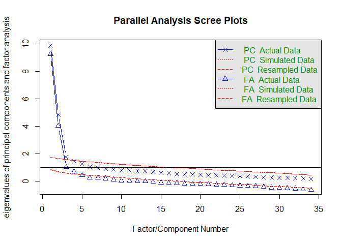
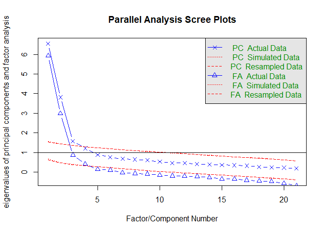
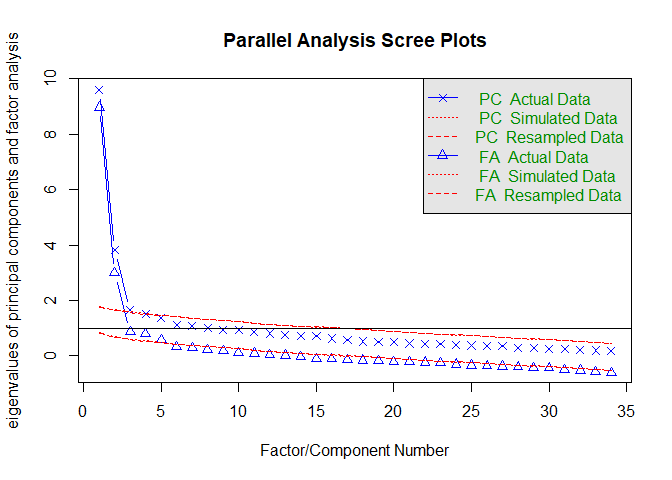
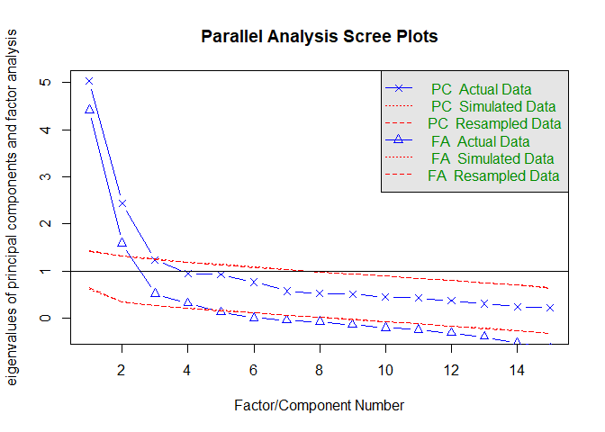

Factor analysis of voice descriptions
================
Laura Fernández Gallardo
September 2017

-   [1) Load subjective ratings](#load-subjective-ratings)
-   [2) Factor analysis for each speaker gender](#factor-analysis-for-each-speaker-gender)
    -   [2a) Factor analysis of male speakers](#a-factor-analysis-of-male-speakers)
    -   [2b) Factor analysis of female speakers](#b-factor-analysis-of-female-speakers)
-   [3) Summary of dimensions and loadings](#summary-of-dimensions-and-loadings)
    -   [Male speakers](#male-speakers)
    -   [Female speakers](#female-speakers)

Perform factor analysis to reduce the 34-dimensional subjective voice descriptions to a smaller set of dimensions. Factor analysis instead of PCA in order to extract latent factors that represent the space of subjective voice descriptions that can be made by listening.

1) Load subjective ratings
--------------------------

Clear workspace.

``` r
rm(list=ls())
```

Load necessary libraries.

``` r
library(RCurl) # to read raw data from repo
library(GPArotation) 
library(psych) # for alpha analysis
library(knitr) # for kable
```

Set paths and read data.

2) Factor analysis for each speaker gender
------------------------------------------

Split data into male and female speakers to perform factor analysis separately, as males and females have different stereotypes.

``` r
data_split_g <- split(data_raw, data_raw$speaker_gender)
data_m <- data_split_g$m
data_f <- data_split_g$w
```

### 2a) Factor analysis of male speakers

``` r
# always use z-scores
data_m <- data_m[order(data_m$listener_pseudonym),]
data_m<- cbind(data_m[,c(1, 5)], data.frame(do.call("rbind", as.list(by(data_m[,16:ncol(data_m)], data_m$listener_pseudonym, scale)))))
data_m <- data_m[order(data_m$listener_pseudonym),]

# find the no of factors
fa.parallel(data_m[,3:ncol(data_m)])
```



    ## Parallel analysis suggests that the number of factors =  4  and the number of components =  3

Parallel analysis suggests that the number of factors = 4 and the number of components = 3 . Hence, perform factor analysis with 4 factors:

``` r
fa_m <- fa(data_m[,3:ncol(data_m)], nfactors=4 , rotate="oblimin", fm="minres") # this is default; no pricipal axis analysis
print(fa_m, cut=.2, digits=2, sort=T)
```

    ## Factor Analysis using method =  minres
    ## Call: fa(r = data_m[, 3:ncol(data_m)], nfactors = 4, rotate = "oblimin", 
    ##     fm = "minres")
    ## Standardized loadings (pattern matrix) based upon correlation matrix
    ##                 item   MR1   MR2   MR3   MR4   h2   u2 com
    ## fest              21 -0.80                   0.63 0.37 1.0
    ## praezise          20 -0.70                   0.60 0.40 1.1
    ## zittrig           19  0.66                   0.53 0.47 1.2
    ## unprofessionell   30  0.63       -0.21       0.52 0.48 1.2
    ## undeutlich        12  0.60             -0.31 0.55 0.45 1.5
    ## gleitend          24 -0.59 -0.26             0.48 0.52 1.5
    ## stockend          28  0.56  0.24             0.46 0.54 1.4
    ## heiser            14  0.48             -0.47 0.54 0.46 2.0
    ## kraftlos          27  0.45       -0.36 -0.21 0.63 0.37 2.4
    ## unangenehm        11  0.44  0.27 -0.31       0.62 0.38 2.6
    ## behaucht          34  0.40 -0.27             0.25 0.75 2.1
    ## hart              29 -0.24  0.68             0.40 0.60 1.3
    ## gepresst          26        0.61             0.56 0.44 1.3
    ## warm              17       -0.61  0.33       0.47 0.53 1.6
    ## entspannt         23 -0.26 -0.54             0.53 0.47 1.8
    ## verbunden         33       -0.54             0.39 0.61 1.3
    ## schrill           32        0.52  0.24  0.21 0.49 0.51 2.0
    ## natuerlich        18 -0.32 -0.38             0.38 0.62 2.1
    ## ungleichmaessig    5  0.26  0.31  0.30       0.27 0.73 3.1
    ## kurz              25        0.29             0.21 0.79 3.1
    ## monoton           10             -0.72       0.65 0.35 1.1
    ## auffaellig        15              0.66       0.35 0.65 1.1
    ## melodisch         22              0.63       0.63 0.37 1.4
    ## unbetont          31             -0.62       0.61 0.39 1.3
    ## klanglos           1  0.29       -0.44       0.56 0.44 2.3
    ## laut               8              0.29  0.26 0.26 0.74 2.1
    ## nicht_nasal        3              0.23       0.21 0.79 2.8
    ## hell               7  0.20              0.72 0.62 0.38 1.3
    ## glatt             13                    0.68 0.44 0.56 1.2
    ## hoch               2                    0.64 0.51 0.49 1.3
    ## scharf             4              0.21  0.61 0.67 0.33 1.5
    ## nicht_knarrend     9                    0.45 0.18 0.82 1.7
    ## langsam           16  0.23 -0.28 -0.25 -0.42 0.56 0.44 3.1
    ## mit_Akzent         6                   -0.27 0.12 0.88 1.8
    ## 
    ##                        MR1  MR2  MR3  MR4
    ## SS loadings           5.39 3.27 3.69 3.53
    ## Proportion Var        0.16 0.10 0.11 0.10
    ## Cumulative Var        0.16 0.25 0.36 0.47
    ## Proportion Explained  0.34 0.21 0.23 0.22
    ## Cumulative Proportion 0.34 0.55 0.78 1.00
    ## 
    ##  With factor correlations of 
    ##       MR1   MR2   MR3   MR4
    ## MR1  1.00  0.37 -0.41 -0.25
    ## MR2  0.37  1.00 -0.05  0.16
    ## MR3 -0.41 -0.05  1.00  0.52
    ## MR4 -0.25  0.16  0.52  1.00
    ## 
    ## Mean item complexity =  1.8
    ## Test of the hypothesis that 4 factors are sufficient.
    ## 
    ## The degrees of freedom for the null model are  561  and the objective function was  18.12 with Chi Square of  4473.24
    ## The degrees of freedom for the model are 431  and the objective function was  3.11 
    ## 
    ## The root mean square of the residuals (RMSR) is  0.04 
    ## The df corrected root mean square of the residuals is  0.04 
    ## 
    ## The harmonic number of observations is  260 with the empirical chi square  438.08  with prob <  0.4 
    ## The total number of observations was  260  with Likelihood Chi Square =  758.47  with prob <  2.2e-20 
    ## 
    ## Tucker Lewis Index of factoring reliability =  0.89
    ## RMSEA index =  0.058  and the 90 % confidence intervals are  0.048 0.06
    ## BIC =  -1638.18
    ## Fit based upon off diagonal values = 0.98
    ## Measures of factor score adequacy             
    ##                                                 MR1  MR2  MR3  MR4
    ## Correlation of scores with factors             0.95 0.92 0.93 0.93
    ## Multiple R square of scores with factors       0.91 0.85 0.87 0.87
    ## Minimum correlation of possible factor scores  0.82 0.70 0.74 0.74

In order to only retain items with large main loading and small cross-loadings, we remove items when main loading &lt;= .5 && (main loading - cross-loading) &lt;= .2. We then run a second factor analysis with the retained items.

``` r
## Second round: Run factor analysis again, removing items:

itemsremove <- c("heiser","kraftlos","unangenehm", "behaucht","natuerlich","ungleichmaessig","kurz","klanglos","laut","nicht_nasal","nicht_knarrend","langsam","mit_Akzent")
intemsremoveindexes <- match(itemsremove, colnames(data_m))

data_m_02 <- data_m[ ,-intemsremoveindexes]

names(data_m_02)
```

    ##  [1] "listener_pseudonym" "sample_heard"       "hoch"              
    ##  [4] "scharf"             "hell"               "monoton"           
    ##  [7] "undeutlich"         "glatt"              "auffaellig"        
    ## [10] "warm"               "zittrig"            "praezise"          
    ## [13] "fest"               "melodisch"          "entspannt"         
    ## [16] "gleitend"           "gepresst"           "stockend"          
    ## [19] "hart"               "unprofessionell"    "unbetont"          
    ## [22] "schrill"            "verbunden"

``` r
fa.parallel(data_m_02[,3:ncol(data_m_02)])
```



    ## Parallel analysis suggests that the number of factors =  4  and the number of components =  3

``` r
# Parallel analysis suggests that the number of factors =  4  and the number of components =  3 

fa_m_02 <- fa(data_m_02[,3:ncol(data_m_02)], nfactors=4 , rotate="oblimin", fm="minres") # this is default; no pricipal axis analysis
print(fa_m_02, cut=.2, digits=2, sort=T)
```

    ## Factor Analysis using method =  minres
    ## Call: fa(r = data_m_02[, 3:ncol(data_m_02)], nfactors = 4, rotate = "oblimin", 
    ##     fm = "minres")
    ## Standardized loadings (pattern matrix) based upon correlation matrix
    ##                 item   MR1   MR3   MR4   MR2   h2   u2 com
    ## fest              11 -0.78                   0.62 0.38 1.0
    ## praezise          10 -0.72                   0.62 0.38 1.1
    ## unprofessionell   18  0.65                   0.53 0.47 1.2
    ## gleitend          14 -0.65 -0.25 -0.20       0.53 0.47 1.5
    ## zittrig            9  0.65                   0.53 0.47 1.2
    ## stockend          16  0.64  0.21             0.50 0.50 1.3
    ## undeutlich         5  0.61                   0.49 0.51 1.3
    ## hart              17 -0.25  0.70             0.42 0.58 1.3
    ## gepresst          15  0.20  0.66             0.61 0.39 1.2
    ## entspannt         13 -0.25 -0.59             0.57 0.43 1.4
    ## warm               8       -0.55  0.35       0.42 0.58 1.7
    ## verbunden         21       -0.50             0.38 0.62 1.4
    ## schrill           20        0.49  0.21  0.23 0.46 0.54 2.0
    ## monoton            4             -0.78       0.71 0.29 1.0
    ## auffaellig         7              0.65       0.35 0.65 1.1
    ## melodisch         12              0.65       0.65 0.35 1.3
    ## unbetont          19  0.21       -0.59       0.60 0.40 1.4
    ## hell               3                    0.87 0.75 0.25 1.0
    ## hoch               1                    0.76 0.59 0.41 1.1
    ## scharf             2 -0.29        0.21  0.58 0.67 0.33 1.8
    ## glatt              6                    0.51 0.34 0.66 1.3
    ## 
    ##                        MR1  MR3  MR4  MR2
    ## SS loadings           3.98 2.53 2.52 2.32
    ## Proportion Var        0.19 0.12 0.12 0.11
    ## Cumulative Var        0.19 0.31 0.43 0.54
    ## Proportion Explained  0.35 0.22 0.22 0.20
    ## Cumulative Proportion 0.35 0.57 0.80 1.00
    ## 
    ##  With factor correlations of 
    ##       MR1   MR3   MR4   MR2
    ## MR1  1.00  0.39 -0.43 -0.11
    ## MR3  0.39  1.00 -0.08  0.21
    ## MR4 -0.43 -0.08  1.00  0.47
    ## MR2 -0.11  0.21  0.47  1.00
    ## 
    ## Mean item complexity =  1.3
    ## Test of the hypothesis that 4 factors are sufficient.
    ## 
    ## The degrees of freedom for the null model are  210  and the objective function was  10.83 with Chi Square of  2719.67
    ## The degrees of freedom for the model are 132  and the objective function was  1.16 
    ## 
    ## The root mean square of the residuals (RMSR) is  0.03 
    ## The df corrected root mean square of the residuals is  0.04 
    ## 
    ## The harmonic number of observations is  260 with the empirical chi square  127  with prob <  0.61 
    ## The total number of observations was  260  with Likelihood Chi Square =  289.19  with prob <  9e-14 
    ## 
    ## Tucker Lewis Index of factoring reliability =  0.899
    ## RMSEA index =  0.07  and the 90 % confidence intervals are  0.057 0.078
    ## BIC =  -444.82
    ## Fit based upon off diagonal values = 0.99
    ## Measures of factor score adequacy             
    ##                                                 MR1  MR3  MR4  MR2
    ## Correlation of scores with factors             0.95 0.91 0.93 0.93
    ## Multiple R square of scores with factors       0.90 0.83 0.86 0.87
    ## Minimum correlation of possible factor scores  0.79 0.66 0.72 0.74

``` r
# fa.diagram(fa_m_02, cut=.40, digits=2)   # fa.graph for plotting (prior to alpha analysis)
```

This second factor analysis explained 54% of data variance.

Next, we examine Cronbach alphas to see if we should remove other items.

``` r
# Dimension 1 -  MR1
psych::alpha(as.data.frame(cbind(
  data_m_02$fest, data_m_02$praezise, data_m_02$unprofessionell, data_m_02$gleitend, data_m_02$zittrig, data_m_02$stockend, data_m_02$undeutlich)
),check.keys=TRUE)
```

    ## Warning in psych::alpha(as.data.frame(cbind(data_m_02$fest, data_m_02$praezise, : Some items were negatively correlated with total scale and were automatically reversed.
    ##  This is indicated by a negative sign for the variable name.

    ## 
    ## Reliability analysis   
    ## Call: psych::alpha(x = as.data.frame(cbind(data_m_02$fest, data_m_02$praezise, 
    ##     data_m_02$unprofessionell, data_m_02$gleitend, data_m_02$zittrig, 
    ##     data_m_02$stockend, data_m_02$undeutlich)), check.keys = TRUE)
    ## 
    ##   raw_alpha std.alpha G6(smc) average_r S/N   ase   mean   sd
    ##       0.87      0.87    0.87      0.49 6.9 0.012 -0.033 0.72
    ## 
    ##  lower alpha upper     95% confidence boundaries
    ## 0.85 0.87 0.9 
    ## 
    ##  Reliability if an item is dropped:
    ##     raw_alpha std.alpha G6(smc) average_r S/N alpha se
    ## V1-      0.84      0.84    0.83      0.47 5.3    0.015
    ## V2-      0.85      0.85    0.83      0.48 5.5    0.015
    ## V3       0.86      0.86    0.84      0.50 5.9    0.014
    ## V4-      0.86      0.86    0.85      0.51 6.1    0.013
    ## V5       0.85      0.85    0.84      0.49 5.8    0.014
    ## V6       0.86      0.86    0.85      0.50 6.1    0.014
    ## V7       0.86      0.86    0.85      0.51 6.4    0.013
    ## 
    ##  Item statistics 
    ##       n raw.r std.r r.cor r.drop     mean   sd
    ## V1- 260  0.82  0.82  0.80   0.74 -7.7e-02 0.95
    ## V2- 260  0.80  0.80  0.77   0.72 -7.7e-02 0.95
    ## V3  260  0.75  0.75  0.69   0.64  2.2e-17 0.95
    ## V4- 260  0.72  0.72  0.66   0.61 -7.7e-02 0.95
    ## V5  260  0.76  0.76  0.71   0.66 -8.3e-18 0.95
    ## V6  260  0.72  0.72  0.66   0.61  1.7e-17 0.95
    ## V7  260  0.70  0.70  0.62   0.58 -6.9e-18 0.95

``` r
# raw_alpha = 0.87 , no item removed


# Dimension 2 -  MR3
psych::alpha(as.data.frame(cbind(
  data_m_02$hart, data_m_02$gepresst, data_m_02$entspannt, data_m_02$warm, data_m_02$verbunden, data_m_02$schrill)
),check.keys=TRUE)
```

    ## Warning in psych::alpha(as.data.frame(cbind(data_m_02$hart, data_m_02$gepresst, : Some items were negatively correlated with total scale and were automatically reversed.
    ##  This is indicated by a negative sign for the variable name.

    ## 
    ## Reliability analysis   
    ## Call: psych::alpha(x = as.data.frame(cbind(data_m_02$hart, data_m_02$gepresst, 
    ##     data_m_02$entspannt, data_m_02$warm, data_m_02$verbunden, 
    ##     data_m_02$schrill)), check.keys = TRUE)
    ## 
    ##   raw_alpha std.alpha G6(smc) average_r S/N  ase   mean   sd
    ##       0.79      0.79    0.79      0.39 3.8 0.02 -0.016 0.67
    ## 
    ##  lower alpha upper     95% confidence boundaries
    ## 0.75 0.79 0.83 
    ## 
    ##  Reliability if an item is dropped:
    ##     raw_alpha std.alpha G6(smc) average_r S/N alpha se
    ## V1-      0.78      0.78    0.76      0.41 3.5    0.022
    ## V2-      0.73      0.73    0.71      0.36 2.8    0.026
    ## V3       0.74      0.74    0.71      0.36 2.8    0.026
    ## V4       0.78      0.78    0.76      0.41 3.4    0.022
    ## V5       0.76      0.76    0.76      0.39 3.2    0.024
    ## V6-      0.78      0.78    0.76      0.41 3.5    0.022
    ## 
    ##  Item statistics 
    ##       n raw.r std.r r.cor r.drop     mean   sd
    ## V1- 260  0.64  0.64  0.53   0.47 -3.3e-02 0.95
    ## V2- 260  0.78  0.78  0.76   0.65 -3.3e-02 0.95
    ## V3  260  0.77  0.77  0.75   0.64 -4.0e-20 0.95
    ## V4  260  0.66  0.66  0.55   0.49 -4.4e-18 0.95
    ## V5  260  0.70  0.70  0.60   0.54 -2.9e-17 0.95
    ## V6- 260  0.66  0.66  0.55   0.48 -3.3e-02 0.95

``` r
# raw_alpha = 0.79 , no item removed

# Dimension 3 -  MR4
psych::alpha(as.data.frame(cbind(
  data_m_02$monoton, data_m_02$auffaellig, data_m_02$melodisch, data_m_02$unbetont)
),check.keys=TRUE)
```

    ## Warning in psych::alpha(as.data.frame(cbind(data_m_02$monoton, data_m_02$auffaellig, : Some items were negatively correlated with total scale and were automatically reversed.
    ##  This is indicated by a negative sign for the variable name.

    ## 
    ## Reliability analysis   
    ## Call: psych::alpha(x = as.data.frame(cbind(data_m_02$monoton, data_m_02$auffaellig, 
    ##     data_m_02$melodisch, data_m_02$unbetont)), check.keys = TRUE)
    ## 
    ##   raw_alpha std.alpha G6(smc) average_r S/N   ase  mean   sd
    ##       0.82      0.82    0.78      0.53 4.4 0.019 0.006 0.76
    ## 
    ##  lower alpha upper     95% confidence boundaries
    ## 0.78 0.82 0.85 
    ## 
    ##  Reliability if an item is dropped:
    ##     raw_alpha std.alpha G6(smc) average_r S/N alpha se
    ## V1       0.73      0.73    0.66      0.47 2.7    0.029
    ## V2-      0.83      0.83    0.76      0.61 4.8    0.019
    ## V3-      0.76      0.76    0.69      0.51 3.2    0.026
    ## V4       0.75      0.75    0.69      0.50 3.0    0.027
    ## 
    ##  Item statistics 
    ##       n raw.r std.r r.cor r.drop     mean   sd
    ## V1  260  0.85  0.85  0.79   0.72 -1.6e-17 0.95
    ## V2- 260  0.72  0.72  0.56   0.51  1.2e-02 0.95
    ## V3- 260  0.81  0.81  0.73   0.66  1.2e-02 0.95
    ## V4  260  0.82  0.82  0.75   0.67  1.0e-17 0.95

``` r
# raw_alpha = 0.82 , remove 2nd item
psych::alpha(as.data.frame(cbind(
  data_m_02$monoton, data_m_02$melodisch, data_m_02$unbetont)
),check.keys=TRUE)
```

    ## Warning in psych::alpha(as.data.frame(cbind(data_m_02$monoton, data_m_02$melodisch, : Some items were negatively correlated with total scale and were automatically reversed.
    ##  This is indicated by a negative sign for the variable name.

    ## 
    ## Reliability analysis   
    ## Call: psych::alpha(x = as.data.frame(cbind(data_m_02$monoton, data_m_02$melodisch, 
    ##     data_m_02$unbetont)), check.keys = TRUE)
    ## 
    ##   raw_alpha std.alpha G6(smc) average_r S/N   ase  mean   sd
    ##       0.83      0.83    0.76      0.61 4.8 0.019 0.004 0.82
    ## 
    ##  lower alpha upper     95% confidence boundaries
    ## 0.79 0.83 0.86 
    ## 
    ##  Reliability if an item is dropped:
    ##     raw_alpha std.alpha G6(smc) average_r S/N alpha se
    ## V1       0.76      0.76    0.62      0.62 3.3    0.029
    ## V2-      0.76      0.76    0.62      0.62 3.2    0.029
    ## V3       0.76      0.76    0.61      0.61 3.1    0.030
    ## 
    ##  Item statistics 
    ##       n raw.r std.r r.cor r.drop     mean   sd
    ## V1  260  0.86  0.86  0.75   0.68 -1.6e-17 0.95
    ## V2- 260  0.86  0.86  0.75   0.68  1.2e-02 0.95
    ## V3  260  0.87  0.87  0.76   0.69  1.0e-17 0.95

``` r
# raw_alpha = 0.83


# Dimension 4 -  MR2
psych::alpha(as.data.frame(cbind(
  data_m_02$hell, data_m_02$hoch, data_m_02$scharf, data_m_02$glatt)
),check.keys=TRUE)
```

    ## 
    ## Reliability analysis   
    ## Call: psych::alpha(x = as.data.frame(cbind(data_m_02$hell, data_m_02$hoch, 
    ##     data_m_02$scharf, data_m_02$glatt)), check.keys = TRUE)
    ## 
    ##   raw_alpha std.alpha G6(smc) average_r S/N  ase    mean   sd
    ##        0.8       0.8    0.77      0.51 4.1 0.02 1.8e-17 0.75
    ## 
    ##  lower alpha upper     95% confidence boundaries
    ## 0.77 0.8 0.84 
    ## 
    ##  Reliability if an item is dropped:
    ##    raw_alpha std.alpha G6(smc) average_r S/N alpha se
    ## V1      0.70      0.70    0.62      0.44 2.4    0.032
    ## V2      0.76      0.76    0.68      0.51 3.1    0.026
    ## V3      0.74      0.74    0.69      0.49 2.8    0.029
    ## V4      0.81      0.81    0.76      0.59 4.4    0.020
    ## 
    ##  Item statistics 
    ##      n raw.r std.r r.cor r.drop     mean   sd
    ## V1 260  0.86  0.86  0.82   0.72 -1.2e-17 0.95
    ## V2 260  0.79  0.79  0.71   0.62  3.9e-18 0.95
    ## V3 260  0.81  0.81  0.73   0.65  3.3e-17 0.95
    ## V4 260  0.71  0.71  0.55   0.49  4.7e-17 0.95

``` r
# raw_alpha = 0.80 , remove 4th item
psych::alpha(as.data.frame(cbind(
  data_m_02$hell, data_m_02$hoch, data_m_02$scharf)
),check.keys=TRUE)
```

    ## 
    ## Reliability analysis   
    ## Call: psych::alpha(x = as.data.frame(cbind(data_m_02$hell, data_m_02$hoch, 
    ##     data_m_02$scharf)), check.keys = TRUE)
    ## 
    ##   raw_alpha std.alpha G6(smc) average_r S/N  ase    mean   sd
    ##       0.81      0.81    0.76      0.59 4.4 0.02 5.8e-18 0.81
    ## 
    ##  lower alpha upper     95% confidence boundaries
    ## 0.77 0.81 0.85 
    ## 
    ##  Reliability if an item is dropped:
    ##    raw_alpha std.alpha G6(smc) average_r S/N alpha se
    ## V1      0.66      0.66    0.50      0.50 2.0    0.042
    ## V2      0.76      0.76    0.61      0.61 3.2    0.030
    ## V3      0.80      0.80    0.67      0.67 4.1    0.024
    ## 
    ##  Item statistics 
    ##      n raw.r std.r r.cor r.drop     mean   sd
    ## V1 260  0.89  0.89  0.82   0.74 -1.2e-17 0.95
    ## V2 260  0.85  0.85  0.73   0.65  3.9e-18 0.95
    ## V3 260  0.82  0.82  0.67   0.61  3.3e-17 0.95

``` r
# raw_alpha = 0.81
```

Compute new factor scores as a weighted average of the z-scores.

``` r
loa_m <- fa_m_02$loadings
loa_m_df <- as.data.frame(loa_m[,])

# remove items from alpha analysis
remove_items <- c('auffaellig','glatt')
loa_m_df <- loa_m_df[-which(row.names(loa_m_df) %in% remove_items),]

# factor scores
fs_m_dim1 <- loa_m_df["fest",1]*data_m$fest + 
  loa_m_df["praezise",1]*data_m$praezise + 
  loa_m_df["unprofessionell",1]*data_m$unprofessionell + 
  loa_m_df["gleitend",1]*data_m$gleitend + 
  loa_m_df["zittrig",1]*data_m$zittrig + 
  loa_m_df["stockend",1]*data_m$stockend + 
  loa_m_df["undeutlich",1]*data_m$undeutlich

  
fs_m_dim2 <- loa_m_df["hart",2]*data_m$hart + 
  loa_m_df["gepresst",2]*data_m$gepresst + 
  loa_m_df["entspannt",2]*data_m$entspannt + 
  loa_m_df["warm",2]*data_m$warm +
  loa_m_df["verbunden",2]*data_m$verbunden + 
  loa_m_df["schrill",2]*data_m$schrill 

fs_m_dim3 <- loa_m_df["monoton",3]*data_m$monoton + 
  loa_m_df["melodisch",3]*data_m$melodisch + 
  loa_m_df["unbetont",3]*data_m$unbetont 

fs_m_dim4 <- loa_m_df["hell",4]*data_m$hell + 
  loa_m_df["hoch",4]*data_m$hoch +
  loa_m_df["scharf",4]*data_m$scharf
```

Write scores to file.

``` r
factorscores_m <- data.frame("sample_heard"=data_m$sample_heard, "dim1"=fs_m_dim1, "dim2"=fs_m_dim2, "dim3"=fs_m_dim3, "dim4"=fs_m_dim4)

# average over raters
factorscores_m_averaged <- aggregate(factorscores_m[,2:ncol(factorscores_m)], by=list(factorscores_m$sample_heard), mean, na.rm=T)
names(factorscores_m_averaged)[1] <- "sample_heard"

write.csv(factorscores_m_averaged, "../../../data/generated_data/factorscores_VD_malespk.csv", row.names = F)

# save scores without averaging
factorscores_m_02 <- data.frame(data_m$listener_pseudonym, data_m$sample_heard,  "dim1"=fs_m_dim1, "dim2"=fs_m_dim2, "dim3"=fs_m_dim3, "dim4"=fs_m_dim4)

write.csv(factorscores_m_02, "../../../data/generated_data/factorscores_VD_malespk_notaveraged.csv", row.names = F)
```

### 2b) Factor analysis of female speakers

For female speakers, we follow a similar procedure as for male speakers. We also find 4 dimensions in the end, yet these are different latent factors as those found for male speech.

``` r
# always use z-scores
data_f <- data_f[order(data_f$listener_pseudonym),]
data_f <- cbind(data_f[,c(1, 5)], data.frame(do.call("rbind", as.list(by(data_f[,16:ncol(data_f)], data_f$listener_pseudonym, scale)))))
data_f <- data_f[order(data_f$listener_pseudonym),]

# find the no of factors
names(data_f)[3:ncol(data_f)]
```

    ##  [1] "klanglos"        "hoch"            "nicht_nasal"    
    ##  [4] "scharf"          "ungleichmaessig" "mit_Akzent"     
    ##  [7] "hell"            "laut"            "nicht_knarrend" 
    ## [10] "monoton"         "unangenehm"      "undeutlich"     
    ## [13] "glatt"           "heiser"          "auffaellig"     
    ## [16] "langsam"         "warm"            "natuerlich"     
    ## [19] "zittrig"         "praezise"        "fest"           
    ## [22] "melodisch"       "entspannt"       "gleitend"       
    ## [25] "kurz"            "gepresst"        "kraftlos"       
    ## [28] "stockend"        "hart"            "unprofessionell"
    ## [31] "unbetont"        "schrill"         "verbunden"      
    ## [34] "behaucht"

``` r
fa.parallel(data_f[,3:ncol(data_f)])
```



    ## Parallel analysis suggests that the number of factors =  5  and the number of components =  3

``` r
# Parallel analysis suggests that the number of factors =  5  and the number of components =  3 

fa_f <- fa(data_f[,3:ncol(data_f)], nfactors=5 , rotate="oblimin", fm="minres") # this is default; no pricipal axis analysis
print(fa_f, cut=.2, digits=2, sort=T)
```

    ## Factor Analysis using method =  minres
    ## Call: fa(r = data_f[, 3:ncol(data_f)], nfactors = 5, rotate = "oblimin", 
    ##     fm = "minres")
    ## Standardized loadings (pattern matrix) based upon correlation matrix
    ##                 item   MR1   MR4   MR5   MR2   MR3    h2   u2 com
    ## unangenehm        11  0.78              0.26       0.726 0.27 1.3
    ## undeutlich        12  0.66                         0.672 0.33 1.4
    ## unprofessionell   30  0.60 -0.22                   0.573 0.43 1.3
    ## monoton           10  0.49                   -0.36 0.586 0.41 2.2
    ## melodisch         22 -0.42  0.24              0.34 0.602 0.40 2.6
    ## praezise          20 -0.42  0.36                   0.476 0.52 2.2
    ## klanglos           1  0.42       -0.23       -0.28 0.463 0.54 2.7
    ## unbetont          31  0.40       -0.30       -0.27 0.537 0.46 2.7
    ## kraftlos          27  0.39 -0.33             -0.35 0.658 0.34 3.2
    ## mit_Akzent         6  0.31                         0.226 0.77 2.4
    ## kurz              25 -0.29                         0.175 0.83 2.8
    ## fest              21        0.68                   0.546 0.45 1.1
    ## zittrig           19       -0.68                   0.535 0.46 1.2
    ## gleitend          24        0.62                   0.462 0.54 1.1
    ## stockend          28       -0.58                   0.525 0.48 1.3
    ## entspannt         23        0.52       -0.35       0.443 0.56 2.0
    ## gepresst          26       -0.45        0.33       0.400 0.60 2.3
    ## verbunden         33        0.43       -0.23  0.28 0.334 0.67 2.8
    ## ungleichmaessig    5       -0.30                   0.129 0.87 2.4
    ## natuerlich        18 -0.26  0.27                   0.308 0.69 2.9
    ## hell               7              0.74             0.681 0.32 1.1
    ## hoch               2              0.69        0.23 0.635 0.36 1.4
    ## glatt             13        0.23  0.65             0.491 0.51 1.4
    ## heiser            14             -0.52             0.411 0.59 1.8
    ## scharf             4 -0.35        0.41  0.24       0.575 0.43 2.9
    ## nicht_knarrend     9              0.35             0.097 0.90 1.5
    ## behaucht          34             -0.34        0.23 0.121 0.88 1.9
    ## langsam           16  0.29       -0.32             0.350 0.65 3.1
    ## nicht_nasal        3              0.21             0.132 0.87 3.2
    ## hart              29                    0.68       0.445 0.56 1.2
    ## warm              17 -0.32             -0.58       0.561 0.44 1.7
    ## schrill           32                    0.56       0.497 0.50 1.6
    ## auffaellig        15                          0.71 0.541 0.46 1.1
    ## laut               8              0.26  0.29  0.36 0.413 0.59 3.3
    ## 
    ##                        MR1  MR4  MR5  MR2  MR3
    ## SS loadings           4.13 3.76 3.50 2.06 1.89
    ## Proportion Var        0.12 0.11 0.10 0.06 0.06
    ## Cumulative Var        0.12 0.23 0.33 0.40 0.45
    ## Proportion Explained  0.27 0.25 0.23 0.13 0.12
    ## Cumulative Proportion 0.27 0.51 0.74 0.88 1.00
    ## 
    ##  With factor correlations of 
    ##       MR1   MR4   MR5   MR2   MR3
    ## MR1  1.00 -0.49 -0.40  0.18 -0.20
    ## MR4 -0.49  1.00  0.27 -0.31  0.13
    ## MR5 -0.40  0.27  1.00  0.16  0.42
    ## MR2  0.18 -0.31  0.16  1.00  0.05
    ## MR3 -0.20  0.13  0.42  0.05  1.00
    ## 
    ## Mean item complexity =  2
    ## Test of the hypothesis that 5 factors are sufficient.
    ## 
    ## The degrees of freedom for the null model are  561  and the objective function was  16.19 with Chi Square of  3995.26
    ## The degrees of freedom for the model are 401  and the objective function was  2.65 
    ## 
    ## The root mean square of the residuals (RMSR) is  0.04 
    ## The df corrected root mean square of the residuals is  0.04 
    ## 
    ## The harmonic number of observations is  260 with the empirical chi square  397.03  with prob <  0.55 
    ## The total number of observations was  260  with Likelihood Chi Square =  646.08  with prob <  9.3e-14 
    ## 
    ## Tucker Lewis Index of factoring reliability =  0.899
    ## RMSEA index =  0.052  and the 90 % confidence intervals are  0.042 0.055
    ## BIC =  -1583.75
    ## Fit based upon off diagonal values = 0.98
    ## Measures of factor score adequacy             
    ##                                                 MR1  MR4  MR5  MR2  MR3
    ## Correlation of scores with factors             0.94 0.93 0.93 0.89 0.88
    ## Multiple R square of scores with factors       0.89 0.86 0.87 0.79 0.78
    ## Minimum correlation of possible factor scores  0.78 0.72 0.73 0.58 0.55

Parallel analysis suggests that the number of factors = 5 and the number of components = 3.

In order to only retain items with large main loading and small cross-loadings, we remove items when main loading &lt;= .5 && (main loading - cross-loading) &lt;= .2.

``` r
## Second round: Run factor analysis again, removing items:

itemsremove <- c("monoton","melodisch","praezise","klanglos","unbetont","kraftlos","mit_Akzent","kurz","entspannt","gepresst","verbunden","ungleichmaessig","natuerlich","scharf","nicht_knarrend","behaucht","langsam","nicht_nasal","laut")
intemsremoveindexes <- match( itemsremove, colnames(data_f))

data_f_02 <- data_f[ ,-intemsremoveindexes ]
names(data_f_02)[3:ncol(data_f_02)]
```

    ##  [1] "hoch"            "hell"            "unangenehm"     
    ##  [4] "undeutlich"      "glatt"           "heiser"         
    ##  [7] "auffaellig"      "warm"            "zittrig"        
    ## [10] "fest"            "gleitend"        "stockend"       
    ## [13] "hart"            "unprofessionell" "schrill"

``` r
fa.parallel(data_f_02[,3:ncol(data_f_02)])
```

    ## The estimated weights for the factor scores are probably incorrect.  Try a different factor extraction method.
    ## The estimated weights for the factor scores are probably incorrect.  Try a different factor extraction method.



    ## Parallel analysis suggests that the number of factors =  4  and the number of components =  2

``` r
# Parallel analysis suggests that the number of factors =  4  and the number of components =  2 


fa_f_02 <- fa(data_f_02[,3:ncol(data_f_02)], nfactors=4 , rotate="oblimin", fm="minres") # this is default; no pricipal axis analysis
print(fa_f_02, cut=.2, digits=2, sort=T)
```

    ## Factor Analysis using method =  minres
    ## Call: fa(r = data_f_02[, 3:ncol(data_f_02)], nfactors = 4, rotate = "oblimin", 
    ##     fm = "minres")
    ## Standardized loadings (pattern matrix) based upon correlation matrix
    ##                 item   MR1   MR2   MR4   MR3   h2   u2 com
    ## zittrig            9  0.75                   0.59 0.41 1.1
    ## fest              10 -0.71                   0.53 0.47 1.0
    ## gleitend          11 -0.67                   0.48 0.52 1.1
    ## stockend          12  0.61                   0.53 0.47 1.2
    ## hoch               1        0.85             0.71 0.29 1.0
    ## hell               2        0.79             0.70 0.30 1.0
    ## glatt              5 -0.31  0.47             0.40 0.60 1.8
    ## auffaellig         7        0.40             0.17 0.83 1.0
    ## heiser             6  0.25 -0.31             0.33 0.67 2.7
    ## unangenehm         3              0.90       0.79 0.21 1.0
    ## undeutlich         4              0.66       0.61 0.39 1.3
    ## unprofessionell   14              0.58       0.55 0.45 1.3
    ## schrill           15        0.21        0.72 0.64 0.36 1.2
    ## hart              13       -0.20        0.66 0.41 0.59 1.2
    ## warm               8             -0.31 -0.52 0.52 0.48 1.7
    ## 
    ##                        MR1  MR2  MR4  MR3
    ## SS loadings           2.44 2.11 2.02 1.38
    ## Proportion Var        0.16 0.14 0.13 0.09
    ## Cumulative Var        0.16 0.30 0.44 0.53
    ## Proportion Explained  0.31 0.27 0.25 0.17
    ## Cumulative Proportion 0.31 0.57 0.83 1.00
    ## 
    ##  With factor correlations of 
    ##       MR1   MR2   MR4  MR3
    ## MR1  1.00 -0.25  0.60 0.27
    ## MR2 -0.25  1.00 -0.22 0.19
    ## MR4  0.60 -0.22  1.00 0.40
    ## MR3  0.27  0.19  0.40 1.00
    ## 
    ## Mean item complexity =  1.3
    ## Test of the hypothesis that 4 factors are sufficient.
    ## 
    ## The degrees of freedom for the null model are  105  and the objective function was  6.27 with Chi Square of  1586.88
    ## The degrees of freedom for the model are 51  and the objective function was  0.53 
    ## 
    ## The root mean square of the residuals (RMSR) is  0.03 
    ## The df corrected root mean square of the residuals is  0.05 
    ## 
    ## The harmonic number of observations is  260 with the empirical chi square  66.04  with prob <  0.077 
    ## The total number of observations was  260  with Likelihood Chi Square =  132.38  with prob <  3.7e-09 
    ## 
    ## Tucker Lewis Index of factoring reliability =  0.886
    ## RMSEA index =  0.081  and the 90 % confidence intervals are  0.062 0.095
    ## BIC =  -151.21
    ## Fit based upon off diagonal values = 0.99
    ## Measures of factor score adequacy             
    ##                                                 MR1  MR2  MR4  MR3
    ## Correlation of scores with factors             0.92 0.92 0.93 0.87
    ## Multiple R square of scores with factors       0.84 0.86 0.87 0.76
    ## Minimum correlation of possible factor scores  0.68 0.71 0.74 0.53

``` r
# fa.diagram(fa_f_02, cut=.40, digits=2)   # fa.graph for plotting (prior to alpha analysis)
```

This second factor analysis explained 53% of data variance.

Alpha analysis: Examine Cronbach alphas to see if we should remove other items.

``` r
# Dimension 1 -  MR1
psych::alpha(as.data.frame(cbind(
  data_f_02$zittrig, data_f_02$fest, data_f_02$gleitend, data_f_02$stockend)
),check.keys=TRUE)
```

    ## Warning in psych::alpha(as.data.frame(cbind(data_f_02$zittrig, data_f_02$fest, : Some items were negatively correlated with total scale and were automatically reversed.
    ##  This is indicated by a negative sign for the variable name.

    ## 
    ## Reliability analysis   
    ## Call: psych::alpha(x = as.data.frame(cbind(data_f_02$zittrig, data_f_02$fest, 
    ##     data_f_02$gleitend, data_f_02$stockend)), check.keys = TRUE)
    ## 
    ##   raw_alpha std.alpha G6(smc) average_r S/N   ase mean   sd
    ##       0.81      0.81    0.77      0.52 4.3 0.019 0.12 0.76
    ## 
    ##  lower alpha upper     95% confidence boundaries
    ## 0.77 0.81 0.85 
    ## 
    ##  Reliability if an item is dropped:
    ##     raw_alpha std.alpha G6(smc) average_r S/N alpha se
    ## V1       0.76      0.76    0.68      0.51 3.1    0.026
    ## V2-      0.76      0.76    0.68      0.52 3.2    0.026
    ## V3-      0.76      0.76    0.69      0.52 3.2    0.026
    ## V4       0.77      0.77    0.69      0.52 3.3    0.025
    ## 
    ##  Item statistics 
    ##       n raw.r std.r r.cor r.drop     mean   sd
    ## V1  260  0.81  0.81  0.71   0.64  3.4e-18 0.95
    ## V2- 260  0.80  0.80  0.70   0.63  2.3e-01 0.95
    ## V3- 260  0.80  0.80  0.69   0.62  2.3e-01 0.95
    ## V4  260  0.79  0.79  0.69   0.62 -4.2e-18 0.95

``` r
# raw_alpha = 0.81, no item removed

# Dimension 2 -  MR2
psych::alpha(as.data.frame(cbind(
  data_f_02$hoch, data_f_02$hell, data_f_02$glatt, data_f_02$auffaellig, data_f_02$heiser)
),check.keys=TRUE)
```

    ## Warning in psych::alpha(as.data.frame(cbind(data_f_02$hoch, data_f_02$hell, : Some items were negatively correlated with total scale and were automatically reversed.
    ##  This is indicated by a negative sign for the variable name.

    ## 
    ## Reliability analysis   
    ## Call: psych::alpha(x = as.data.frame(cbind(data_f_02$hoch, data_f_02$hell, 
    ##     data_f_02$glatt, data_f_02$auffaellig, data_f_02$heiser)), 
    ##     check.keys = TRUE)
    ## 
    ##   raw_alpha std.alpha G6(smc) average_r S/N   ase   mean   sd
    ##       0.74      0.74    0.75      0.36 2.8 0.026 -0.054 0.66
    ## 
    ##  lower alpha upper     95% confidence boundaries
    ## 0.69 0.74 0.79 
    ## 
    ##  Reliability if an item is dropped:
    ##     raw_alpha std.alpha G6(smc) average_r S/N alpha se
    ## V1       0.65      0.65    0.62      0.32 1.9    0.035
    ## V2       0.63      0.63    0.61      0.30 1.7    0.038
    ## V3       0.68      0.68    0.68      0.35 2.1    0.033
    ## V4       0.76      0.76    0.75      0.44 3.2    0.025
    ## V5-      0.73      0.73    0.71      0.40 2.6    0.028
    ## 
    ##  Item statistics 
    ##       n raw.r std.r r.cor r.drop     mean   sd
    ## V1  260  0.77  0.77  0.74   0.60  9.4e-18 0.95
    ## V2  260  0.81  0.81  0.78   0.66 -7.4e-18 0.95
    ## V3  260  0.72  0.72  0.63   0.53 -5.0e-17 0.95
    ## V4  260  0.56  0.56  0.37   0.32  5.0e-18 0.95
    ## V5- 260  0.64  0.64  0.51   0.41 -2.7e-01 0.95

``` r
# raw_alpha = 0.74 , remove 4th item
psych::alpha(as.data.frame(cbind(
  data_f_02$hoch, data_f_02$hell, data_f_02$glatt,data_f_02$heiser)
),check.keys=TRUE)
```

    ## Warning in psych::alpha(as.data.frame(cbind(data_f_02$hoch, data_f_02$hell, : Some items were negatively correlated with total scale and were automatically reversed.
    ##  This is indicated by a negative sign for the variable name.

    ## 
    ## Reliability analysis   
    ## Call: psych::alpha(x = as.data.frame(cbind(data_f_02$hoch, data_f_02$hell, 
    ##     data_f_02$glatt, data_f_02$heiser)), check.keys = TRUE)
    ## 
    ##   raw_alpha std.alpha G6(smc) average_r S/N   ase   mean   sd
    ##       0.76      0.76    0.75      0.44 3.2 0.025 -0.068 0.72
    ## 
    ##  lower alpha upper     95% confidence boundaries
    ## 0.71 0.76 0.81 
    ## 
    ##  Reliability if an item is dropped:
    ##     raw_alpha std.alpha G6(smc) average_r S/N alpha se
    ## V1       0.71      0.71    0.63      0.45 2.5    0.031
    ## V2       0.64      0.64    0.57      0.37 1.8    0.039
    ## V3       0.69      0.69    0.67      0.43 2.2    0.034
    ## V4-      0.76      0.76    0.71      0.52 3.2    0.026
    ## 
    ##  Item statistics 
    ##       n raw.r std.r r.cor r.drop     mean   sd
    ## V1  260  0.75  0.75  0.68   0.54  9.4e-18 0.95
    ## V2  260  0.83  0.83  0.79   0.67 -7.4e-18 0.95
    ## V3  260  0.78  0.78  0.66   0.58 -5.0e-17 0.95
    ## V4- 260  0.69  0.69  0.53   0.44 -2.7e-01 0.95

``` r
# raw_alpha = 0.76

# Dimension 3 -  MR4
psych::alpha(as.data.frame(cbind(
  data_f_02$unangenehm, data_f_02$undeutlich, data_f_02$unprofessionell)
),check.keys=TRUE)
```

    ## 
    ## Reliability analysis   
    ## Call: psych::alpha(x = as.data.frame(cbind(data_f_02$unangenehm, data_f_02$undeutlich, 
    ##     data_f_02$unprofessionell)), check.keys = TRUE)
    ## 
    ##   raw_alpha std.alpha G6(smc) average_r S/N  ase     mean   sd
    ##       0.82      0.82    0.75       0.6 4.5 0.02 -9.7e-18 0.81
    ## 
    ##  lower alpha upper     95% confidence boundaries
    ## 0.78 0.82 0.86 
    ## 
    ##  Reliability if an item is dropped:
    ##    raw_alpha std.alpha G6(smc) average_r S/N alpha se
    ## V1      0.74      0.74    0.58      0.58 2.8    0.033
    ## V2      0.75      0.75    0.60      0.60 3.0    0.031
    ## V3      0.76      0.76    0.62      0.62 3.2    0.030
    ## 
    ##  Item statistics 
    ##      n raw.r std.r r.cor r.drop     mean   sd
    ## V1 260  0.86  0.86  0.76   0.68 -1.4e-17 0.95
    ## V2 260  0.86  0.86  0.74   0.67  7.5e-18 0.95
    ## V3 260  0.85  0.85  0.73   0.66 -8.3e-18 0.95

``` r
# raw_alpha = 0.82, no item removed

# Dimension 4 -  MR3
psych::alpha(as.data.frame(cbind(
  data_f_02$schrill, data_f_02$hart, data_f_02$warm)
),check.keys=TRUE)
```

    ## Warning in psych::alpha(as.data.frame(cbind(data_f_02$schrill, data_f_02$hart, : Some items were negatively correlated with total scale and were automatically reversed.
    ##  This is indicated by a negative sign for the variable name.

    ## 
    ## Reliability analysis   
    ## Call: psych::alpha(x = as.data.frame(cbind(data_f_02$schrill, data_f_02$hart, 
    ##     data_f_02$warm)), check.keys = TRUE)
    ## 
    ##   raw_alpha std.alpha G6(smc) average_r S/N   ase mean   sd
    ##       0.71      0.71    0.62      0.45 2.4 0.031 0.12 0.76
    ## 
    ##  lower alpha upper     95% confidence boundaries
    ## 0.65 0.71 0.77 
    ## 
    ##  Reliability if an item is dropped:
    ##     raw_alpha std.alpha G6(smc) average_r S/N alpha se
    ## V1       0.59      0.59    0.42      0.42 1.4    0.051
    ## V2       0.65      0.65    0.48      0.48 1.9    0.043
    ## V3-      0.61      0.61    0.44      0.44 1.6    0.048
    ## 
    ##  Item statistics 
    ##       n raw.r std.r r.cor r.drop     mean   sd
    ## V1  260  0.81  0.81  0.66   0.55 -3.0e-17 0.95
    ## V2  260  0.78  0.78  0.59   0.50  2.2e-17 0.95
    ## V3- 260  0.80  0.80  0.63   0.53  3.6e-01 0.95

``` r
# raw_alpha = 0.71, no item removed


## Compute new factor scores as a weighted average of the z-scores

loa_f <- fa_f_02$loadings
loa_f_df <- as.data.frame(loa_f[,])

# remove items from alpha analysis
remove_items <- c('auffaellig')
loa_f_df <- loa_f_df[-which(row.names(loa_f_df) %in% remove_items),]

# factor scores
fs_f_dim1 <- loa_f_df["zittrig",1]*data_f$zittrig + 
  loa_f_df["fest",1]*data_f$fest + 
  loa_f_df["gleitend",1]*data_f$gleitend + 
  loa_f_df["stockend",1]*data_f$stockend 
  

fs_f_dim2 <- loa_f_df["hoch",2]*data_f$hoch + 
  loa_f_df["hell",2]*data_f$hell + 
  loa_f_df["glatt",2]*data_f$glatt + 
  loa_f_df["heiser",2]*data_f$heiser

  
fs_f_dim3 <- loa_f_df["unangenehm",3]*data_f$unangenehm + 
  loa_f_df["undeutlich",3]*data_f$undeutlich + 
  loa_f_df["unprofessionell",3]*data_f$unprofessionell
  
fs_f_dim4 <- loa_f_df["schrill",4]*data_f$schrill + 
  loa_f_df["hart",4]*data_f$hart + 
  loa_f_df["warm",4]*data_f$warm
```

Write scores to file.

``` r
factorscores_f <- data.frame("sample_heard"=data_f$sample_heard, "dim1"=fs_f_dim1, "dim2"=fs_f_dim2, "dim3"=fs_f_dim3, "dim4"=fs_f_dim4)

factorscores_f_averaged <- aggregate(factorscores_f[,2:ncol(factorscores_f)], by=list(factorscores_f$sample_heard), mean, na.rm=T)
names(factorscores_f_averaged)[1] <- "sample_heard"

write.csv(factorscores_f_averaged, "../../../data/generated_data/factorscores_VD_femalespk.csv", row.names = F)


# save scores without averaging
factorscores_f_02 <- data.frame(data_m$listener_pseudonym, data_m$sample_heard,  "dim1"=fs_m_dim1, "dim2"=fs_m_dim2, "dim3"=fs_m_dim3, "dim4"=fs_m_dim4)

write.csv(factorscores_f_02, "../../../data/generated_data/factorscores_femalespk_VD_notaveraged.csv", row.names = F)
```

3) Summary of dimensions and loadings
-------------------------------------

-   Male speech Dimension 1: proficiency (precision / fluency) (\*negative) Dimension 2: tension Dimension 3: melody Dimension 4: brightness

-   Female speech Dimension 1: fluency (not connected to precision in contrast to male speech) (*negative) Dimension 2: brightness ( and also, smoothness with lower loading - can be neglected ) Dimension 3: proficiency precision (*negative) Dimension 4: shrillness (related to tension dim of male speech)

### Male speakers

``` r
# keep only English item translations
vd_items <- read.csv(text=getURL(paste0(path_github,"/VD_Questionnaire.csv")), header=TRUE, sep=",") 

loa_m_df$item <- rownames(loa_m_df)
loa_m_df_retained <- merge(loa_m_df, vd_items, by.x = 'item', by.y = 'right_German')
loa_m_df_retained <- loa_m_df_retained[,c(9,2:5)]

# set to NA the cross-loadings, to hide from kable
mean(loa_m_df_retained[,2:5][abs(loa_m_df_retained[,2:5])<0.4]) # avg of cros-loadings to be removed
```

    ## [1] -0.003145955

``` r
loa_m_df_retained[,2:5][abs(loa_m_df_retained[,2:5])<0.4] <- NA

# dimension names 
names(loa_m_df_retained) <- c("item_English", "*neg proficiency precision",  "tension", "melody", "brightness")

# show loadings table with kable
options(knitr.kable.NA = '')
kable(loa_m_df_retained, digits = 2)
```

| item\_English   |  \*neg proficiency precision|  tension|  melody|  brightness|
|:----------------|----------------------------:|--------:|-------:|-----------:|
| relaxed         |                             |    -0.59|        |            |
| firm            |                        -0.78|         |        |            |
| pressed         |                             |     0.66|        |            |
| smooth          |                        -0.65|         |        |            |
| hard            |                             |     0.70|        |            |
| bright          |                             |         |        |        0.87|
| high            |                             |         |        |        0.76|
| melodious       |                             |         |    0.65|            |
| monotonous      |                             |         |   -0.78|            |
| precise         |                        -0.72|         |        |            |
| sharp           |                             |         |        |        0.58|
| shrill          |                             |     0.49|        |            |
| halting         |                         0.64|         |        |            |
| not\_emphasized |                             |         |   -0.59|            |
| inarticulate    |                         0.61|         |        |            |
| unprofessional  |                         0.65|         |        |            |
| jointed         |                             |    -0.50|        |            |
| warm            |                             |    -0.55|        |            |
| shaky           |                         0.65|         |        |            |

### Female speakers

``` r
# keep only English item translations
loa_f_df$item <- rownames(loa_f_df)
loa_f_df_retained <- merge(loa_f_df, vd_items, by.x = 'item', by.y = 'right_German')
loa_f_df_retained <- loa_f_df_retained[,c(9,2:5)]

# set to NA the cross-loadings, to hide from kable
mean(loa_f_df_retained[,2:5][abs(loa_f_df_retained[,2:5])<0.4]) # avg of cros-loadings to be removed
```

    ## [1] -0.00230397

``` r
loa_f_df_retained[,2:5][abs(loa_f_df_retained[,2:5])<0.4] <- NA

# dimension names
names(loa_f_df_retained) <- c("item_English","*neg fluency",  "brightness", "*neg proficiency precision", "shrillness")

# show loadings table with kable
options(knitr.kable.NA = '')
kable(loa_f_df_retained, digits = 2)
```

| item\_English  |  \*neg fluency|  brightness|  \*neg proficiency precision|  shrillness|
|:---------------|--------------:|-----------:|----------------------------:|-----------:|
| firm           |          -0.71|            |                             |            |
| not\_coarse    |               |        0.47|                             |            |
| smooth         |          -0.67|            |                             |            |
| hard           |               |            |                             |        0.66|
| hoarse         |               |            |                             |            |
| bright         |               |        0.79|                             |            |
| high           |               |        0.85|                             |            |
| shrill         |               |            |                             |        0.72|
| halting        |           0.61|            |                             |            |
| unpleasant     |               |            |                         0.90|            |
| inarticulate   |               |            |                         0.66|            |
| unprofessional |               |            |                         0.58|            |
| warm           |               |            |                             |       -0.52|
| shaky          |           0.75|            |                             |            |
