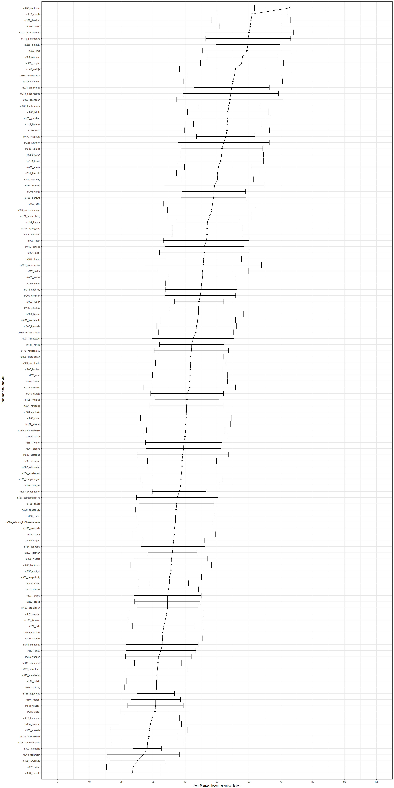
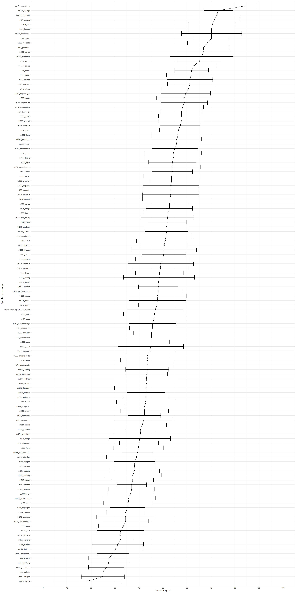
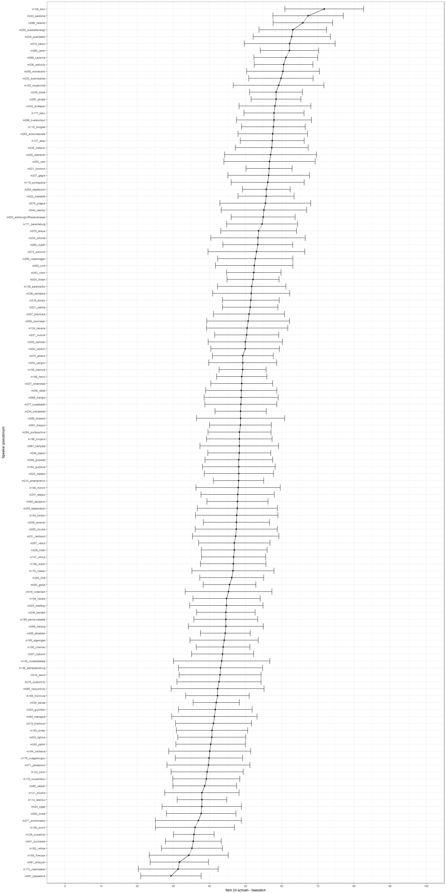

Plots of mean ratings for each item of speaker characteristics
================
Laura Fernández Gallardo
June 2017

-   [1) Load subjective ratings](#load-subjective-ratings)
-   [2) Prepare data for plots](#prepare-data-for-plots)
-   [3) Generate plots](#generate-plots)

From the ratings of 34 speaker characteristics given to the 300 speakers of the [NSC corpus](http://www.qu.tu-berlin.de/?id=nsc-corpus), plot speakers' mean ratings for each of the 34 questionnaire items.

1) Load subjective ratings
--------------------------

Clear workspace.

Load necessary libraries.

``` r
library(RCurl) # to read raw data from repo
library(plyr)   #install.packages('plyr')
library(stringi) # install.packages("stringi")
library(ggplot2) # install.packages("ggplot2")
```

Set paths and read data.

2) Prepare data for plots
-------------------------

``` r
data_raw$speaker_ID2 = stri_sub(data_raw$sample_heard, 1, -14)


## split data males, female speakers
data_split_g <- split(data_raw, data_raw$speaker_gender)
data_m <- data_split_g$male
data_f <- data_split_g$female


# souce D:\Users\fernandez.laura\Documents\Work\utils\R\summarySE.R
source('summarySE.R')


nameitems = c("Item 1 sympatisch - unsympatisch",
              "Item 2 unsicher - sicher",
              "Item 3 unattraktiv - attraktiv",
              "Item 4 verstaendnisvoll - verstaendnislos",
              "Item 5 entschieden - unentschieden",
              "Item 6 aufdringlich - unaufdringlich",
              "Item 7 nah - distanziert",
              "Item 8 interessiert - gelangweilt",
              "Item 9 emotionslos - emotional",
              "Item 10 genervt - nicht genervt",
              "Item 11 passiv - aktiv",
              "Item 12 unangenehm - angenehm",
              "Item 13 charaktervoll - charakterlos",
              "Item 14 reserviert - gesellig",
              "Item 15 nervoes - entspannt",
              "Item 16 distanziert - mitfuehlend",
              "Item 17 unterwuerfig - dominant",
              "Item 18 affektiert - unaffektiert",
              "Item 19 gefuehlskalt - herzlich",
              "Item 20 jung - alt",
              "Item 21 sachlich - unsachlich",
              "Item 22 aufgeregt - ruhig",
              "Item 23 kompetent - inkompetent",
              "Item 24 schoen - haesslich",
              "Item 25 unfreundlich - freundlich",
              "Item 26 weiblich - maennlich",
              "Item 27 provokativ - gehorsam",
              "Item 28 engagiert - gleichgueltig",
              "Item 29 langweilig - interessant",
              "Item 30 folgsam - zynisch",
              "Item 31 unaufgesetzt - aufgesetzt",
              "Item 32 dumm - intelligent",
              "Item 33 erwachsen - kindlich",
              "Item 34 frech - bescheiden"
              )
```

3) Generate plots
-----------------

Plotting the values for each speaker - for each of the 34 scales (questionnaire items). Plots are generated for male and for female speakers, separately. Speakers are sorted from high to low ratings given on the corresponding scale.

``` r
for (i in 1:length(nameitems)){ ## for each scale in the questionnaire

resumen_m <- summarySE(data_m, measurevar=names(data_m)[9+i], groupvars="speaker_ID2", na.rm=TRUE)
resumen_f <- summarySE(data_f, measurevar=names(data_m)[9+i], groupvars="speaker_ID2", na.rm=TRUE)


# sort speakers according to this scale
resumen_m.sorted <- resumen_m[order(resumen_m[3]),]
resumen_f.sorted <- resumen_f[order(resumen_f[3]),]

  
# male speakers

plot_m <- ggplot(resumen_m.sorted, aes(x=resumen_m.sorted[3], y=c(1:nrow(resumen_m.sorted)) ) ) +
  geom_point(size=2) +
  geom_errorbarh(aes(xmax = resumen_m.sorted[3] + resumen_m.sorted[6], xmin=resumen_m.sorted[3] - resumen_m.sorted[6])) +
  scale_y_discrete(limits=resumen_m.sorted$speaker_ID2) +
  scale_x_continuous(limits = c(0, 100), breaks = seq(0, 100, length.out = 11)) +
  geom_line() +
  ylab("Speaker pseudonym") +
  xlab(nameitems[i]) +
  theme_bw()  

print(plot_m)

# female speakers

plot_f <- ggplot(resumen_f.sorted, aes(x=resumen_f.sorted[3], y=c(1:nrow(resumen_f.sorted)) ) ) +
  geom_point(size=2) +
  geom_errorbarh(aes(xmax = resumen_f.sorted[3] + resumen_f.sorted[6], xmin=resumen_f.sorted[3] - resumen_f.sorted[6])) +
  scale_y_discrete(limits=resumen_f.sorted$speaker_ID2) +
  scale_x_continuous(limits = c(0, 100), breaks = seq(0, 100, length.out = 11)) +
  geom_line() +
  ylab("Speaker pseudonym") +
  xlab(nameitems[i]) +
  theme_bw()  

print(plot_f)

} # end for each scale
```



    ## Warning: Removed 2 rows containing missing values (geom_errorbarh).


    ## Warning: Removed 1 rows containing missing values (geom_errorbarh).


