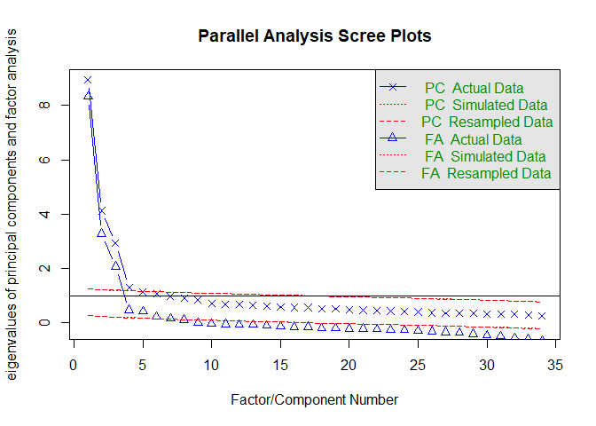
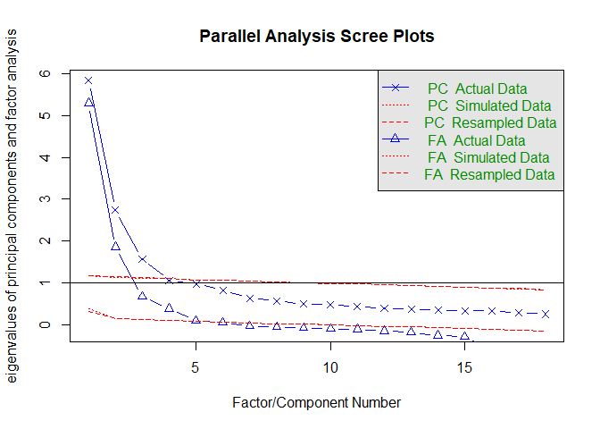
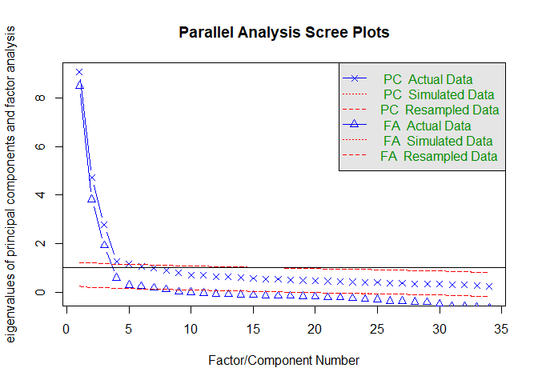
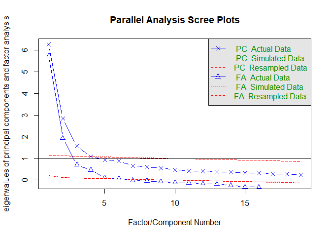

Factor analysis of speaker characteristics
================
Laura Fernández Gallardo
June 2017

-   [1) Load subjective ratings](#load-subjective-ratings)
-   [2) Factor analysis for each speaker gender](#factor-analysis-for-each-speaker-gender)
    -   [2a) Factor analysis of male speakers](#a-factor-analysis-of-male-speakers)
    -   [2b) Factor analysis of female speakers](#b-factor-analysis-of-female-speakers)
-   [3) Summary of dimensions and loadings](#summary-of-dimensions-and-loadings)
    -   [Male speakers](#male-speakers)
    -   [Female speakers](#female-speakers)

Perform factor analysis to reduce the 34-dimensional subjective speaker attributions to a smaller set of dimensions. Factor analysis instead of PCA in order to extract latent factors that represent the space of perceived interpersonal speaker characteristics from voice.

More details in Fernández Gallardo and Weiss (2018).

1) Load subjective ratings
--------------------------

Clear workspace.

``` r
rm(list=ls())
```

Load necessary libraries.

``` r
library(RCurl) # to read raw data from repo
library(GPArotation) 
library(psych) # for alpha analysis
library(knitr) # for kable
```

Set paths and read data.

2) Factor analysis for each speaker gender
------------------------------------------

Split data into male and female speakers to perform factor analysis separately, as males and females have different stereotypes.

``` r
data_split_g <- split(data_raw, data_raw$speaker_gender)
data_m <- data_split_g$male
data_f <- data_split_g$female
```

### 2a) Factor analysis of male speakers

``` r
# always use z-scores
data_m <- data_m[order(data_m$listener_pseudonym),]
data_m<- cbind(data_m[,c(1, 5)], data.frame(do.call("rbind", as.list(by(data_m[,10:ncol(data_m)], data_m$listener_pseudonym, scale)))))
data_m <- data_m[order(data_m$listener_pseudonym),]

# find the no of factors
fa.parallel(data_m[,3:ncol(data_m)])
```



    ## Parallel analysis suggests that the number of factors =  7  and the number of components =  4

Parallel analysis suggests that the number of factors = 7 and the number of components = 4 . Hence, perform factor analysis with 7 factors:

``` r
fa_m <- fa(data_m[,3:ncol(data_m)], nfactors=7 , rotate="oblimin", fm="minres") # this is default; no pricipal axis analysis

print(fa_m, cut=.2, digits=2, sort=T)
```

    ## Factor Analysis using method =  minres
    ## Call: fa(r = data_m[, 3:ncol(data_m)], nfactors = 7, rotate = "oblimin", 
    ##     fm = "minres")
    ## Standardized loadings (pattern matrix) based upon correlation matrix
    ##                 item   MR1   MR5   MR6   MR2   MR4   MR3   MR7   h2   u2
    ## mitfuehlend       16  0.83                                     0.64 0.36
    ## herzlich          19  0.82                                     0.69 0.31
    ## distanziert        7 -0.78                                     0.57 0.43
    ## verstaendnislos    4 -0.64                                     0.43 0.57
    ## freundlich        25  0.62                                     0.59 0.41
    ## unsympathisch      1 -0.59 -0.24                               0.57 0.43
    ## nicht_genervt     10  0.56                                     0.39 0.61
    ## emotional          9  0.37  0.23                   -0.26  0.21 0.45 0.55
    ## gesellig          14  0.35  0.29                          0.24 0.51 0.49
    ## charakterlos      13 -0.33 -0.29                               0.46 0.54
    ## attraktiv          3        0.83                               0.65 0.35
    ## haesslich         24       -0.77                               0.60 0.40
    ## angenehm          12  0.25  0.56                               0.63 0.37
    ## interessant       29        0.54                               0.54 0.46
    ## intelligent       32        0.39                         -0.39 0.60 0.40
    ## sicher             2              0.79                         0.67 0.33
    ## unentschieden      5             -0.76                         0.51 0.49
    ## aktiv             11        0.24  0.38             -0.28       0.55 0.45
    ## gehorsam          27                    0.83                   0.67 0.33
    ## zynisch           30                   -0.77                   0.58 0.42
    ## bescheiden        34  0.26              0.38                   0.39 0.61
    ## dominant          17        0.21  0.30 -0.36                   0.51 0.49
    ## unaufdringlich     6                    0.34        0.28 -0.20 0.35 0.65
    ## alt               20                          0.81             0.58 0.42
    ## kindlich          33                         -0.79             0.67 0.33
    ## maennlich         26        0.28              0.28             0.21 0.79
    ## ruhig             22              0.22              0.51       0.41 0.59
    ## entspannt         15        0.30  0.31              0.48       0.51 0.49
    ## gleichgueltig     28 -0.37                          0.37       0.48 0.52
    ## gelangweilt        8 -0.34       -0.24              0.34       0.55 0.45
    ## unaffektiert      18                                0.27       0.19 0.81
    ## aufgesetzt        31 -0.21                         -0.25       0.18 0.82
    ## unsachlich        21             -0.22                    0.38 0.25 0.75
    ## inkompetent       23       -0.30 -0.24                    0.36 0.57 0.43
    ##                 com
    ## mitfuehlend     1.0
    ## herzlich        1.0
    ## distanziert     1.0
    ## verstaendnislos 1.2
    ## freundlich      1.3
    ## unsympathisch   1.5
    ## nicht_genervt   1.2
    ## emotional       3.3
    ## gesellig        3.8
    ## charakterlos    3.2
    ## attraktiv       1.0
    ## haesslich       1.0
    ## angenehm        1.7
    ## interessant     1.4
    ## intelligent     2.8
    ## sicher          1.1
    ## unentschieden   1.0
    ## aktiv           3.5
    ## gehorsam        1.0
    ## zynisch         1.0
    ## bescheiden      3.3
    ## dominant        3.7
    ## unaufdringlich  3.1
    ## alt             1.1
    ## kindlich        1.0
    ## maennlich       2.8
    ## ruhig           1.7
    ## entspannt       2.6
    ## gleichgueltig   2.6
    ## gelangweilt     3.6
    ## unaffektiert    3.1
    ## aufgesetzt      3.1
    ## unsachlich      2.0
    ## inkompetent     3.8
    ## 
    ##                        MR1  MR5  MR6  MR2  MR4  MR3  MR7
    ## SS loadings           5.00 3.64 2.33 2.07 1.72 1.42 0.94
    ## Proportion Var        0.15 0.11 0.07 0.06 0.05 0.04 0.03
    ## Cumulative Var        0.15 0.25 0.32 0.38 0.43 0.48 0.50
    ## Proportion Explained  0.29 0.21 0.14 0.12 0.10 0.08 0.06
    ## Cumulative Proportion 0.29 0.50 0.64 0.76 0.86 0.94 1.00
    ## 
    ##  With factor correlations of 
    ##       MR1   MR5   MR6   MR2   MR4   MR3   MR7
    ## MR1  1.00  0.60  0.21  0.24 -0.01 -0.22 -0.05
    ## MR5  0.60  1.00  0.48 -0.01  0.25 -0.07 -0.24
    ## MR6  0.21  0.48  1.00 -0.35  0.38 -0.07 -0.09
    ## MR2  0.24 -0.01 -0.35  1.00 -0.12  0.12 -0.20
    ## MR4 -0.01  0.25  0.38 -0.12  1.00  0.13 -0.28
    ## MR3 -0.22 -0.07 -0.07  0.12  0.13  1.00 -0.16
    ## MR7 -0.05 -0.24 -0.09 -0.20 -0.28 -0.16  1.00
    ## 
    ## Mean item complexity =  2.1
    ## Test of the hypothesis that 7 factors are sufficient.
    ## 
    ## The degrees of freedom for the null model are  561  and the objective function was  15.1 with Chi Square of  28077.21
    ## The degrees of freedom for the model are 344  and the objective function was  0.74 
    ## 
    ## The root mean square of the residuals (RMSR) is  0.02 
    ## The df corrected root mean square of the residuals is  0.02 
    ## 
    ## The harmonic number of observations is  1859 with the empirical chi square  743.73  with prob <  1.6e-31 
    ## The total number of observations was  1873  with Likelihood Chi Square =  1366.18  with prob <  1.2e-121 
    ## 
    ## Tucker Lewis Index of factoring reliability =  0.939
    ## RMSEA index =  0.04  and the 90 % confidence intervals are  0.038 0.042
    ## BIC =  -1225.96
    ## Fit based upon off diagonal values = 1
    ## Measures of factor score adequacy             
    ##                                                 MR1  MR5  MR6  MR2  MR4
    ## Correlation of scores with factors             0.96 0.94 0.91 0.91 0.90
    ## Multiple R square of scores with factors       0.92 0.89 0.84 0.83 0.81
    ## Minimum correlation of possible factor scores  0.83 0.77 0.67 0.66 0.61
    ##                                                 MR3  MR7
    ## Correlation of scores with factors             0.85 0.79
    ## Multiple R square of scores with factors       0.72 0.63
    ## Minimum correlation of possible factor scores  0.43 0.26

In order to only retain items with large main loading and small cross-loadings, we remove items when main loading &lt;= .5 && (main loading - cross-loading) &lt;= .2. We then run a second factor analysis with the retained items.

``` r
## Second round: Run factor analysis again, removing items:

itemsremove <- c("emotional", "gesellig", "charakterlos", "intelligent", "aktiv", "bescheiden", "dominant", "unaufdringlich", "maennlich", "entspannt", "gleichgueltig", "gelangweilt", "unaffektiert", "aufgesetzt", "unsachlich", "inkompetent")
intemsremoveindexes <- match( itemsremove, colnames(data_m))

data_m_02 <- data_m[ ,-intemsremoveindexes ]

names(data_m_02)
```

    ##  [1] "listener_pseudonym" "sample_heard"       "unsympathisch"     
    ##  [4] "sicher"             "attraktiv"          "verstaendnislos"   
    ##  [7] "unentschieden"      "distanziert"        "nicht_genervt"     
    ## [10] "angenehm"           "mitfuehlend"        "herzlich"          
    ## [13] "alt"                "ruhig"              "haesslich"         
    ## [16] "freundlich"         "gehorsam"           "interessant"       
    ## [19] "zynisch"            "kindlich"

``` r
fa.parallel(data_m_02[,3:ncol(data_m_02)])
```



    ## Parallel analysis suggests that the number of factors =  5  and the number of components =  3

``` r
# Parallel analysis suggests that the number of factors =  5  and the number of components =  3 

fa_m_02 <- fa(data_m_02[,3:ncol(data_m_02)], nfactors=5 , rotate="oblimin", fm="minres") # this is default; no pricipal axis analysis
```

    ## Warning in fac(r = r, nfactors = nfactors, n.obs = n.obs, rotate =
    ## rotate, : A loading greater than abs(1) was detected. Examine the loadings
    ## carefully.

    ## The estimated weights for the factor scores are probably incorrect.  Try a different factor extraction method.

``` r
print(fa_m_02, cut=.2, digits=2, sort=T)
```

    ## Factor Analysis using method =  minres
    ## Call: fa(r = data_m_02[, 3:ncol(data_m_02)], nfactors = 5, rotate = "oblimin", 
    ##     fm = "minres")
    ## 
    ##  Warning: A Heywood case was detected. 
    ## Standardized loadings (pattern matrix) based upon correlation matrix
    ##                 item   MR1   MR4   MR2   MR5   MR3   h2      u2 com
    ## herzlich          10  0.85                         0.69 0.30587 1.0
    ## mitfuehlend        9  0.84                         0.65 0.35100 1.0
    ## distanziert        6 -0.76                         0.56 0.44186 1.0
    ## freundlich        14  0.59                         0.58 0.42343 1.4
    ## verstaendnislos    4 -0.58                         0.41 0.59002 1.1
    ## unsympathisch      1 -0.52 -0.31                   0.57 0.42953 1.7
    ## nicht_genervt      7  0.51                         0.40 0.60476 1.3
    ## attraktiv          3        0.85                   0.70 0.30318 1.0
    ## haesslich         13       -0.79                   0.63 0.36867 1.0
    ## angenehm           8  0.22  0.58                   0.60 0.39925 1.5
    ## interessant       16  0.26  0.48                   0.47 0.53433 1.8
    ## sicher             2              1.01             1.00 0.00039 1.0
    ## unentschieden      5             -0.60             0.40 0.59782 1.0
    ## gehorsam          15                    0.87       0.75 0.24873 1.0
    ## zynisch           17                   -0.71       0.54 0.45965 1.0
    ## alt               11                          0.82 0.66 0.34251 1.0
    ## kindlich          18                         -0.73 0.60 0.39746 1.1
    ## ruhig             12              0.20        0.21 0.16 0.83752 3.7
    ## 
    ##                        MR1  MR4  MR2  MR5  MR3
    ## SS loadings           3.67 2.43 1.50 1.45 1.33
    ## Proportion Var        0.20 0.13 0.08 0.08 0.07
    ## Cumulative Var        0.20 0.34 0.42 0.50 0.58
    ## Proportion Explained  0.35 0.23 0.14 0.14 0.13
    ## Cumulative Proportion 0.35 0.59 0.73 0.87 1.00
    ## 
    ##  With factor correlations of 
    ##       MR1  MR4   MR2   MR5   MR3
    ## MR1  1.00 0.59  0.11  0.24 -0.06
    ## MR4  0.59 1.00  0.34  0.07  0.17
    ## MR2  0.11 0.34  1.00 -0.31  0.31
    ## MR5  0.24 0.07 -0.31  1.00 -0.06
    ## MR3 -0.06 0.17  0.31 -0.06  1.00
    ## 
    ## Mean item complexity =  1.3
    ## Test of the hypothesis that 5 factors are sufficient.
    ## 
    ## The degrees of freedom for the null model are  153  and the objective function was  7.88 with Chi Square of  14706.72
    ## The degrees of freedom for the model are 73  and the objective function was  0.2 
    ## 
    ## The root mean square of the residuals (RMSR) is  0.02 
    ## The df corrected root mean square of the residuals is  0.02 
    ## 
    ## The harmonic number of observations is  1865 with the empirical chi square  157.84  with prob <  3.4e-08 
    ## The total number of observations was  1873  with Likelihood Chi Square =  379.94  with prob <  4.9e-43 
    ## 
    ## Tucker Lewis Index of factoring reliability =  0.956
    ## RMSEA index =  0.048  and the 90 % confidence intervals are  0.043 0.052
    ## BIC =  -170.14
    ## Fit based upon off diagonal values = 1

``` r
# fa.diagram(fa_m_02, cut=.40, digits=2)   # fa.graph for plotting (prior to alpha analysis)
```

This second factor analysis explained 58% of data variance.

Next, we examine Cronbach alphas to see if we should remove other items.

``` r
# Dimension 1 -  MR1
alpha(as.data.frame(cbind(
  data_m_02$herzlich, data_m_02$mitfuehlend, data_m_02$distanziert, data_m_02$freundlich, data_m_02$verstaendnislos, data_m_02$unsympatisch, data_m_02$nicht.genervt)
),check.keys=TRUE)
```

    ## Warning in alpha(as.data.frame(cbind(data_m_02$herzlich, data_m_02$mitfuehlend, : Some items were negatively correlated with total scale and were automatically reversed.
    ##  This is indicated by a negative sign for the variable name.

    ## 
    ## Reliability analysis   
    ## Call: alpha(x = as.data.frame(cbind(data_m_02$herzlich, data_m_02$mitfuehlend, 
    ##     data_m_02$distanziert, data_m_02$freundlich, data_m_02$verstaendnislos, 
    ##     data_m_02$unsympatisch, data_m_02$nicht.genervt)), check.keys = TRUE)
    ## 
    ##   raw_alpha std.alpha G6(smc) average_r S/N    ase  mean   sd
    ##       0.86      0.86    0.84      0.55 6.1 0.0052 0.012 0.78
    ## 
    ##  lower alpha upper     95% confidence boundaries
    ## 0.85 0.86 0.87 
    ## 
    ##  Reliability if an item is dropped:
    ##     raw_alpha std.alpha G6(smc) average_r S/N alpha se
    ## V1       0.81      0.81    0.77      0.51 4.2   0.0072
    ## V2       0.82      0.82    0.78      0.53 4.5   0.0069
    ## V3-      0.83      0.83    0.80      0.55 5.0   0.0064
    ## V4       0.84      0.84    0.81      0.56 5.2   0.0062
    ## V5-      0.85      0.85    0.82      0.59 5.9   0.0055
    ## 
    ##  Item statistics 
    ##        n raw.r std.r r.cor r.drop     mean   sd
    ## V1  1804  0.86  0.86  0.83   0.76 -1.6e-17 0.97
    ## V2  1873  0.84  0.84  0.80   0.73  2.2e-17 0.97
    ## V3- 1873  0.80  0.80  0.72   0.67  3.0e-02 0.97
    ## V4  1873  0.78  0.78  0.70   0.65  1.1e-17 0.97
    ## V5- 1873  0.74  0.73  0.62   0.58  3.0e-02 0.97

``` r
# raw_alpha = 0.88. no item removed

# Dimension 2 -  MR4
alpha(as.data.frame(cbind(
  data_m_02$attraktiv, data_m_02$haesslich, data_m_02$interessant, data_m_02$angenehm)
),check.keys=TRUE)
```

    ## Warning in alpha(as.data.frame(cbind(data_m_02$attraktiv, data_m_02$haesslich, : Some items were negatively correlated with total scale and were automatically reversed.
    ##  This is indicated by a negative sign for the variable name.

    ## 
    ## Reliability analysis   
    ## Call: alpha(x = as.data.frame(cbind(data_m_02$attraktiv, data_m_02$haesslich, 
    ##     data_m_02$interessant, data_m_02$angenehm)), check.keys = TRUE)
    ## 
    ##   raw_alpha std.alpha G6(smc) average_r S/N    ase     mean  sd
    ##       0.84      0.84     0.8      0.56 5.1 0.0062 -0.00043 0.8
    ## 
    ##  lower alpha upper     95% confidence boundaries
    ## 0.83 0.84 0.85 
    ## 
    ##  Reliability if an item is dropped:
    ##     raw_alpha std.alpha G6(smc) average_r S/N alpha se
    ## V1       0.77      0.77    0.69      0.53 3.3   0.0093
    ## V2-      0.78      0.78    0.70      0.54 3.5   0.0089
    ## V3       0.82      0.82    0.76      0.61 4.7   0.0070
    ## V4       0.80      0.80    0.74      0.57 4.0   0.0080
    ## 
    ##  Item statistics 
    ##        n raw.r std.r r.cor r.drop     mean   sd
    ## V1  1873  0.85  0.85  0.80   0.72  3.5e-18 0.97
    ## V2- 1873  0.84  0.84  0.78   0.70 -1.7e-03 0.97
    ## V3  1873  0.78  0.78  0.65   0.60  7.7e-18 0.97
    ## V4  1873  0.81  0.81  0.71   0.65 -1.1e-17 0.97

``` r
# raw_alpha = 0.84. no item removed

# Dimension 3 -  MR2
alpha(as.data.frame(cbind(
  data_m_02$sicher, data_m_02$unentschieden)
),check.keys=TRUE)
```

    ## Warning in alpha(as.data.frame(cbind(data_m_02$sicher, data_m_02$unentschieden)), : Some items were negatively correlated with total scale and were automatically reversed.
    ##  This is indicated by a negative sign for the variable name.

    ## Warning in matrix(unlist(drop.item), ncol = 8, byrow = TRUE): Datenlänge
    ## [12] ist kein Teiler oder Vielfaches der Anzahl der Spalten [8]

    ## 
    ## Reliability analysis   
    ## Call: alpha(x = as.data.frame(cbind(data_m_02$sicher, data_m_02$unentschieden)), 
    ##     check.keys = TRUE)
    ## 
    ##   raw_alpha std.alpha G6(smc) average_r S/N  ase mean   sd
    ##       0.78      0.78    0.63      0.63 3.5 0.01 0.31 0.88
    ## 
    ##  lower alpha upper     95% confidence boundaries
    ## 0.76 0.78 0.8 
    ## 
    ##  Reliability if an item is dropped:
    ##     raw_alpha std.alpha G6(smc) average_r  S/N alpha se
    ## V1-      0.63      0.63     0.4      0.63   NA       NA
    ## V2       0.40      0.63      NA        NA 0.63    0.018
    ## 
    ##  Item statistics 
    ##        n raw.r std.r r.cor r.drop     mean   sd
    ## V1- 1873   0.9   0.9  0.72   0.63  6.2e-01 0.97
    ## V2  1873   0.9   0.9  0.72   0.63 -2.9e-18 0.97

``` r
# raw_alpha = 0.78. no item removed


# Dimension 4 -  MR5
alpha(as.data.frame(cbind(
  data_m_02$gehorsam, data_m_02$zynisch)
),check.keys=TRUE)
```

    ## Warning in alpha(as.data.frame(cbind(data_m_02$gehorsam, data_m_02$zynisch)), : Some items were negatively correlated with total scale and were automatically reversed.
    ##  This is indicated by a negative sign for the variable name.

    ## Warning in alpha(as.data.frame(cbind(data_m_02$gehorsam, data_m_02$zynisch)), : Datenlänge [12] ist kein Teiler oder Vielfaches der Anzahl der Spalten [8]

    ## 
    ## Reliability analysis   
    ## Call: alpha(x = as.data.frame(cbind(data_m_02$gehorsam, data_m_02$zynisch)), 
    ##     check.keys = TRUE)
    ## 
    ##   raw_alpha std.alpha G6(smc) average_r S/N  ase mean   sd
    ##       0.78      0.78    0.64      0.64 3.6 0.01 0.24 0.88
    ## 
    ##  lower alpha upper     95% confidence boundaries
    ## 0.76 0.78 0.8 
    ## 
    ##  Reliability if an item is dropped:
    ##     raw_alpha std.alpha G6(smc) average_r  S/N alpha se
    ## V1-      0.64      0.64    0.41      0.64   NA       NA
    ## V2       0.41      0.64      NA        NA 0.64    0.018
    ## 
    ##  Item statistics 
    ##        n raw.r std.r r.cor r.drop    mean   sd
    ## V1- 1873  0.91  0.91  0.72   0.64 4.7e-01 0.97
    ## V2  1873  0.91  0.91  0.72   0.64 1.6e-18 0.97

``` r
# raw_alpha = 0.78. no item removed


# Dimension 5 -  MR3
alpha(as.data.frame(cbind(
  data_m_02$alt, data_m_02$kindlich, data_m_02$ruhig)
),check.keys=TRUE)
```

    ## Warning in alpha(as.data.frame(cbind(data_m_02$alt, data_m_02$kindlich, : Some items were negatively correlated with total scale and were automatically reversed.
    ##  This is indicated by a negative sign for the variable name.

    ## 
    ## Reliability analysis   
    ## Call: alpha(x = as.data.frame(cbind(data_m_02$alt, data_m_02$kindlich, 
    ##     data_m_02$ruhig)), check.keys = TRUE)
    ## 
    ##   raw_alpha std.alpha G6(smc) average_r S/N   ase  mean   sd
    ##       0.63      0.63    0.58      0.36 1.7 0.015 -0.05 0.74
    ## 
    ##  lower alpha upper     95% confidence boundaries
    ## 0.6 0.63 0.66 
    ## 
    ##  Reliability if an item is dropped:
    ##     raw_alpha std.alpha G6(smc) average_r  S/N alpha se
    ## V1       0.41      0.41    0.26      0.26 0.71    0.027
    ## V2-      0.36      0.36    0.22      0.22 0.55    0.030
    ## V3       0.76      0.76    0.61      0.61 3.12    0.011
    ## 
    ##  Item statistics 
    ##        n raw.r std.r r.cor r.drop     mean   sd
    ## V1  1873  0.80  0.80  0.69   0.52  1.9e-17 0.97
    ## V2- 1873  0.82  0.82  0.73   0.56 -1.5e-01 0.97
    ## V3  1873  0.65  0.65  0.32   0.27  2.3e-17 0.97

``` r
# raw_alpha = 0.63
alpha(as.data.frame(cbind(
  data_m_02$alt, data_m_02$kindlich)
),check.keys=TRUE)
```

    ## Warning in alpha(as.data.frame(cbind(data_m_02$alt, data_m_02$kindlich)), : Some items were negatively correlated with total scale and were automatically reversed.
    ##  This is indicated by a negative sign for the variable name.

    ## Warning in alpha(as.data.frame(cbind(data_m_02$alt, data_m_02$kindlich)), : Datenlänge [12] ist kein Teiler oder Vielfaches der Anzahl der Spalten [8]

    ## 
    ## Reliability analysis   
    ## Call: alpha(x = as.data.frame(cbind(data_m_02$alt, data_m_02$kindlich)), 
    ##     check.keys = TRUE)
    ## 
    ##   raw_alpha std.alpha G6(smc) average_r S/N   ase mean   sd
    ##       0.76      0.76    0.61      0.61 3.1 0.011  0.2 0.87
    ## 
    ##  lower alpha upper     95% confidence boundaries
    ## 0.74 0.76 0.78 
    ## 
    ##  Reliability if an item is dropped:
    ##     raw_alpha std.alpha G6(smc) average_r  S/N alpha se
    ## V1-      0.61      0.61    0.37      0.61   NA       NA
    ## V2       0.37      0.61      NA        NA 0.61    0.018
    ## 
    ##  Item statistics 
    ##        n raw.r std.r r.cor r.drop    mean   sd
    ## V1- 1873   0.9   0.9   0.7   0.61 4.0e-01 0.97
    ## V2  1873   0.9   0.9   0.7   0.61 3.7e-18 0.97

``` r
# raw_alpha = 0.76
```

Compute new factor scores as a weighted average of the z-scores.

``` r
loa_m <- fa_m_02$loadings
loa_m_df <- as.data.frame(loa_m[,])


fs_m_dim1 <- loa_m_df["herzlich",1]*data_m$herzlich + 
  loa_m_df["mitfuehlend",1]*data_m$mitfuehlend + 
  loa_m_df["distanziert",1]*data_m$distanziert + 
  loa_m_df["freundlich",1]*data_m$freundlich + 
  loa_m_df["verstaendnislos",1]*data_m$verstaendnislos + 
  loa_m_df["unsympathisch",1]*data_m$unsympathisch + 
  loa_m_df["nicht_genervt",1]*data_m$nicht_genervt

fs_m_dim2 <- loa_m_df["attraktiv",2]*data_m$attraktiv + 
  loa_m_df["haesslich",2]*data_m$haesslich + 
  loa_m_df["angenehm",2]*data_m$angenehm + 
  loa_m_df["interessant",2]*data_m$interessant


fs_m_dim3 <- loa_m_df["sicher",3]*data_m$sicher + 
  loa_m_df["unentschieden",3]*data_m$unentschieden 

fs_m_dim4 <- loa_m_df["gehorsam",4]*data_m$gehorsam + 
  loa_m_df["zynisch",4]*data_m$zynisch

fs_m_dim5 <- loa_m_df["alt",5]*data_m$alt + 
  loa_m_df["kindlich",5]*data_m$kindlich
```

Write scores to file.

``` r
factorscores_m <- data.frame("sample_heard"=data_m$sample_heard, "dim1"=fs_m_dim1, "dim2"=fs_m_dim2, "dim3"=fs_m_dim3, "dim4"=fs_m_dim4, "dim5"=fs_m_dim5)

# average over raters
factorscores_m_averaged <- aggregate(factorscores_m[,2:ncol(factorscores_m)], by=list(factorscores_m$sample_heard), mean, na.rm=T)
names(factorscores_m_averaged)[1] <- "sample_heard"

write.csv(factorscores_m_averaged, "../../data/generated_data/factorscores_malespk.csv", row.names = F)

# save scores without averaging
factorscores_m_02 <- data.frame(data_m$listener_pseudonym, data_m$sample_heard,  "dim1"=fs_m_dim1, "dim2"=fs_m_dim2, "dim3"=fs_m_dim3, "dim4"=fs_m_dim4, "dim5"=fs_m_dim5)

write.csv(factorscores_m_02, "../../data/generated_data/factorscores_malespk_notaveraged.csv", row.names = F)
```

### 2b) Factor analysis of female speakers

For female speakers, we follow a similar procedure as for male speakers. We also find 5 dimensions in the end.

``` r
# always use z-scores
data_f <- data_f[order(data_f$listener_pseudonym),]
data_f <- cbind(data_f[,c(1, 5)], data.frame(do.call("rbind", as.list(by(data_f[,10:ncol(data_f)], data_f$listener_pseudonym, scale)))))
data_f <- data_f[order(data_f$listener_pseudonym),]

# find the no of factors
names(data_f)[3:ncol(data_f)]
```

    ##  [1] "unsympathisch"   "sicher"          "attraktiv"      
    ##  [4] "verstaendnislos" "unentschieden"   "unaufdringlich" 
    ##  [7] "distanziert"     "gelangweilt"     "emotional"      
    ## [10] "nicht_genervt"   "aktiv"           "angenehm"       
    ## [13] "charakterlos"    "gesellig"        "entspannt"      
    ## [16] "mitfuehlend"     "dominant"        "unaffektiert"   
    ## [19] "herzlich"        "alt"             "unsachlich"     
    ## [22] "ruhig"           "inkompetent"     "haesslich"      
    ## [25] "freundlich"      "maennlich"       "gehorsam"       
    ## [28] "gleichgueltig"   "interessant"     "zynisch"        
    ## [31] "aufgesetzt"      "intelligent"     "kindlich"       
    ## [34] "bescheiden"

``` r
fa.parallel(data_f[,3:ncol(data_f)])
```



    ## Parallel analysis suggests that the number of factors =  8  and the number of components =  5

``` r
# Parallel analysis suggests that the number of factors =  8  and the number of components =  5 

fa_f <- fa(data_f[,3:ncol(data_f)], nfactors=8 , rotate="oblimin", fm="minres") # this is default; no pricipal axis analysis
print(fa_f, cut=.2, digits=2, sort=T)
```

    ## Factor Analysis using method =  minres
    ## Call: fa(r = data_f[, 3:ncol(data_f)], nfactors = 8, rotate = "oblimin", 
    ##     fm = "minres")
    ## Standardized loadings (pattern matrix) based upon correlation matrix
    ##                 item   MR1   MR4   MR6   MR2   MR5   MR3   MR7   MR8    h2
    ## distanziert        7 -0.74                                           0.563
    ## mitfuehlend       16  0.70                                           0.643
    ## herzlich          19  0.69                                           0.711
    ## verstaendnislos    4 -0.69                                      0.21 0.432
    ## freundlich        25  0.62                                           0.643
    ## nicht_genervt     10  0.61                                           0.464
    ## unsympathisch      1 -0.59 -0.27                                     0.579
    ## gleichgueltig     28 -0.43                          0.31             0.501
    ## charakterlos      13 -0.32              0.22                         0.415
    ## attraktiv          3        0.83                                     0.696
    ## haesslich         24       -0.82                                     0.689
    ## intelligent       32        0.57                               -0.27 0.616
    ## angenehm          12  0.24  0.53                                     0.682
    ## interessant       29        0.46                   -0.22             0.608
    ## inkompetent       23       -0.34 -0.29                          0.25 0.537
    ## maennlich         26       -0.23                                     0.091
    ## sicher             2              0.77                               0.674
    ## unentschieden      5             -0.74                               0.538
    ## aktiv             11              0.48             -0.36             0.596
    ## entspannt         15              0.46              0.43             0.521
    ## gehorsam          27                    0.81                         0.655
    ## zynisch           30                   -0.75                         0.576
    ## bescheiden        34                    0.51                         0.417
    ## dominant          17              0.39 -0.42                         0.614
    ## unaufdringlich     6                    0.34              0.26       0.432
    ## alt               20                          0.80                   0.611
    ## kindlich          33                         -0.70                   0.576
    ## ruhig             22              0.34              0.45             0.439
    ## gelangweilt        8 -0.35       -0.22              0.38             0.563
    ## unaffektiert      18                                      0.70       0.418
    ## aufgesetzt        31                                     -0.47       0.290
    ## emotional          9  0.26  0.26                   -0.20        0.39 0.542
    ## unsachlich        21             -0.28                          0.31 0.287
    ## gesellig          14  0.28                                      0.31 0.531
    ##                   u2 com
    ## distanziert     0.44 1.1
    ## mitfuehlend     0.36 1.2
    ## herzlich        0.29 1.2
    ## verstaendnislos 0.57 1.2
    ## freundlich      0.36 1.3
    ## nicht_genervt   0.54 1.3
    ## unsympathisch   0.42 1.6
    ## gleichgueltig   0.50 2.4
    ## charakterlos    0.59 3.9
    ## attraktiv       0.30 1.0
    ## haesslich       0.31 1.1
    ## intelligent     0.38 2.1
    ## angenehm        0.32 1.8
    ## interessant     0.39 2.5
    ## inkompetent     0.46 4.4
    ## maennlich       0.91 2.3
    ## sicher          0.33 1.1
    ## unentschieden   0.46 1.0
    ## aktiv           0.40 2.3
    ## entspannt       0.48 2.6
    ## gehorsam        0.34 1.0
    ## zynisch         0.42 1.0
    ## bescheiden      0.58 1.6
    ## dominant        0.39 2.8
    ## unaufdringlich  0.57 3.8
    ## alt             0.39 1.1
    ## kindlich        0.42 1.1
    ## ruhig           0.56 2.6
    ## gelangweilt     0.44 3.0
    ## unaffektiert    0.58 1.1
    ## aufgesetzt      0.71 1.2
    ## emotional       0.46 3.5
    ## unsachlich      0.71 3.7
    ## gesellig        0.47 4.4
    ## 
    ##                        MR1  MR4  MR6  MR2  MR5  MR3  MR7  MR8
    ## SS loadings           4.81 3.43 2.66 2.34 1.46 1.29 1.20 0.94
    ## Proportion Var        0.14 0.10 0.08 0.07 0.04 0.04 0.04 0.03
    ## Cumulative Var        0.14 0.24 0.32 0.39 0.43 0.47 0.51 0.53
    ## Proportion Explained  0.27 0.19 0.15 0.13 0.08 0.07 0.07 0.05
    ## Cumulative Proportion 0.27 0.45 0.60 0.73 0.81 0.88 0.95 1.00
    ## 
    ##  With factor correlations of 
    ##       MR1   MR4   MR6   MR2   MR5   MR3   MR7   MR8
    ## MR1  1.00  0.64  0.18  0.28 -0.20 -0.22  0.33  0.29
    ## MR4  0.64  1.00  0.37  0.08 -0.04 -0.20  0.38  0.00
    ## MR6  0.18  0.37  1.00 -0.39  0.33 -0.17  0.22 -0.05
    ## MR2  0.28  0.08 -0.39  1.00 -0.23  0.20  0.23 -0.09
    ## MR5 -0.20 -0.04  0.33 -0.23  1.00  0.07  0.13 -0.22
    ## MR3 -0.22 -0.20 -0.17  0.20  0.07  1.00  0.11 -0.22
    ## MR7  0.33  0.38  0.22  0.23  0.13  0.11  1.00 -0.10
    ## MR8  0.29  0.00 -0.05 -0.09 -0.22 -0.22 -0.10  1.00
    ## 
    ## Mean item complexity =  2
    ## Test of the hypothesis that 8 factors are sufficient.
    ## 
    ## The degrees of freedom for the null model are  561  and the objective function was  16.2 with Chi Square of  42658.94
    ## The degrees of freedom for the model are 317  and the objective function was  0.55 
    ## 
    ## The root mean square of the residuals (RMSR) is  0.01 
    ## The df corrected root mean square of the residuals is  0.02 
    ## 
    ## The harmonic number of observations is  2633 with the empirical chi square  600.86  with prob <  8.3e-20 
    ## The total number of observations was  2646  with Likelihood Chi Square =  1457.94  with prob <  1.7e-145 
    ## 
    ## Tucker Lewis Index of factoring reliability =  0.952
    ## RMSEA index =  0.037  and the 90 % confidence intervals are  0.035 0.039
    ## BIC =  -1040.27
    ## Fit based upon off diagonal values = 1
    ## Measures of factor score adequacy             
    ##                                                 MR1  MR4  MR6  MR2  MR5
    ## Correlation of scores with factors             0.96 0.95 0.93 0.92 0.88
    ## Multiple R square of scores with factors       0.91 0.90 0.86 0.85 0.78
    ## Minimum correlation of possible factor scores  0.83 0.79 0.72 0.69 0.55
    ##                                                 MR3  MR7  MR8
    ## Correlation of scores with factors             0.84 0.82 0.81
    ## Multiple R square of scores with factors       0.70 0.67 0.65
    ## Minimum correlation of possible factor scores  0.40 0.34 0.30

Parallel analysis suggests that the number of factors = 8 and the number of components = 5.

In order to only retain items with large main loading and small cross-loadings, we remove items when main loading &lt;= .5 && (main loading - cross-loading) &lt;= .2.

``` r
## Second round: Run factor analysis again, removing items:

itemsremove <- c("gleichgueltig","charakterlos","inkompetent","maennlich","aktiv","entspannt","dominant","unaufdringlich","ruhig","gelangweilt","aufgesetzt","emotional","unsachlich","gesellig","interessant")
intemsremoveindexes <- match( itemsremove, colnames(data_f))

data_f_02 <- data_f[ ,-intemsremoveindexes ]
names(data_f_02)[3:ncol(data_f_02)]
```

    ##  [1] "unsympathisch"   "sicher"          "attraktiv"      
    ##  [4] "verstaendnislos" "unentschieden"   "distanziert"    
    ##  [7] "nicht_genervt"   "angenehm"        "mitfuehlend"    
    ## [10] "unaffektiert"    "herzlich"        "alt"            
    ## [13] "haesslich"       "freundlich"      "gehorsam"       
    ## [16] "zynisch"         "intelligent"     "kindlich"       
    ## [19] "bescheiden"

``` r
fa.parallel(data_f_02[,3:ncol(data_f_02)])
```



    ## Parallel analysis suggests that the number of factors =  6  and the number of components =  4

``` r
# Parallel analysis suggests that the number of factors =  6  and the number of components =  4 


fa_f_02 <- fa(data_f_02[,3:ncol(data_f_02)], nfactors=5 , rotate="oblimin", fm="minres") # this is default; no pricipal axis analysis
print(fa_f_02, cut=.2, digits=2, sort=T)
```

    ## Factor Analysis using method =  minres
    ## Call: fa(r = data_f_02[, 3:ncol(data_f_02)], nfactors = 5, rotate = "oblimin", 
    ##     fm = "minres")
    ## Standardized loadings (pattern matrix) based upon correlation matrix
    ##                 item   MR1   MR4   MR5   MR2   MR3    h2   u2 com
    ## herzlich          11  0.84                         0.721 0.28 1.0
    ## mitfuehlend        9  0.84                         0.650 0.35 1.0
    ## distanziert        6 -0.78                         0.560 0.44 1.0
    ## freundlich        14  0.56        0.22             0.638 0.36 1.6
    ## verstaendnislos    4 -0.49                         0.381 0.62 1.3
    ## nicht_genervt      7  0.49        0.23             0.437 0.56 1.5
    ## unsympathisch      1 -0.45 -0.37                   0.564 0.44 2.0
    ## attraktiv          3        0.83                   0.704 0.30 1.0
    ## haesslich         13       -0.81                   0.681 0.32 1.0
    ## intelligent       17        0.61              0.21 0.471 0.53 1.4
    ## angenehm           8  0.22  0.59                   0.681 0.32 1.5
    ## gehorsam          15              0.80             0.646 0.35 1.0
    ## zynisch           16             -0.72             0.568 0.43 1.0
    ## bescheiden        19              0.58             0.391 0.61 1.2
    ## unaffektiert      10              0.24             0.073 0.93 1.8
    ## sicher             2                    0.82       0.725 0.27 1.0
    ## unentschieden      5                   -0.81       0.606 0.39 1.0
    ## kindlich          18                         -0.81 0.702 0.30 1.0
    ## alt               12       -0.21              0.68 0.490 0.51 1.2
    ## 
    ##                        MR1  MR4  MR5  MR2  MR3
    ## SS loadings           3.47 2.66 1.89 1.45 1.23
    ## Proportion Var        0.18 0.14 0.10 0.08 0.06
    ## Cumulative Var        0.18 0.32 0.42 0.50 0.56
    ## Proportion Explained  0.32 0.25 0.18 0.14 0.11
    ## Cumulative Proportion 0.32 0.57 0.75 0.89 1.00
    ## 
    ##  With factor correlations of 
    ##       MR1   MR4   MR5   MR2   MR3
    ## MR1  1.00  0.63  0.35  0.09 -0.23
    ## MR4  0.63  1.00  0.22  0.28 -0.04
    ## MR5  0.35  0.22  1.00 -0.35 -0.20
    ## MR2  0.09  0.28 -0.35  1.00  0.34
    ## MR3 -0.23 -0.04 -0.20  0.34  1.00
    ## 
    ## Mean item complexity =  1.2
    ## Test of the hypothesis that 5 factors are sufficient.
    ## 
    ## The degrees of freedom for the null model are  171  and the objective function was  8.74 with Chi Square of  23052.59
    ## The degrees of freedom for the model are 86  and the objective function was  0.24 
    ## 
    ## The root mean square of the residuals (RMSR) is  0.02 
    ## The df corrected root mean square of the residuals is  0.02 
    ## 
    ## The harmonic number of observations is  2636 with the empirical chi square  256.24  with prob <  7.9e-19 
    ## The total number of observations was  2646  with Likelihood Chi Square =  635.55  with prob <  9.9e-85 
    ## 
    ## Tucker Lewis Index of factoring reliability =  0.952
    ## RMSEA index =  0.049  and the 90 % confidence intervals are  0.046 0.053
    ## BIC =  -42.2
    ## Fit based upon off diagonal values = 1
    ## Measures of factor score adequacy             
    ##                                                 MR1  MR4  MR5  MR2  MR3
    ## Correlation of scores with factors             0.95 0.94 0.90 0.91 0.88
    ## Multiple R square of scores with factors       0.90 0.88 0.82 0.82 0.78
    ## Minimum correlation of possible factor scores  0.80 0.77 0.63 0.65 0.55

``` r
# fa.diagram(fa_f_02, cut=.40, digits=2)   # fa.graph for plotting (prior to alpha analysis)
```

This second factor analysis explained 56% of data variance.

Alpha analysis: Examine Cronbach alphas to see if we should remove other items.

``` r
# Dimension 1 -  MR1
alpha(as.data.frame(cbind(
  data_f_02$herzlich, data_f_02$mitfuehlend, data_f_02$distanziert, data_f_02$freundlich, data_f_02$verstaendnislos, data_f_02$nicht.genervt, data_f_02$unsympatisch)
),check.keys=TRUE)
```

    ## Warning in alpha(as.data.frame(cbind(data_f_02$herzlich, data_f_02$mitfuehlend, : Some items were negatively correlated with total scale and were automatically reversed.
    ##  This is indicated by a negative sign for the variable name.

    ## 
    ## Reliability analysis   
    ## Call: alpha(x = as.data.frame(cbind(data_f_02$herzlich, data_f_02$mitfuehlend, 
    ##     data_f_02$distanziert, data_f_02$freundlich, data_f_02$verstaendnislos, 
    ##     data_f_02$nicht.genervt, data_f_02$unsympatisch)), check.keys = TRUE)
    ## 
    ##   raw_alpha std.alpha G6(smc) average_r S/N    ase mean   sd
    ##       0.86      0.86    0.85      0.56 6.3 0.0042 0.31 0.79
    ## 
    ##  lower alpha upper     95% confidence boundaries
    ## 0.85 0.86 0.87 
    ## 
    ##  Reliability if an item is dropped:
    ##     raw_alpha std.alpha G6(smc) average_r S/N alpha se
    ## V1       0.81      0.81    0.77      0.52 4.3   0.0060
    ## V2       0.82      0.82    0.79      0.53 4.6   0.0057
    ## V3-      0.84      0.84    0.81      0.56 5.1   0.0053
    ## V4       0.83      0.83    0.80      0.56 5.0   0.0054
    ## V5-      0.87      0.87    0.84      0.62 6.5   0.0042
    ## 
    ##  Item statistics 
    ##        n raw.r std.r r.cor r.drop     mean   sd
    ## V1  2553  0.86  0.86  0.84   0.77 -1.2e-17 0.98
    ## V2  2646  0.84  0.84  0.80   0.73 -2.9e-18 0.98
    ## V3- 2646  0.80  0.80  0.72   0.67  7.6e-01 0.98
    ## V4  2646  0.81  0.81  0.74   0.69  1.4e-17 0.98
    ## V5- 2646  0.71  0.71  0.58   0.55  7.6e-01 0.98

``` r
# raw_alpha = 0.89


# Dimension 2 -  MR4
alpha(as.data.frame(cbind(
  data_f_02$attraktiv, data_f_02$haesslich, data_f_02$intelligent, data_f_02$angenehm)
),check.keys=TRUE)
```

    ## Warning in alpha(as.data.frame(cbind(data_f_02$attraktiv, data_f_02$haesslich, : Some items were negatively correlated with total scale and were automatically reversed.
    ##  This is indicated by a negative sign for the variable name.

    ## 
    ## Reliability analysis   
    ## Call: alpha(x = as.data.frame(cbind(data_f_02$attraktiv, data_f_02$haesslich, 
    ##     data_f_02$intelligent, data_f_02$angenehm)), check.keys = TRUE)
    ## 
    ##   raw_alpha std.alpha G6(smc) average_r S/N    ase  mean  sd
    ##       0.84      0.84    0.81      0.57 5.2 0.0052 -0.11 0.8
    ## 
    ##  lower alpha upper     95% confidence boundaries
    ## 0.83 0.84 0.85 
    ## 
    ##  Reliability if an item is dropped:
    ##     raw_alpha std.alpha G6(smc) average_r S/N alpha se
    ## V1       0.76      0.76    0.70      0.52 3.2   0.0080
    ## V2-      0.77      0.77    0.70      0.52 3.3   0.0079
    ## V3       0.86      0.86    0.80      0.66 5.9   0.0049
    ## V4       0.79      0.79    0.73      0.55 3.7   0.0072
    ## 
    ##  Item statistics 
    ##        n raw.r std.r r.cor r.drop     mean   sd
    ## V1  2646  0.86  0.86  0.82   0.74 -2.0e-17 0.98
    ## V2- 2646  0.86  0.86  0.81   0.73 -4.3e-01 0.98
    ## V3  2646  0.73  0.73  0.57   0.53 -1.1e-18 0.98
    ## V4  2646  0.83  0.83  0.75   0.69 -4.8e-18 0.98

``` r
# raw_alpha = 0.86 if intelligent removed (before raw_alpha = 0.84)
alpha(as.data.frame(cbind(
  data_f_02$attraktiv, data_f_02$haesslich, data_f_02$angenehm)
),check.keys=TRUE)
```

    ## Warning in alpha(as.data.frame(cbind(data_f_02$attraktiv, data_f_02$haesslich, : Some items were negatively correlated with total scale and were automatically reversed.
    ##  This is indicated by a negative sign for the variable name.

    ## 
    ## Reliability analysis   
    ## Call: alpha(x = as.data.frame(cbind(data_f_02$attraktiv, data_f_02$haesslich, 
    ##     data_f_02$angenehm)), check.keys = TRUE)
    ## 
    ##   raw_alpha std.alpha G6(smc) average_r S/N    ase  mean   sd
    ##       0.86      0.86     0.8      0.66 5.9 0.0049 -0.14 0.86
    ## 
    ##  lower alpha upper     95% confidence boundaries
    ## 0.85 0.86 0.87 
    ## 
    ##  Reliability if an item is dropped:
    ##     raw_alpha std.alpha G6(smc) average_r S/N alpha se
    ## V1       0.79      0.79    0.65      0.65 3.8   0.0082
    ## V2-      0.78      0.78    0.63      0.63 3.5   0.0087
    ## V3       0.83      0.83    0.71      0.71 4.8   0.0067
    ## 
    ##  Item statistics 
    ##        n raw.r std.r r.cor r.drop     mean   sd
    ## V1  2646  0.89  0.89  0.80   0.74 -2.0e-17 0.98
    ## V2- 2646  0.89  0.89  0.82   0.75 -4.3e-01 0.98
    ## V3  2646  0.87  0.87  0.75   0.70 -4.8e-18 0.98

``` r
# raw_alpha = 0.86

# Dimension 3 -  MR5
alpha(as.data.frame(cbind(
  data_f_02$gehorsam, data_f_02$zynisch, data_f_02$bescheiden, data_f_02$unaffektiert)
),check.keys=TRUE)
```

    ## Warning in alpha(as.data.frame(cbind(data_f_02$gehorsam, data_f_02$zynisch, : Some items were negatively correlated with total scale and were automatically reversed.
    ##  This is indicated by a negative sign for the variable name.

    ## 
    ## Reliability analysis   
    ## Call: alpha(x = as.data.frame(cbind(data_f_02$gehorsam, data_f_02$zynisch, 
    ##     data_f_02$bescheiden, data_f_02$unaffektiert)), check.keys = TRUE)
    ## 
    ##   raw_alpha std.alpha G6(smc) average_r S/N   ase  mean   sd
    ##       0.67      0.67    0.65      0.34   2 0.011 -0.25 0.69
    ## 
    ##  lower alpha upper     95% confidence boundaries
    ## 0.65 0.67 0.69 
    ## 
    ##  Reliability if an item is dropped:
    ##     raw_alpha std.alpha G6(smc) average_r  S/N alpha se
    ## V1       0.50      0.50    0.43      0.25 0.99   0.0170
    ## V2-      0.52      0.52    0.46      0.27 1.10   0.0162
    ## V3       0.57      0.57    0.56      0.31 1.34   0.0147
    ## V4       0.76      0.76    0.70      0.52 3.21   0.0081
    ## 
    ##  Item statistics 
    ##        n raw.r std.r r.cor r.drop     mean   sd
    ## V1  2646  0.80  0.80  0.76   0.60 -3.5e-17 0.98
    ## V2- 2646  0.78  0.78  0.72   0.56 -1.0e+00 0.98
    ## V3  2646  0.74  0.74  0.59   0.49 -1.3e-17 0.98
    ## V4  2646  0.52  0.52  0.22   0.19 -9.1e-18 0.98

``` r
# raw_alpha = 0.76 if unaffektiert removed (before raw_alpha = 0.67)
alpha(as.data.frame(cbind(
  data_f_02$gehorsam, data_f_02$zynisch, data_f_02$bescheiden)
),check.keys=TRUE)
```

    ## Warning in alpha(as.data.frame(cbind(data_f_02$gehorsam, data_f_02$zynisch, : Some items were negatively correlated with total scale and were automatically reversed.
    ##  This is indicated by a negative sign for the variable name.

    ## 
    ## Reliability analysis   
    ## Call: alpha(x = as.data.frame(cbind(data_f_02$gehorsam, data_f_02$zynisch, 
    ##     data_f_02$bescheiden)), check.keys = TRUE)
    ## 
    ##   raw_alpha std.alpha G6(smc) average_r S/N    ase  mean   sd
    ##       0.76      0.76     0.7      0.52 3.2 0.0081 -0.33 0.81
    ## 
    ##  lower alpha upper     95% confidence boundaries
    ## 0.75 0.76 0.78 
    ## 
    ##  Reliability if an item is dropped:
    ##     raw_alpha std.alpha G6(smc) average_r S/N alpha se
    ## V1       0.60      0.60    0.43      0.43 1.5   0.0155
    ## V2-      0.65      0.65    0.48      0.48 1.9   0.0135
    ## V3       0.78      0.78    0.64      0.64 3.5   0.0086
    ## 
    ##  Item statistics 
    ##        n raw.r std.r r.cor r.drop     mean   sd
    ## V1  2646  0.86  0.86  0.77   0.66 -3.5e-17 0.98
    ## V2- 2646  0.84  0.84  0.73   0.62 -1.0e+00 0.98
    ## V3  2646  0.77  0.77  0.57   0.50 -1.3e-17 0.98

``` r
# raw_alpha = 0.78 if bescheiden removed (before raw_alpha = 0.76)
alpha(as.data.frame(cbind(
  data_f_02$gehorsam, data_f_02$zynisch)
),check.keys=TRUE)
```

    ## Warning in alpha(as.data.frame(cbind(data_f_02$gehorsam, data_f_02$zynisch)), : Some items were negatively correlated with total scale and were automatically reversed.
    ##  This is indicated by a negative sign for the variable name.

    ## Warning in matrix(unlist(drop.item), ncol = 8, byrow = TRUE): Datenlänge
    ## [12] ist kein Teiler oder Vielfaches der Anzahl der Spalten [8]

    ## 
    ## Reliability analysis   
    ## Call: alpha(x = as.data.frame(cbind(data_f_02$gehorsam, data_f_02$zynisch)), 
    ##     check.keys = TRUE)
    ## 
    ##   raw_alpha std.alpha G6(smc) average_r S/N    ase  mean   sd
    ##       0.78      0.78    0.64      0.64 3.5 0.0086 -0.25 0.89
    ## 
    ##  lower alpha upper     95% confidence boundaries
    ## 0.76 0.78 0.8 
    ## 
    ##  Reliability if an item is dropped:
    ##     raw_alpha std.alpha G6(smc) average_r  S/N alpha se
    ## V1-      0.64      0.64    0.41      0.64   NA       NA
    ## V2       0.41      0.64      NA        NA 0.64    0.016
    ## 
    ##  Item statistics 
    ##        n raw.r std.r r.cor r.drop     mean   sd
    ## V1- 2646   0.9   0.9  0.72   0.64 -5.1e-01 0.98
    ## V2  2646   0.9   0.9  0.72   0.64  1.2e-17 0.98

``` r
# raw_alpha = 0.78


# Dimension 4 -  MR2
alpha(as.data.frame(cbind(
  data_f_02$sicher, data_f_02$unentschieden)
),check.keys=TRUE)
```

    ## Warning in alpha(as.data.frame(cbind(data_f_02$sicher, data_f_02$unentschieden)), : Some items were negatively correlated with total scale and were automatically reversed.
    ##  This is indicated by a negative sign for the variable name.

    ## Warning in alpha(as.data.frame(cbind(data_f_02$sicher, data_f_02$unentschieden)), : Datenlänge [12] ist kein Teiler oder Vielfaches der Anzahl der Spalten [8]

    ## 
    ## Reliability analysis   
    ## Call: alpha(x = as.data.frame(cbind(data_f_02$sicher, data_f_02$unentschieden)), 
    ##     check.keys = TRUE)
    ## 
    ##   raw_alpha std.alpha G6(smc) average_r S/N    ase mean   sd
    ##        0.8       0.8    0.66      0.66 3.9 0.0079 0.11 0.89
    ## 
    ##  lower alpha upper     95% confidence boundaries
    ## 0.78 0.8 0.81 
    ## 
    ##  Reliability if an item is dropped:
    ##     raw_alpha std.alpha G6(smc) average_r  S/N alpha se
    ## V1-      0.66      0.66    0.44      0.66   NA       NA
    ## V2       0.44      0.66      NA        NA 0.66    0.016
    ## 
    ##  Item statistics 
    ##        n raw.r std.r r.cor r.drop    mean   sd
    ## V1- 2646  0.91  0.91  0.74   0.66 2.2e-01 0.98
    ## V2  2646  0.91  0.91  0.74   0.66 2.7e-18 0.98

``` r
# raw_alpha = 0.80. no item removed


# Dimension 5 -  MR3
alpha(as.data.frame(cbind(
  data_f_02$alt, data_f_02$kindlich)
),check.keys=TRUE)
```

    ## Warning in alpha(as.data.frame(cbind(data_f_02$alt, data_f_02$kindlich)), : Some items were negatively correlated with total scale and were automatically reversed.
    ##  This is indicated by a negative sign for the variable name.

    ## Warning in alpha(as.data.frame(cbind(data_f_02$alt, data_f_02$kindlich)), : Datenlänge [12] ist kein Teiler oder Vielfaches der Anzahl der Spalten [8]

    ## 
    ## Reliability analysis   
    ## Call: alpha(x = as.data.frame(cbind(data_f_02$alt, data_f_02$kindlich)), 
    ##     check.keys = TRUE)
    ## 
    ##   raw_alpha std.alpha G6(smc) average_r S/N   ase mean   sd
    ##       0.71      0.71    0.55      0.55 2.4 0.011 0.41 0.86
    ## 
    ##  lower alpha upper     95% confidence boundaries
    ## 0.69 0.71 0.73 
    ## 
    ##  Reliability if an item is dropped:
    ##     raw_alpha std.alpha G6(smc) average_r  S/N alpha se
    ## V1-      0.55      0.55     0.3      0.55   NA       NA
    ## V2       0.30      0.55      NA        NA 0.55    0.014
    ## 
    ##  Item statistics 
    ##        n raw.r std.r r.cor r.drop     mean   sd
    ## V1- 2646  0.88  0.88  0.65   0.55  8.3e-01 0.98
    ## V2  2646  0.88  0.88  0.65   0.55 -1.7e-17 0.98

``` r
# raw_alpha = 0.71. no item removed


## Compute new factor scores as a weighted average of the z-scores

loa_f <- fa_f_02$loadings
loa_f_df <- as.data.frame(loa_f[,])


fs_f_dim1 <- loa_f_df["herzlich",1]*data_f$herzlich + 
  loa_f_df["mitfuehlend",1]*data_f$mitfuehlend + 
  loa_f_df["distanziert",1]*data_f$distanziert +
  loa_f_df["freundlich",1]*data_f$freundlich + 
  loa_f_df["verstaendnislos",1]*data_f$verstaendnislos +
  loa_f_df["nicht_genervt",1]*data_f$nicht_genervt +
  loa_f_df["unsympathisch",1]*data_f$unsympathisch 
  
  
fs_f_dim2 <- loa_f_df["attraktiv",2]*data_f$attraktiv + 
  loa_f_df["haesslich",2]*data_f$haesslich + 
  loa_f_df["angenehm",2]*data_f$angenehm 

fs_f_dim3 <- loa_f_df["gehorsam",3]*data_f$gehorsam + 
  loa_f_df["zynisch",3]*data_f$zynisch

fs_f_dim4 <- loa_f_df["sicher",4]*data_f$sicher + 
  loa_f_df["unentschieden",4]*data_f$unentschieden 

fs_f_dim5 <- loa_f_df["alt",5]*data_f$alt + 
  loa_f_df["kindlich",5]*data_f$kindlich
```

Write scores to file.

``` r
factorscores_f <- data.frame("sample_heard"=data_f$sample_heard, "dim1"=fs_f_dim1, "dim2"=fs_f_dim2, "dim3"=fs_f_dim3, "dim4"=fs_f_dim4, "dim5"=fs_f_dim5)

factorscores_f_averaged <- aggregate(factorscores_f[,2:ncol(factorscores_f)], by=list(factorscores_f$sample_heard), mean, na.rm=T)
names(factorscores_f_averaged)[1] <- "sample_heard"

write.csv(factorscores_f_averaged, "../../data/generated_data/factorscores_femalespk.csv", row.names = F)


# save scores without averaging
factorscores_f_02 <- data.frame(data_m$listener_pseudonym, data_m$sample_heard,  "dim1"=fs_m_dim1, "dim2"=fs_m_dim2, "dim3"=fs_m_dim3, "dim4"=fs_m_dim4, "dim5"=fs_m_dim5)

write.csv(factorscores_f_02, "../../data/generated_data/factorscores_femalespk_notaveraged.csv", row.names = F)
```

3) Summary of dimensions and loadings
-------------------------------------

dim1: Warmth.

-   Equivalent to "Benevolence" of the interpersonal circumplex. In the literature:
-   Jacobs and Scholl (2005): "feindselig vs. einfühlsam"
-   Wiggins, Trapnell, and Phillips (1988): "kaltherzig vs. warm-verträglich"

dim2: Attractiveness.

-   Perception (imagined) physical attractiveness. Foundation on interpersonal attraction Aronson, Wilson, and Akert (2009).

dim3: Confidence.

-   Equivalent to "dominance" of the interpersonal circumplex. In the literature:
-   Jacobs and Scholl (2005): "durchsetzungsfähig vs. schüchtern",
-   Wiggins, Trapnell, and Phillips (1988): "sicher-dominant vs. unsicher-unterwürfig"
-   This is the 3rd dimension for male speech and the 4th dimension for female speech.

dim4: Compliance.

-   Diagonal of the interpersonal circumplex:
-   Jacobs and Scholl (2005): "zynisch vs. folgsam"
-   Wiggins, Trapnell, and Phillips (1988): "arrogant-berechnend vs. bescheiden-vertrauensvoll"
-   This is the 4th dimension for male speech and the 3rd dimension for female speech.

dim5: Maturity.

-   Perception of speakers' age Weiss, Estival, and Stiefelhagen (2018).

There was an indication of a calm dimension, but the items were removed due to lower loadings.

### Male speakers

``` r
# keep only English item translations
sc_items <- read.csv(text=getURL(paste0(path_github,"/SC_Questionnaire.csv")), header=TRUE, sep=",") 

loa_m_df$item <- rownames(loa_m_df)
loa_m_df_retained <- merge(loa_m_df, sc_items, by.x = 'item', by.y = 'right_German')
loa_m_df_retained <- loa_m_df_retained[,c(10,2:6)]

# set to NA the cross-loadings, to hide from kable
mean(loa_m_df_retained[,2:6][abs(loa_m_df_retained[,2:6])<0.4]) # avg of cros-loadings to be removed
```

    ## [1] 0.01428122

``` r
loa_m_df_retained[,2:6][abs(loa_m_df_retained[,2:6])<0.4] <- NA

# dimension names 
names(loa_m_df_retained) <- c("item_English", "warmth",  "attractiveness", "confidence", "compliance", "maturity")

# show loadings table with kable
options(knitr.kable.NA = '')
kable(loa_m_df_retained, digits = 2)
```

| item\_English  |  warmth|  attractiveness|  confidence|  compliance|  maturity|
|:---------------|-------:|---------------:|-----------:|-----------:|---------:|
| old            |        |                |            |            |      0.82|
| pleasant       |        |            0.58|            |            |          |
| attractive     |        |            0.85|            |            |          |
| distant        |   -0.76|                |            |            |          |
| friendly       |    0.59|                |            |            |          |
| submissive     |        |                |            |        0.87|          |
| ugly           |        |           -0.79|            |            |          |
| hearty         |    0.85|                |            |            |          |
| interesting    |        |            0.48|            |            |          |
| childish       |        |                |            |            |     -0.73|
| affectionate   |    0.84|                |            |            |          |
| not\_irritated |    0.51|                |            |            |          |
| calm           |        |                |            |            |          |
| secure         |        |                |        1.01|            |          |
| indecisive     |        |                |       -0.60|            |          |
| non\_likable   |   -0.52|                |            |            |          |
| unsympathetic  |   -0.58|                |            |            |          |
| cynical        |        |                |            |       -0.71|          |

### Female speakers

``` r
# keep only English item translations
loa_f_df$item <- rownames(loa_f_df)
loa_f_df_retained <- merge(loa_f_df, sc_items, by.x = 'item', by.y = 'right_German')
loa_f_df_retained <- loa_f_df_retained[,c(10,2:6)]

# set to NA the cross-loadings, to hide from kable
mean(loa_f_df_retained[,2:6][abs(loa_f_df_retained[,2:6])<0.4]) # avg of cros-loadings to be removed
```

    ## [1] 0.01349359

``` r
loa_f_df_retained[,2:6][abs(loa_f_df_retained[,2:6])<0.4] <- NA

# dimension names
names(loa_f_df_retained) <- c("item_English","warmth",  "attractiveness", "compliance", "confidence",  "maturity")

# show loadings table with kable
options(knitr.kable.NA = '')
kable(loa_f_df_retained, digits = 2)
```

| item\_English  |  warmth|  attractiveness|  compliance|  confidence|  maturity|
|:---------------|-------:|---------------:|-----------:|-----------:|---------:|
| old            |        |                |            |            |      0.68|
| pleasant       |        |            0.59|            |            |          |
| attractive     |        |            0.83|            |            |          |
| modest         |        |                |        0.58|            |          |
| distant        |   -0.78|                |            |            |          |
| friendly       |    0.56|                |            |            |          |
| submissive     |        |                |        0.80|            |          |
| ugly           |        |           -0.81|            |            |          |
| hearty         |    0.84|                |            |            |          |
| intelligent    |        |            0.61|            |            |          |
| childish       |        |                |            |            |     -0.81|
| affectionate   |    0.84|                |            |            |          |
| not\_irritated |    0.49|                |            |            |          |
| secure         |        |                |            |        0.82|          |
| unaffected     |        |                |            |            |          |
| indecisive     |        |                |            |       -0.81|          |
| non\_likable   |   -0.45|                |            |            |          |
| unsympathetic  |   -0.49|                |            |            |          |
| cynical        |        |                |       -0.72|            |          |

Aronson, E., T. D. Wilson, and R. M. Akert. 2009. *Social Psychology*. 7th ed. Prentice Hall.

Fernández Gallardo, L., and B. Weiss. 2018. “The Nautilus Speaker Characterization Corpus: Speech Recordings and Labels of Speaker Characteristics and Voice Descriptions.” In *International Conference on Language Resources and Evaluation (LREC)*.

Jacobs, I., and W. Scholl. 2005. “Interpersonale Adjektivliste (IAL).” *Diagnostica – Zeitschrift Für Psychologische Diagnostik Und Differentielle Psychologie* 51 (3): 145–55.

Weiss, B., D. Estival, and U. Stiefelhagen. 2018. “Studying Vocal Perceptual Dimension of Non-Experts by Assigning Overall Speaker (Dis-)Similarities.” *Acta Acustica United with Acustica* 104: 174–84.

Wiggins, J. S., P. Trapnell, and N. Phillips. 1988. “Psychometric and Geometric Characteristics of the Revised Interpersonal Adjective Scales (IAS-R).” *Multivariate Behavioral Research* 23 (4): 517–30.
